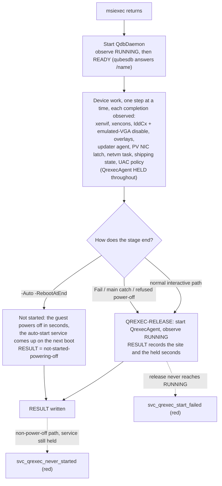

# ADR - boot: what may touch the device model in a fresh domain's first minutes

Decisions about the install and the first boots of a Windows guest, as seen from the device model (QEMU in the
stub domain) and from Xen. Format and status vocabulary: `docs/ADR-README.md`.

| record | content |
|---|---|
| `findings/wedge.md` | the stall measurements this file rests on |
| `packaging/setup/Install-QwtImproved.ps1` | stage 2 of the install, where §2 is enforced |
| `tools/tests/svc-serial-start-test.ps1`, `svc-serial-start-selftest.sh` | the offline suite that asserts §2's order |
| `mgmt/harness/paced-ab.sh`, `mgmt/harness/stock-ab.sh` | the A/B runs that grade §1 |

| § | decision | status | date |
|---|---|---|---|
| 1 | Work that reaches QEMU or Xen in a fresh domain's first minutes is serialized and paced | ACCEPTED (owner, Jev); the harness half WITHDRAWN (owner) | 2026-10-04 |
| 2 | The qrexec service opens only after stage 2's device work | ACCEPTED (owner, Jev) | 2026-10-04 |

---

## 1. Work that reaches QEMU or Xen in a fresh domain's first minutes is serialized and paced

**Status:** ACCEPTED (owner, Jev), 2026-10-04. The test-harness half of the original decision is WITHDRAWN
(owner, the same day); see below.

**Context.** A fresh domain sometimes stalls in its first minutes. Measured 2026-10-04 (`findings/wedge.md`):
QEMU in the stub domain stops completing the guest's I/O requests. Xen holds a vCPU (`pause_flags=4`, blocked in
Xen) waiting for the device model, while the stub domain sits idle with nothing pending. In the 2026-09-10
captures QEMU itself was stuck: QMP went unanswered, and once its greeting arrived 63 minutes late. The stall
strikes under concentrated activity in a fresh domain's first minutes. A guest with no QWT at all froze the same
way, so the defect is below our code.

The owner observed that "the more we follow quality best practices, the worse the stalls". Jev's explanation
(1.00): our quality changes SYNCHRONIZED and CONCENTRATED the guest's demands on the device model at that
moment. Readiness waits that release everything at once, deterministic fresh-domain transitions, readiness
polling, instrumentation and synchronous cleanup all land together, where the earlier ad hoc code had spread the
same work out by accident. The one change ever measured to help fits this explanation: close+pin serialized
every qrexec call's vchan work on one CPU, and stalls under load went from 17 of 26 to 0 of 26 (Jev 0.74).

**Decision.** In a fresh domain's first minutes - every install stage, every post-install boot, every boot with
an emulated medium - our product never releases work all at once.

1. Anything that reaches the device model or Xen happens ONE THING AT A TIME.
2. Each step starts only when the previous step's completion has been OBSERVED. QWT's services after msiexec
   come up one by one, each after the previous one is running.
3. Pacing means waiting for an observed completion. It never means a fixed sleep (owner: no pauses or timeouts
   as a fix).

Jev: this rule 0.93; judging changes by their exposure alone 0.07.

**Withdrawn.** The decision originally also said that our test harness makes no guest call in a boot's first
minutes (prime-run `QUIET_BOOT_SECS`, 420 s). The owner withdrew that the same day: "420s? you want me to tell
each install is going to take 7min more because we are afraid to touch it?". A hands-off window is avoidance
that ships nothing; dom0 itself calls into a new qube at once; and in the A/B the window confounded the product
change. The harness keeps touching the guest exactly as the release gate does.

**Cost.** Installs and test runs take longer by the serialization: tens of seconds to about 2 minutes per clean
install. The serialized service start itself measured about 0.3 s.

**Evidence.** Owed. The pre-registered clean-install A/B `mgmt/harness/paced-ab.sh` (CONTROL = today, PACED)
runs 30 installs per arm with a one-sided Fisher test on stall counts, bar p <= 0.05. It started 2026-10-04
11:51Z with the withdrawn harness window still in its PACED arm, so it cannot grade the product change. Jev:
stop it 0.81; run STOCK vs OURS first 0.85 (`mgmt/harness/stock-ab.sh`).

**Open.** The device-model defect itself is outside this repo. It is reported upstream only with the owner's
approval of the exact text.

## 2. The qrexec service opens only after stage 2's device work

**Status:** ACCEPTED (owner, Jev), 2026-10-04.

**Context.** The mechanism, verified in source. Xen 4.19's `p2m_remove_entry` requests a device-model mapcache
invalidate for every page the guest removes from its physmap (`XENMEM_decrease_reservation`, or unmapping a
mapped grant). The vCPU then waits synchronously for QEMU in the stub domain, and QEMU 9.0.2's invalidate
handler runs `bdrv_drain_all` first. Every qrexec call INTO the guest makes the guest map the caller's vchan
ring and unmap it at close, because the service side is the vchan client. That is two synchronous QEMU round
trips per call. The guest's own outgoing calls and the agent's control channel only GRANT pages and do not pay
this.

Four recorded freezes (#3, #5, #6, E18) were each a call into the guest that landed in stage 2, between the
moment QWT's services came up after msiexec and the stage's power-off: the window of the device work. Before
168f72c (2026-09-08) the stage-2 agent usually gave up after 60 s waiting for QubesDB, so that window ran with
no qrexec service at all, and the stall rate jumped after that commit.

Section 1 had declined to hold qrexec back for the stage. On this mechanism the owner chose it ("need the fix
first ... checks a posteriori"). Jev: this shape 0.95 combined; "removes the window for every caller" 0.91; the
top implementation risk is the QubesDB dependency, 0.45, met by rule 1 below. The owner rejected any
test-harness hands-off window: this is a property of the product, enforced in the product.

**Decision.** In stage 2 of `packaging/setup/Install-QwtImproved.ps1`:

1. Right after msiexec, only QdbDaemon is started, and it is observed RUNNING and then READY (the local qubesdb
   answers `/name`). The device work needs it: the PV NIC priming latch reads the qube class from the live
   qubesdb.
2. QrexecAgent is HELD (`svc_serial_start`: held-for-device-work) through every step that reconfigures a device
   or a driver: xenvif, xencons, the IddCx device and the emulated-VGA disable, the overlays, the updater agent,
   the PV NIC priming latch, the netvm task, the shipping state, the UAC policy.
3. After the last of them, at the QREXEC-RELEASE site, QrexecAgent is started and observed RUNNING
   (`Start-HeldQrexecAgent`). The RESULT records the site and the hold's length (`svc_qrexec_start`,
   `svc_qrexec_held_secs`).
4. Every exit path after msiexec that does not power off starts it before writing its RESULT: Fail, the main
   catch, a refused power-off.
5. On the `-Auto -RebootAtEnd` path it is not started in this stage at all. The guest powers off within seconds,
   the service is auto-start and comes up on the next boot as stock QWT's does, and the RESULT says so
   (`not-started-powering-off`).
6. Two errors of their own, both red in `mgmt/harness/result-flags.py`: a RESULT written on a non-power-off path
   with the service still held (`svc_qrexec_never_started`), and a release that does not reach RUNNING
   (`svc_qrexec_start_failed`).
7. No fixed sleep anywhere. Every wait is an observed condition with a bounded failure detector, through one
   observation routine for every service start (`Start-QwtServiceObserved`).

**Cost.** qrexec answers only when the install is done.

- On the interactive path (install.cmd, or /auto without /reboot) the no-qrexec phase of stage 2 grows by the
  device work: measured 33-60 s from msiexec's return to INSTALL COMPLETE over 25 archived runs (2026-09-05 to
  2026-10-03), on top of the ~60 s the MSI already takes.
- On the `-Auto -RebootAtEnd` path (the clean install through prime-run) qrexec does not answer in stage 2 at
  all.
- dom0 calls issued meanwhile queue for `qrexec_timeout` and land together at the release. The harnesses already
  live with a no-qrexec phase: `quick-upgrade.sh` and `e2e-wait.sh` call a stall only after `STALL_SECS` (300 s)
  without an answer, and `admin.vm.Stats` needs no agent.
- A death of one of our components during the hold reaches dom0 only through the guest log, because the death
  reporter's notification rides the local qrexec-agent (`guest/qwt-notify-error.ps1`). This is an honest limit.

**Evidence.** Offline: every assertion of the suite fails under its knob (24 knobs; re-run by the reviewer,
77 pass / 0 fail clean). On the rig: gate #6 on 4.3.34 (24e28f46, 2026-10-04) held QrexecAgent 24.2 s through
stage 2's device work and did not start it before the power-off; all 8 install cells PASS with no stall, record
CLEAN. 0 of 8 at the recent ~18% stall rate has P = 0.21, so this is consistent with the fix, not proof of it.

**A coin flip on the framing, stated plainly.** Jev rated "a product property rather than avoidance" at 0.44.
The check is a posteriori: the stall rate on the rig with this order, against the record before it, through the
release gate as it runs, with no harness quiet window.

**Open.** Not fixed by this section:

- a freeze in a post-install boot (#4: our agent was running and answered the harness's first-answer burst,
  which the stage-2 hold does not reach; the every-boot form, F2, waits on a premise probe);
- a freeze with no QWT at all (J-C sp.1);
- QEMU's own hang, which is not ours to patch (dom0 is not patched; owner);
- the pre-msiexec part of an upgrade (the previous QWT's agent answers until `vchan_prestop` stops it) and the
  seconds between the release and the end of the stage, neither of which the hold covers.
