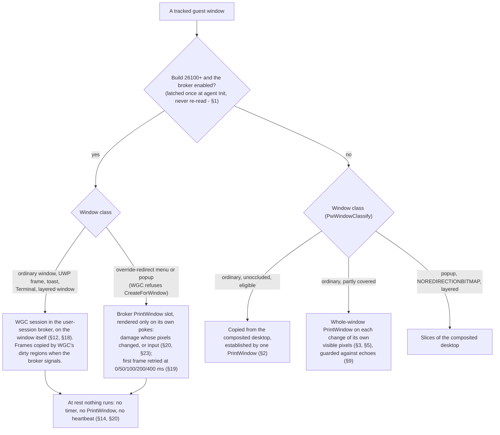
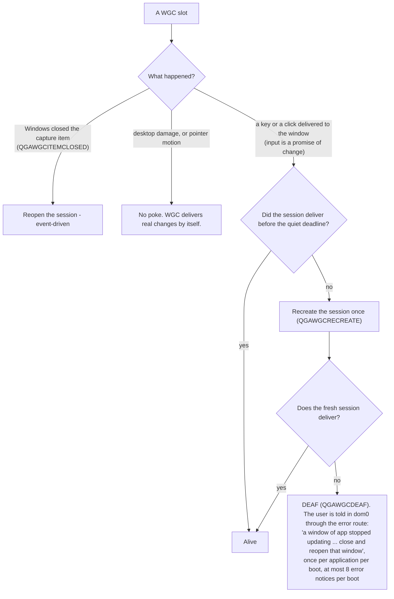

# ADR - window content capture: the PrintWindow engine, the WGC broker, and rest

Decisions about where a guest window's pixels come from, when the agent asks an application to paint, and how
a capture that has stopped is noticed. This file is not a status report: what a guest measured on a given day
belongs in `findings/`, and the mechanisms live in the design notes and the code headers. Format and status
vocabulary: `docs/ADR-README.md`.

| record | content |
|---|---|
| `DESIGN-per-window-capture.md` | per-window buffers; Gate 0 (PrintWindow returns an occluded window's content) |
| `DESIGN-pure-per-window.md` | the per-window model; the classes PrintWindow cannot render |
| `DESIGN-wgc-broker.md` | the user-session WGC broker: slots, routes, IPC |
| `DESIGN-rest-zero-capture.md` | the rest-zero design (§18): stages S0-S5 and the measurement plan |
| `agent/gui-agent/wincapture.cpp` (header comment) | the PrintWindow engine as built: service loop, sweep, echo guard |
| `findings/issues.md`, `findings/capture.md` | open defects, and the measurements quoted here |

Two build populations run different designs. **Below build 26100** the agent's own PrintWindow engine and the
composited desktop are the sources (§1-§11, §13). **On 26100 and later** every window is a WGC session in the
user-session broker and nothing runs at rest (§12, §14, §18-§32). Rules for editing this file: a section
changes only when a decision changes; every tradeoff is written with its cost and a bound; every section is
classified by Jev and the verdict recorded; a PROPOSED section is not built before its verdict.

| § | decision | status | date |
|---|---|---|---|
| 1 | The pixel source is chosen per window class; capabilities are decided at start | ACCEPTED (Jev 0.79) | 2026-09-30 |
| 2 | An unoccluded window is copied from the composited desktop, established once | ACCEPTED below 26100; RETIRED on 26100+ by §18/§20 | 2026-09-30 |
| 3 | A partly covered window is captured whole, never a mixed buffer | ACCEPTED (PrintWindow engine) | 2026-09-30 |
| 4 | No TIMED PrintWindow | ACCEPTED (owner) | 2026-09-30 |
| 5 | A window's change is a change of its OWN visible pixels | ACCEPTED | 2026-09-30 |
| 6 | Guest stacking follows dom0 only through focus | ACCEPTED (a protocol fact) | 2026-09-30 |
| 7 | Content dom0 shows but the guest covers | OPEN below 26100; answered on 26100+ by §18 | 2026-09-30 |
| 8 | Some applications repaint because they were asked to paint | ACCEPTED (a measured fact) | 2026-09-30 |
| 9 | The echo guard | ACCEPTED, PROVISIONAL (its main cost is not measured) | 2026-09-30 |
| 10 | Widen the echo window to 500 ms | PROPOSED | 2026-09-30 |
| 11 | Stop sweeping windows that have visible pixels; serve a held-back change when its pause ends | PROPOSED | 2026-09-30 |
| 12 | UWP frame windows are captured with WGC on the frame itself | ACCEPTED; its quiet ladder amended by §19 and §32 | 2026-09-30 |
| 13 | Keep the echo escalation for 10 s after a pause | REJECTED | 2026-09-30 |
| 14 | At rest, zero work | ACCEPTED (owner); met on 26100+ (§20) | 2026-09-30 |
| 15 | A window at rest is copied from the desktop, whatever covers it | REJECTED (owner) | 2026-09-30 |
| 16 | The echo guard is retired | PROPOSED; its premise (§15) was rejected | 2026-09-30 |
| 17 | Liveness from process handles and system notifications, not heartbeats | PROPOSED; largely carried out in another form by §18 S4 and §19 | 2026-09-30 |
| 18 | Every window on 26100+ is captured with WGC through the broker; at rest nothing runs | ACCEPTED, MEASUREMENT OWED; the deaf ladder amended by §32 | 2026-09-30 |
| 19 | Rest-zero S3/S4 as built | ACCEPTED (Jev); the damage-driven liveness items SUPERSEDED by §32 | 2026-10-01 |
| 20 | Rest-zero S2 and the three loops the acceptance found | ACCEPTED (Jev), MEASURED | 2026-10-01 |
| 21 | Liveness pokes need a margin and the event order; a refused focus is not a no-op | the margin SUPERSEDED by §32; the focus fix ACCEPTED (Jev) | 2026-10-01 |
| 22 | Windows' composition is not bypassed | ACCEPTED (Jev) | 2026-10-01 |
| 23 | Pointer motion pokes only the slots the broker renders on request | ACCEPTED (Jev); kept by §32 | 2026-10-01 |
| 24 | A liveness poke is checked against the windows above as they are now | PROPOSED (Jev), built on rz18; SUPERSEDED by §32 | 2026-10-01 |
| 25 | The broker arena is reserved and committed per allocation | ACCEPTED (Jev) | 2026-10-01 |
| 26 | No liveness poke from damage that also covers the desktop | SUPERSEDED by §32 | 2026-10-01 |
| 27 | A window that just moved still covers where it was | SUPERSEDED by §32 | 2026-10-02 |
| 28 | Damage confined to a window's outer 8 px is DWM chrome | SUPERSEDED by §32 | 2026-10-02 |
| 29 | Regions a window changes invisibly to WGC are learned | premise RETRACTED 2026-10-02; SUPERSEDED by §32 | 2026-10-02 |
| 30 | A window's own untracked popups occlude its liveness damage | SUPERSEDED by §32 | 2026-10-02 |
| 31 | Alt-nav key-tip badges are dropped fully | ACCEPTED (owner) | 2026-10-02 |
| 32 | Liveness from input and Windows' own events only; the damage-comparison detector goes | ACCEPTED (owner) | 2026-10-02 |

### Where a window's pixels come from today

### How a capture that has stopped is noticed on 26100+ (§32)

---

## 1. The pixel source is chosen per window class; capabilities are decided at start

**Status:** ACCEPTED, 2026-09-30. Jev: accept 0.79, accept-measure-owed 0.19; cost bounded 0.09; conflicts
with the owner's direction 0.11; a user-visible regression possible 0.71.

**Context.** The agent runs as SYSTEM, where `Windows.Graphics.Capture` refuses (`IsSupported` threw
`0x80070424` in the service context, measured 2026-09-02). The interactive user's session can use it, hence a
broker there. A capability re-read at runtime turns a failure into a silent mode change.

**Decision.** Every tracked window gets one pixel source, chosen by its class (`PwWindowClassify`) and by
capabilities latched once at agent Init:

1. An ordinary window: the agent's own PrintWindow engine, or the composited desktop while it is unoccluded
   (§2). On 26100+ this was later widened to WGC for ordinary windows too (§18).
2. A window PrintWindow cannot render correctly from the agent's context - override-redirect popups,
   `WS_EX_NOREDIRECTIONBITMAP` windows (UWP frames, toasts, Windows Terminal), per-pixel-alpha and colour-key
   layered windows: on build 26100 and later the user-session WGC broker (§12), below that slices of the
   composited desktop.
3. The broker is eligible on build 26100+ unless qubesdb switches it off, and eligibility is never re-read at
   runtime. A broker that was working and stops is a FAILURE, reported loudly, never a capability change.

## 2. An unoccluded window is copied from the composited desktop, established once, then left alone

**Status:** ACCEPTED below 26100; RETIRED on 26100+ by §18 and §20 (nothing is copied out of the desktop
image there). Marked TO RETIRE by the owner 2026-09-30. Jev: accept 0.83, accept-measure-owed 0.16; cost
bounded 0.31; conflicts with the owner's direction 0.09; a user-visible regression possible 0.73.

**Context.** PrintWindow on the typing path cost 50-76 ms per frame. A periodic re-verify turned a static
difference between the two sources into a visible content swap at about 0.5 Hz (agent e97edb8).

**Decision.** While a window is unoccluded and otherwise eligible (`PwDdaEligible`: not moving, geometry
matches, fully on screen, not layered, nothing tracked above it), its damaged sub-rects are copied from the
desktop duplication frame. Entering that mode costs ONE PrintWindow, which establishes the buffer. Nothing
re-renders the window while it stays eligible: there is no periodic PrintWindow "to correct" differences
between the two sources.

**Cost.** A difference between the sources (alpha byte, Windows 11 rounded corners) persists as a one-time
transition instead of being corrected.

**Why retired.** This is slicing: the source is the composited desktop picture, which the owner is removing
as a window source entirely ("i desperately try to fully get rid of it", 2026-09-30; see §15). On 26100+ it
retires with §18, and the desktop duplication stays only as a damage signal. Below 26100 there is no
per-window source that does not ask the application to paint, so it stays there until the owner decides
otherwise.

## 3. A partly covered window is captured whole, never a mixed buffer

**Status:** ACCEPTED, 2026-09-30 (the PrintWindow engine). Jev: accept 0.77, accept-measure-owed 0.14; cost
bounded 0.95; conflicts with the owner's direction 0.12; a user-visible regression possible 0.79.

**Decision.** A window that anything tracked above it overlaps is captured with one whole-window PrintWindow
whenever its own visible pixels change (§5). Its visible part is never taken from the desktop while its
covered part comes from elsewhere.

**Why.** The covered part has no change signal: dirty rects there belong to the window on top. A mixed
buffer's two halves age independently, and dom0 may be showing the covered half (§7).

**Cost.** Every change in the visible part costs a whole-window PrintWindow on the application's own UI
thread (32-438 ms measured per call on this rig), and for an application that repaints when asked to paint,
that PrintWindow is itself a change (§8).

## 4. No TIMED PrintWindow

**Status:** ACCEPTED (owner), 2026-09-30. Jev: accept 0.70, accept-measure-owed 0.21; cost bounded 0.62;
conflicts with the owner's direction 0.20; a user-visible regression possible 0.86.

**Decision.** The owner: "but no TIMED PrintWindow. if it is event driven it is not that bad". PrintWindow
runs only because something happened to THAT window: its first capture, a change in its own visible pixels
(§5), the settle after a move or drag, a change the echo guard held back (§11). Never because a timer fired.

**Why.** A PrintWindow runs on the captured application's UI thread whether or not anything changed, and some
applications repaint because they were asked to paint (§8), so a timed render is also a source of damage.

**Consequence.** The timed renders that existed on 2026-09-30 are defects to retire:

- the engine's round-robin sweep (`wincapture.cpp`: one window per 250 ms slot; a window that keeps coming
  back unchanged backs off to one sweep per 2 s);
- the broker's backstop render on its PrintWindow route (every `WGCBRK_POKE_SAFETY_MS` = 1 s, doubling to
  `WGCBRK_POKE_BACKOFF_MAX_MS` = 8 s while its renders publish nothing) - removed on 26100+ by §18 S3;
- the broker's relay source measurement: a PrintWindow that repeats (500 ms, doubling to 8 s) for as long as a
  poke on a relay stays unanswered - anchored to an event, but a timer once it has started (answered by §19).

The one real job these did, content that has no change signal, is §7.

## 5. A window's change is a change of its OWN visible pixels

**Status:** ACCEPTED, 2026-09-30. Jev: accept 0.76, accept-measure-owed 0.22; cost bounded 0.83; conflicts
with the owner's direction 0.10; a user-visible regression possible 0.73.

**Context.** Damage under a window above belongs to that window. Attributing it to the window beneath made
113-116 of 117-119 Explorer captures find nothing (2026-09-24), and poked a healthy WGC session into demotion
(2026-09-30).

**Decision.** Desktop damage marks a window only if the window's own uncovered pixels changed:
`PwScreenUnchanged` hashes the spans that nothing tracked above covers, and a window whose ordering is
unknown counts as changed. For a broker window, damage confined to its outer 2-pixel border, or lying wholly
inside one opaque window stacked above it, does not poke it (agent 7f3f248, c21d6fd).

**Cost.** A window whose ordering cannot be described (no capture-grade z-order, or more than 16 occluders)
is treated as changed by any damage that touches it.

## 6. Guest stacking follows dom0 only through focus

**Status:** ACCEPTED, 2026-09-30: a protocol fact the design must carry. Jev: accept 0.60,
accept-measure-owed 0.34; cost bounded 0.09; conflicts with the owner's direction 0.10; a user-visible
regression possible 0.77.

**Decision.** The agent aligns guest stacking with dom0 only when dom0 focuses a window (`MSG_FOCUS` ->
`SetForegroundWindow`, plus `BringWindowToTop` behind the `FocusRaise` switch). It never infers dom0's
stacking otherwise.

**Why.** The GUI protocol has no restack message; anything touching it needs a design writeup and upstream
review first (CLAUDE.md). The focused window is on top in both, which is what the unoccluded path (§2)
serves.

**Cost.** Stacking can differ: a guest window that is topmost in the guest, an application that activates
itself, a dom0 window manager that focuses without raising. Where it differs, dom0 shows pixels that the
guest covers (§7).

## 7. Content dom0 shows but the guest covers

**Status:** OPEN below 26100, the owner's call; on 26100+ answered by §18 (every window is its own WGC
session, option (a) below). Jev 2026-09-30: accept-measure-owed 0.54, owner-decision 0.38; cost bounded 0.56;
conflicts with the owner's direction 0.33; a user-visible regression possible 0.69.

**The problem.** Where stacking differs (§6), dom0 shows part of a window that is covered in the guest. That
part makes no desktop damage, so nothing event-driven sees it change. On 2026-09-30 the sweep (§4) refreshed
it: at best every 250 ms, at worst every 2 s or one 250 ms slot per swept window, whichever is longer.

**Options.**

- (a) WGC through the broker for covered ordinary windows on 26100+: arrival-driven, no cost on the
  application's UI thread, no echo. Costs: broker slots (32, shared with §1's classes), a WGC session and
  broker memory per covered window. Below 26100 it changes nothing.
- (b) Refresh on uncover only: uncovering makes damage in the guest, and the window is captured then. Stale in
  dom0 for as long as stacking differs and that part keeps changing.
- (c) Keep a timed sweep for covered windows: violates §4.

**Recommendation.** (a) on 26100+ (taken by §18). Below 26100 the sweep stays until the owner answers the
question put on 2026-09-30: there is no per-window change event there, no broker, and SYSTEM cannot use WGC.

## 8. Some applications repaint because they were asked to paint

**Status:** ACCEPTED, 2026-09-30: a measured fact the design must carry. Jev: accept 0.85,
accept-measure-owed 0.14; cost bounded 0.45; conflicts with the owner's direction 0.09; a user-visible
regression possible 0.54.

**Decision.** The engine treats its own PrintWindow as a possible CAUSE of damage, never as a neutral read.

**Evidence.** Measured on w11-ds (26100.1742), with no agent running: a bare PrintWindow loop on a Windows 11
Notepad made DWM report its whole visible area dirty about 4 times per call. With our agent, the agent's own
hash of that Notepad's visible desktop pixels had changed before every capture it requested in the burn window
(per-minute counters: capture decisions = hash changes), so the repaint changes the pixels on screen, at least
while it is drawn. Two overlapping Notepads kept the engine re-rendering them about 15 times a second for about
29 minutes after they opened: DWM, the agent and the Notepads at about 150% of one core, on a desktop nobody
touched.

**Not measured.** Whether the repaint settles back to the same picture (a flicker sampled mid-repaint) or
leaves different pixels. A repaint of identical pixels is not a change, since the detector compares pixels
(§5), so only a repaint that changes them can feed a loop. **Corrected:** an earlier wording here, "a 19x18 px
element changing each time", read a dirty rect as a pixel change; a dirty rect only says an area was
re-presented.

## 9. The echo guard

**Status:** ACCEPTED, PROVISIONAL: its main cost is not measured. Agent 78e925e, 45aeedb. Jev 2026-09-30:
accept-measure-owed 1.00; cost bounded 0.93; conflicts with the owner's direction 0.26; a user-visible
regression possible 0.93.

**Decision.** A mark that arrives while we are capturing that window, or within `WC_ECHO_MS` (250 ms) of that
capture's return, is treated as the ECHO of our own render. Three echoes in a row pause the window's captures
for 1 s, doubling to 4 s while pauses pass quietly; a mark outside that window ends the pause. An echo that
lands while the window is paused is DROPPED.

**Why.** §8. The guard cut the attributed CPU of that scene about 4x (3+3 interleaved A/B, disjoint ranges,
2026-09-30).

**Cost, written out because this is the tradeoff.** The guard cannot tell "this window changed because we
rendered it" from "this window changes all the time". A window that animates on its own while partly covered
is captured in bursts of three and then not at all until `WC_ECHO_MS` after the last capture: at most one
capture per (capture time + 250 ms), against one per capture time without the guard. A 20 Hz animation that
costs 10 ms to capture would reach dom0 at about 8 updates a second instead of 20 - DERIVED, NOT MEASURED. And
a genuine change that lands inside the echo window just as a pause starts is dropped; only the next capture of
that window delivers it, and on 2026-09-30 that capture was the sweep, which §4 retires (§11).

**Owed.** The throttle on a self-animating, partly covered window, measured against a build without the
guard.

## 10. Widen the echo window to 500 ms

**Status:** PROPOSED. Jev 2026-09-30: accept-measure-owed 0.75, reject 0.21; cost bounded 0.80; conflicts
with the owner's direction 0.19; a user-visible regression possible 0.90.

**Proposal.** `WC_ECHO_MS` 250 -> 500.

**Why.** Of 21 changes that ended a Notepad's echo pause (w11-ds, 2026-09-30), 8 came 265-468 ms after our own
capture of that window: the tail of our own render.

**Cost.** §9's throttle doubles: a self-animating partly covered window drops to one capture per (capture
time + 500 ms), and more genuine changes are classed as echoes and held back.

## 11. Stop sweeping windows that have visible pixels, and serve a held-back change when its pause ends

**Status:** PROPOSED. Jev 2026-09-30: accept-measure-owed 0.55, accept 0.20; cost bounded 0.80; conflicts
with the owner's direction 0.35; a user-visible regression possible 0.87.

**Proposal.**

- (a) The sweep skips a window with any pixel visible on the guest desktop, from the capture-grade z-order;
  with no usable ordering the window counts as not visible and is swept as before.
- (b) When an echo pause ends and a mark was dropped during it, the window is captured once.

**Why.** §4: a visible window's changes arrive as desktop damage, so its sweep is a timed render and nothing
else. (b) is required by (a): the sweep is what delivered a change dropped at the start of a pause (§9), and
without it that change stays lost until the window changes again.

**Cost.**

- The covered part of a partly visible window is refreshed only when its visible part changes or when it is
  uncovered: stale where dom0 shows it (§7).
- An application that echoes gets one capture per pause period (at most 4 s) for as long as it stays open. It
  is triggered by its own echo, so it is an event-anchored loop that behaves like a 0.25 Hz timer. The sweep
  delivered the same captures before.
- Windows with no visible pixel are still swept: (a) alone does not meet §4.

## 12. UWP frame windows are captured with WGC on the frame itself

**Status:** ACCEPTED (wgcbroker c661f08, 4ada067). The quiet ladder's demotion rule was changed by §19
(recreate, not demote) and then by §32 (no damage-driven check at all; the relay left the ladder). Jev
2026-09-30: accept 0.69, accept-measure-owed 0.30; cost bounded 0.36; conflicts with the owner's direction
0.23; a user-visible regression possible 0.59.

**Decision.** An `ApplicationFrameWindow` is captured with a WGC session on the frame window itself. As
decided on 2026-09-30, the broker's quiet ladder (WGC -> relay -> PrintWindow) demoted a session only when
damage the agent saw stayed unanswered for `WGCBRK_WGC_QUIET_MS` (2 s), counted from the first unanswered
poke.

**Why.** WGC is arrival-driven: nothing renders while nothing changes. The earlier up-front re-route to
relay/PrintWindow rested on a misreading, and a quiet test timed from the last frame demoted every WGC session
at its next change.

**Evidence.** Settings stayed on WGC 6 of 6 times with the binaries swapped in, 6 of 6 installed from the
release package on 26100.1742, and 6 of 6 on German 26200. Idle: 0 renders, against 288 renders in 20 s with
DWM at 47-53% of a core on the PrintWindow route.

## 13. Keep the echo escalation for 10 s after a pause

**Status:** REJECTED (agent c274a51, reverted in 301cf6f). Jev 2026-09-30: reject 0.84, accept 0.06; cost
bounded 0.18; conflicts with the owner's direction 0.19; a user-visible regression possible 0.55.

**Proposal.** A genuine change during an echo episode ends the pause but keeps the escalation for 10 s after
the last pause.

**Why rejected.** No measurable effect in a 3+3 interleaved A/B on the same scene.

## 14. At rest, zero work

**Status:** ACCEPTED (owner), 2026-09-30. Met on 26100+ as measured in §20 (rz3b, rz5). Jev: accept-measure-
owed 0.50, accept 0.47; cost bounded 0.72; conflicts with the owner's direction 0.14; a user-visible regression
possible 0.58.

**Context.** The owner: "idle load should GO, not just be reduced"; "anything pause-driven is meh. avoid
whenever possible"; "change does not occur on idle desktop"; "while window moves you can do whatever fuck you
want. i want zero idle polls while it is stopped and no pixel changes." On a desktop at rest nothing changes,
so every cost measured there is our own: a timer acting without a change, or a PrintWindow manufacturing the
change it then reacts to (§8). Reducing it (the echo guard cut it about 4x, §9) leaves a desktop that is never
at rest while our agent runs. The bar is the agent-stopped floor.

**Decision.** When no window moves and no pixel changes, the agent and the broker do NOTHING: no PrintWindow,
no thread woken by a timer, no heartbeat. Every wait is on an event, or on a deadline that exists only while
work is pending. While a window moves, anything goes, including timers, dwells and PrintWindow.

**Bound.** None at rest: zero wakeups, zero PrintWindow. Measured as per-thread context switches of our
processes and DWM CPU on a static multi-window desktop, against the same desktop with our agent stopped.

**What woke at rest on 2026-09-30, by reading the code** (all removed on 26100+ by §18-§20):

- the agent's desktop-duplication thread: `AcquireNextFrame` with a 1 s timeout, and a stale-grant sweep on
  every pass (1/s);
- the capture engine's worker: waits of at most 250 ms for the sweep (4/s), plus the sweep's PrintWindows;
- the agent's main loop: a 1 s timeout whenever the broker or the notification bridge is up (1/s);
- the broker's main loop: 250 ms, or 33 ms while any window is on its PrintWindow route (4/s or 30/s); agent
  and broker heartbeats (each gives up after 10 s of silence); input-desktop and console-session polls;
- the broker's backstop render (§4) and the echo loop (§8) wherever PrintWindow served a window at rest.

## 15. A window at rest is copied from the desktop, whatever covers it; PrintWindow only establishes

**Status:** REJECTED (owner), 2026-09-30. Built as agent 2b47ae3 on experiment branch `rest-zero`, never
measured. Jev before the rejection: accept-measure-owed 0.90; cost bounded 0.15; conflicts with the owner's
direction 0.23; a user-visible regression possible 0.83.

**Proposal.** Supersede §3, §10 and §11. A window that is not moving, and that nothing moving overlaps, takes
its changes from the desktop duplication frame: every damaged sub-rect, minus the rectangles of the tracked
windows above it, is copied into its buffer - the §2 path, clipped by occlusion instead of refused by it.
PrintWindow runs only to establish a buffer: first capture, a resize, and the settle after motion.

**Why proposed.** §14. A read that does not perturb the application gives an idle desktop nothing to react to.
The skew that made §3 reject mixed buffers (the window list newer than the frame, so an occluder that just
moved leaks its pixels into the window below) exists only while something moves, and §14 hands motion to
PrintWindow.

**Cost.** The covered part of a window at rest is as old as its last establish or its last uncovering: stale
in dom0 wherever dom0 shows it (§6, §7). A window above casts its shadow onto the one below, and the desktop
holds the shadow, so the copy bakes it in; a translucent window above is treated as covering. A window that
cannot be copied at all (translucent itself, off the desktop) stays on PrintWindow, and an application whose
repaint changes its visible pixels would loop there.

**Why rejected.** The owner: "desktop-copy is slicing in disguise, right?" / "the exact design we tried to
retire?" It is. The source is the composited desktop picture - what slicing used, and what the de-slice
retired as a window source. Cutting around the windows above removes only the most visible artifact of that
source; the copy still carries the composite's others: the shadow a window above casts, what shows behind
rounded corners, the window list being newer than the picture. Written down so it is not proposed again. The
non-slicing route to §14 is §18.

## 16. The echo guard is retired

**Status:** PROPOSED; its premise (§15) was rejected, and it has not been re-judged. Jev 2026-09-30:
accept-measure-owed 0.97; cost bounded 0.12; conflicts with the owner's direction 0.17; a user-visible
regression possible 0.81.

**Proposal.** Remove §9's guard once no stationary window is captured with PrintWindow because it changed, so
that nothing echoes into the capture path.

**Why.** §14: the guard is pause-driven, and it cannot tell an echo from a window that animates on its own
(§9), so it throttles the latter.

**Cost.** Any window still captured with PrintWindow at rest loses its only protection against an echo loop;
§14's measurement is what finds one.

## 17. Liveness from process handles and system notifications, not heartbeats

**Status:** PROPOSED (Jev 2026-09-30: accept-measure-owed 0.84, owner-decision 0.06; cost bounded 0.27;
conflicts with the owner's direction 0.14; a user-visible regression possible 0.58). Most of it was carried
out in another form: §18 S4 removed every timed wake on both sides and turned heartbeats into request
deadlines, and §19 replaced the broker's heartbeat and pid poll on the agent with an owned mutex. Not
re-graded here.

**Proposal.** The agent and the broker watch each other through process handles only; the broker learns of an
input-desktop switch and a console-session change from system notifications (`EVENT_SYSTEM_DESKTOPSWITCH`,
`WTSRegisterSessionNotification`), not by polling. The desktop-duplication thread waits without a timeout and
is stopped by an event of its own; the stale-grant sweep, the arena reap and every other deferred job arm a
one-shot deadline only while they have work.

**Why.** §14. A heartbeat is a timer on both sides; a process handle signals the exit it exists to detect.

**Cost.** A process that is alive but hung is no longer noticed by its peer: the broker keeps serving a hung
agent (it is idle then), and the agent's existing broker stage/hang diagnostics become the only record.

## 18. Every window on 26100+ is captured with WGC through the broker; at rest nothing runs

**Status:** ACCEPTED, MEASUREMENT OWED (the measurement plan is in `DESIGN-rest-zero-capture.md`; §19-§21
record what the stages found). The design's deaf ladder (E) and the relay (G) were changed by §32.

**Context.** §14 without slicing (§15, §2). The 2026-09-02 pure-per-window study settled for concessions
because a SYSTEM agent has no per-window paint signal; the broker's FrameArrived is that signal, and a WGC
frame costs the application no paint.

**Decision.** Where `DirectRequired()` holds (26100+, broker enabled, decided at start):

1. Every window, ordinary ones too, is a broker WGC session.
2. Broker frames are copied when the broker signals, by WGC's dirty regions.
3. In seamless mode the desktop image is never copied; its dirty-rect metadata remains the damage and
   liveness signal.
4. Every wait on both sides is event-driven, with a one-shot deadline only while a request is pending;
   heartbeats become request deadlines.
5. A deaf session is recreated once and then fails loudly (changed by §19, then §32).
6. Registration failures and WGC refusals hold loudly; the relay is skipped where its destination cannot open.
7. Menus come only from their own frame.
8. Below 26100, and under the explicit opt-out, nothing changes.

The full design, its stages (S0 instruments, then S1-S5) and its measurement plan: `DESIGN-rest-zero-capture.md`.

**How it was decided.** Jev first: four premise-framed calls on distilled facts (owner rules R1-R4 as the
premise) decided the forks - WGC for ordinary windows 0.87, broker-event delivery 0.97, dirty regions 0.87,
every timed wake replaced by events 0.92-0.99, request deadlines for hangs 0.97, own-change pokes 0.92,
recreate-then-loud 0.77, relay skip 0.87, the 2026-09-02 concessions retired (drag attribution 0.95, repair
tick 1.00, menus from their own frame 0.92). Then one Fable agent wrote the design from those verdicts. Then
Jev validated it: no decision rejected; meets R1-R4 once complete 0.75; reintroduces a 2026-09-02 concession
0.23; ready for S0 0.66; the shutdown "kick window" rejected (0.66) and replaced by proving every stop path is
released by an existing event or process exit.

**Cost.**

- Capacity (32 slots; the 128 MiB committed arena of the time): OPEN at decision time (Jev 0.55 insufficient
  evidence) until a window census and a per-allocation-commit probe; the arena was settled by §25, the census
  is still owed.
- Windows WGC refuses at session creation: OPEN (hold-loudly 0.49 vs retry-on-state-change 0.40) until a
  capture-target probe on 26100.1742 and 26200; hold-loudly first.
- Foreground typing/scroll latency without the desktop copy: measured before any mitigation (a3); proposed
  bar p50 no worse than the candidate by 10 ms, the owner's to confirm.
- A hang at rest surfaces at the next request, not within seconds; a lost wakeup is no longer masked by a
  timeout (every converted wait gets a signal-before-wait test).
- A menu's first paint waits for its own frame (~109 ms first content measured), accepted by Jev 0.65.
- Builds below 26100: unchanged; whether they change is the owner's decision (d7).

## 19. Rest-zero S3/S4 as built: the choices the design left open, and one it got wrong

**Status:** ACCEPTED (Jev), 2026-10-01, recorded while implementing §18's stages S3 (own-change pokes, deaf
hold, no PrintWindow backstop) and S4 (no timed wake on either side). Items 1 and 2 concern damage-driven
liveness pokes on WGC slots and are SUPERSEDED by §32; the rest stand.

**Decisions.**

1. **SUPERSEDED by §32.** A quiet WGC session that has delivered is recreated every time; DEAF only when a
   fresh session delivers nothing. This replaced design E's "recreate once, then deaf". Why: a system menu
   opened over a focused Notepad (its drawing, appearance and drop shadow) poked Notepad 273 times; WGC
   correctly delivered nothing; Notepad had used its one recreate at startup, so E declared the healthy window
   deaf and froze it (QGAWGCDEAF). DDA's dirty rects are coarser than a window's own change, so any poke-based
   deafness detector sees false pokes; a recreate makes one cost a session open and a frame, a freeze makes it
   cost the window. Jev: this and item 2 together 0.64 (keep E 0.01); recreates at rest 0.21; recreates every
   ~2 s under content WGC misses 0.79, acceptable 0.62. Every recreate is logged (QGAWGCRECREATE).
2. **SUPERSEDED by §32.** For a WGC slot every window above counts as an occluder for its poke, a popup with
   a 24 px shadow margin; its poke is only a liveness hint. A PrintWindow slot (a menu) keeps the opaque-only
   rule: there the poke is the render trigger, and a change beneath a translucent popup must render.
3. **Requests are acknowledged by sequence.** The broker writes `CtlAck` = the ControlSeq its main loop last
   handled per slot; the agent's hang deadline (2 s) and its arena reclaim key on it. E's "AckState leaves
   REQUESTED" would have read a PrintWindow popup whose first render is black as a hung broker.
4. **The agent's death reaches the helpers through a mutex it owns.** The broker and the notification bridge
   run with the interactive user's limited token, denied SYNCHRONIZE on the SYSTEM agent; they relied on a
   heartbeat and a pid poll. The agent's main thread owns a nonce-named mutex per helper for its life;
   abandoned = the agent died.
5. **The relay capability is probed at the first ladder descent, not at process start** (§18/G said "at
   start"). The agent tells a broker window from a user window only by the broker's validated pid, and a
   destination-shaped window from a broker not yet validated was measured (2026-09-26) to be mapped to dom0.
6. **A PrintWindow popup's first frame is retried at 0/50/100/200/400 ms after its open**, then only its own
   pokes render it: a popup rendered before it painted comes back black, and its own paint can land in the pass
   the agent attributes to its appearance. Bounded; armed by the open, ended by the first published frame.
7. **The diagnostic signature of a burst's last frame keeps a one-shot 500 ms deadline** armed by the burst;
   without it a static window's published signature stays on the frame before its last change (measured
   2026-09-27).
8. **A measured SAME on a relay's source answers its pending poke** (26200); left pending, the quiet test
   re-ran a source PrintWindow every 0.5-8 s for as long as nothing changed. (The relay left the deaf ladder in
   §32 and stays only as a capture route.)
9. **Held maps on 26100+ get one deadline per window** (the crop ceiling, then the declaration once both
   graces end), not a 32/100 ms re-check; a consumed frame and a completed crop measurement queue that window
   for the tracking pass.
10. **A busy broker is not a hung one.** The hang deadline (2 s without an ack) also requires the broker's
    progress counter (`BrokerProgress`, bumped at every call it starts or finishes) not to have moved: a fresh
    broker opening eight sessions in one pass was reaped as hung (measured). Jev: fixes it 0.94, still detects
    a real hang 0.94 - confirmed by suspending the broker: QGABROKERHUNG 2 s after the next request, reaped,
    back in 594 ms.
11. **The notification bridge lists on the ETW proxy's records, not on a clock.** On 26100.1742
    NotificationChanged throws for the unpackaged bridge, which therefore listed the Notification Center every
    2 s for ever (~25 wakes/s, the last rest load of the stack). The notification database is NOT written when
    a toast arrives on that build (wpndatabase.db-wal untouched across 10 toasts), so a file-watch push saw none
    of them; with it alone an allowlisted app's toast would have been banner-suppressed and never forwarded. The
    ETW tier's proxy delivered every toast's records within the second. Jev (re-asked with that measurement):
    ETW push 0.73; verify every toast listed promptly and a dead proxy falling back loudly to the 2 s floor
    (both 0.77).

**Evidence (S3/S4b, w11-ds 26100.1742; 3 interleaved arms each with the agent-stopped floor).** The scene
was NOT the burn scene - no Terminal, no Paint; see §20's correction. The broker's wakes at rest fell from
~6/s to 0-9 per 60 s (an Explorer window that repaints itself ~1/15 s accounts for them); its CPU 0; our family
CPU 0.31-0.41% of a core vs 0.03-0.08% for the floor, all of it the notification bridge (S4c); every window's
delivered frame matched the guest's own render (MAD <= 1.5/255). Open at the time: the bridge (a
system-started thread inside it woke ~20.7/s; its 30 s listing floor), both resolved in §20.

## 20. Rest-zero S2 and the three loops the acceptance found

**Status:** ACCEPTED (Jev), MEASURED 2026-10-01, during the rest-zero acceptance passes rz2-rz3b on w11-ds
(26100.1742). Each fix was reviewed by Jev before commit.

**CORRECTED 2026-10-01: "the burn scene" in this section and in §19 was NOT the burn scene.** Every pass from
rz1 to rz7 ran on 2 Notepad 3816x1004, Settings, the quiet Explorer folder, two shell "File Explorer" windows
and two "Location is not available" error dialogs. The two Windows Terminals and Paint that the scene names
never opened, and nothing said so: the launches threw nothing, and the harness only counted windows (>= 7), so
the dialogs and stray Explorer windows made up the number. This had been recorded on 2026-09-30
(`findings/issues.md`, the DWM P1: "the opener must assert what it opened") and was not acted on until the owner
asked whether Paint was there. The results below cover Notepad, Settings (a UWP frame), Explorer and the
dialogs; they do not cover Terminal or Paint, which draw through their own swap chains rather than GDI. §21
records what the asserted scene found.

**Decisions.**

1. **On 26100+ in seamless nothing is copied out of the desktop image (S2, as designed).** The capture thread
   had copied every desktop frame into the staging buffer although no window took a pixel from it
   (QGACOMPOSITECOPY 0 over whole runs). It now copies only while window 0 shows the desktop (non-seamless, or
   on its way there); otherwise a desktop frame is a damage signal with no framebuffer at all, and the buffer is
   refilled whole - on any next frame, delivered even with no dirty rects, whole-screen damage - when window 0
   wants it again. A non-seamless entry asks Windows for that frame with one asynchronous RedrawWindow of every
   window: measured, it made desktop duplication deliver 44 and 29 frames against 0 and 0 for the same launch
   without it. A fence on each side keeps a skip racing an entry from losing both. Found by the acceptance, not
   the review: a broker frame was clipped to the published image's size, now 0, so every window stayed black and
   was declared (8 of 8, rz3); the S2 audit had listed the image pointer's readers and not its dimensions'. A
   broker frame is clipped to the screen now.
2. **A PrintWindow slot's own render is not a change.** Rendering a window makes Windows present it again with
   the same pixels: a desktop dirty rect, a poke, the next render. A held, untouched system menu looped at ~11
   renders and ~46 desktop frames a second at rest (rz2); with the broker merely suspended, 0. Both PrintWindow
   paths echo (WM_PRINT: one present per render; PW_RENDERFULLCONTENT: more). The damage poke on a PrintWindow
   slot now carries a signature of the window's on-screen pixels for that frame (the desktop surface mapped
   READ-ONLY for the frame being processed; DDA stays a damage signal, nothing copied, nothing sent) and pokes
   only if they changed; input pokes are unchanged. Jev chose this over "converge, then input only" (0.80 vs
   0.16: async content such as a suggestion list filling must still render).
3. **A WGC arrival whose card equals the published one is not republished** (the same rule on the WGC path;
   ABI 20 counts them as SameFrames). Only in steady state: an arrival answering a registration is published
   whatever it holds, and the broker's quiet/deaf test keys on arrivals, not publishes. Jev: fits the rule 0.84,
   registration-safe 0.91.
4. **The notification bridge's database watcher is not a listing trigger.** A listing is served from the
   database the watcher watches, so a watcher-triggered listing can re-trigger itself; on this build the watcher
   never fired for a toast arrival anyway. Removing the trigger did NOT remove the toast-tail load (item 5), so
   it was not that load's cause.
5. **The bridge lists for a notification id it has not seen, not for every ETW record.** In the ~90 s after a
   toast burst every record named a toast already listed (or none) and each cost a full listing plus two
   retries; a listing works a system thread inside the bridge (start shcore.dll+0x259c0) hundreds of times:
   3500-9900 wakes per 20 s, while a process merely HOLDING a listener woke 0 times in the same tail (so the
   platform does not push; our listings were the cost). An ETW dump of a burst shows every toast's arrival
   carrying its own id in 5+ events, the same numbers as the listener's. An id-bearing record now queues its
   id; the main loop lists only if one is unseen; an id-less record lists only until the first id ever arrives.
   Jev: this rule 0.97. Measured (rz5): the tail went from 7475-9358 bridge switches to 21 in 40 s, the shcore
   thread silent, all 10 toasts still listed (<= 1.8 s), the proxy-down toasts 2/2.
6. **S5 is moot on 26100+.** Synthesis needs an owner that is not slice-fed, and every window there is; a menu
   is its own override-redirect window on a PrintWindow slot, whose rest behaviour is item 2.

**Evidence.**

- rz3b (build 362b761): QGADESKCOPY off on every agent start, never on; QGACOMPOSITECOPY 0; every window's
  delivered frame matched the guest's render (MAD <= 1.6/255); the held menu, navigated three times, rendered 4
  times (fid 4) and was then silent, with capture, main and broker at 0. At rest, per minute: the agent wakes
  8-24 times (main and hooks, following the guest's window events and one Explorer window's 10-15 frames a
  minute; capture 0), the broker 0-3, the bridge 0-2, the ETW proxy 0; our family CPU 0.00 in every arm;
  attributed CPU (DWM + ours) 0.00-0.03 against the agent-stopped floor's 0.03-0.05, five arms interleaved
  with three floors. Toasts 10/10 listed within 1.2 s; with the ETW proxy killed the bridge said so and
  recovered in 7 s (2/2 listed). Hangs: the broker hung and asked is reaped in 2 s (back in 625 ms), hung and
  not asked is left alone (by design); the agent hung while a window published moved the broker's AgentStalls.
- rz5 (cf46ea0, the quiet-folder scene, ABI 21 wake counters): in three of four rest samples the agent's named
  threads (main, hooks, capture, toastcrop) woke 0 times (2-4 switches of a pool thread remain), broker 0-2,
  bridge 0-2, proxy 0; the main loop's wakes between two peeks were all window events (the instrument's own
  PowerShell windows), with deadline 0, desktop frame 0, broker frame 0; five consecutive decay minutes ended at
  0/0/0/0.

## 21. What the real burn scene found: liveness pokes need a margin and the event order, and a refused focus is not a no-op

**Status:** found by the first rest-zero passes on the ASSERTED burn scene (rz8 and the probes after it,
w11-ds 26100.1742, 2026-10-01). Item 1 (the liveness margin) is SUPERSEDED by §32, which removed damage-driven
liveness pokes. Item 2 (the focus fix) is ACCEPTED (Jev) and stands.

1. **SUPERSEDED by §32.** A WGC slot's liveness poke treats every window above with a 24 px margin, and a
   desktop frame is judged after the window events queued before it. Why: M7 failed twice (rz7, rz8) with a
   window beneath Calculator recreated. A phase probe on one fixed pair showed focus flips and a reveal poked
   nothing; typing into Calculator put damage 9 px PAST Calculator's edge over the window beneath (poked,
   recreated 2 s later, nothing of its own changed); and a new window's first pixels were judged before the
   window was tracked (no occluder). Jev: margin plus event order 0.54 over the margin alone 0.34, 24 px 0.76,
   mechanism established 0.69. Cost: a session that stops delivering is noticed only by damage outside a 24 px
   band around windows above, or by input - a delay, not a loss. Bound: liveness only; a PrintWindow slot's
   render trigger keeps bare rects. Agent 02b4f72.
2. **A dom0 focus request is made allowed - one zero-distance mouse move before SetForegroundWindow - instead
   of left refused.** Why: in one of rz8's rest arms both Terminals repainted ~2.2 times a second for the whole
   minute (ours ~2% of a core, Terminal 2%, DWM 3.5%); only that arm's restarted agent had received dom0 focus
   requests (one per window as it mapped them), all refused by the foreground lock. Replayed guest-side: a
   refused SetForegroundWindow activates the window inside its own thread's queue, Windows Terminal's cursor
   then blinks for ever with nobody using it, and neither FLASHW_STOP nor a posted deactivation undoes it;
   AttachThreadInput alone does nothing; with the zero move first the call succeeds and the window that later
   loses the foreground goes quiet. Jev: conditional move 0.60, not "intercepting focus" 0.22, decide and
   report 0.27. Cost: dom0 focus requests that silently failed before now move the guest foreground (dom0
   deciding guest focus is HandleFocus's stated intent); one synthetic WM_MOUSEMOVE at the cursor's own
   position per request. Bound: only when the window is not already the foreground; the non-seamless window-0
   path is untouched. Surfaced to the owner for veto. Agent b4d1153.
3. **Not changed, measured.** Windows Terminal reports its WHOLE surface dirty on every present, so S1b's dirty
   regions give it nothing (a frame costs two whole-card copies: 6.7 MB typing, 4.5 MB per blink). Cheaper per
   frame would be a diff of the readback; with the focus fix a Terminal repaints at rest only while it really
   has focus (a blinking cursor is a change).

## 22. Windows' composition is not bypassed: dom0 already composes the windows, and the rest is Windows' own

**Status:** ACCEPTED (Jev), 2026-10-01.

**Context.** The owner asked: "this is all side effects of windows doing the compositing before dom0 does its
own compositing ... evaluate if it is feasible to skip some windows part and delegate it to dom0 entirely."
Constraints in force: zero security-model changes, no new dom0 services, no GUI-protocol / gui-daemon /
grant-lifecycle change without a design writeup, owner review and an upstream issue.

**Decision.** Keep the per-window WGC path (§18). The composition dom0 can own - putting the windows on the
screen - it already owns: each guest window is its own granted buffer, damage is fire-and-forget, gui-daemon
puts the rects, dom0's compositor composes, and on 26100+ seamless no longer copies or grants the composited
desktop at all (§20). What Windows still does first is Windows' own: DWM is always on (since Windows 8) and
composes its desktop; a DirectX/DirectComposition app's pixels (UWP/WinUI/XAML, Windows Terminal, browsers)
exist outside the app only inside DWM, so every out-of-process route to them - WGC, Desktop Duplication,
PrintWindow PW_RENDERFULLCONTENT - is a DWM render. Jev: dom0 already owns the movable part 0.96; skipping
Windows' composition within the constraints not feasible 0.59, for legacy GDI windows only 0.41, for all
windows 0.00; any bypass for modern apps changes the security model 0.95.

**Rejected, with why.**

- Reading a legacy GDI window's redirection surface directly (BitBlt / PrintWindow, or the undocumented
  DwmGetDxSharedSurface): it exists before composition, but no out-of-process per-window paint signal exists on
  Windows (the 2026-09-02 pure-per-window study), so it would be read on a timer - the polling the rest-zero
  work removed - and covers only the legacy class.
- Hooking each app's Present in-process: process injection into every user app (anti-cheat/AV conflict, a
  security-model change).
- Granting apps' raw graphics buffers to dom0: kernel-level access to DWM/graphics-kernel allocations plus a
  protocol and grant-lifecycle change, and dom0 cannot compose DirectComposition visual trees anyway.
- Detecting a change before it is rendered (we inject the key; accessibility events precede the frame): it
  cannot deliver pixels earlier, and nothing in the event-driven path waits on a timer it could skip (Jev 0.22
  that it helps).

**What is left to win, and how it is measured first.** At most one composition interval (~16 ms at 60 Hz;
Jev 0.63 for "up to one refresh"). The controllable lever there is the composition rate of the guest's
display, which the project's IDD can raise (untested). Before any of it: the guest-side stage split per key -
injection, the WGC arrival with the frame's age (its composition time), the broker's publish, the agent's
damage - Jev 0.95 as the next step; `m5diag.sh` with the s4-m5diag trace broker. The M5 number that prompted
the question is itself retracted (`findings/issues.md`, 2026-10-01): its post-SendWait anchor charges a
delivery faster than SendWait to the next key. For whole-surface-dirty windows (Terminal), a self-diff of the
readback is marginal (Jev 0.56) until the per-frame cost split (readback vs copies) is measured.

## 23. Pointer motion is not a promise of change: it pokes only the slots the broker renders on request

**Status:** ACCEPTED (Jev), 2026-10-01. Agent 6d87b48 (`BrokerPokeWindowMotion`). §32 keeps it: WGC slots
take no motion pokes, PrintWindow slots do.

**Context.** On a WGC slot an input poke only asks a liveness question ("a change is coming - did the session
see it?"), and the broker of the time answered an unanswered poke after 2 s by recreating the session (§19
item 1). Motion makes no promise of change. Measured on retail 26300 (w11r-ds), the owner hovering: over a
focused Notepad (no hover effect; the caret stops blinking 5 s after the last key) its slot took +2555 pokes
and 3 QGAWGCRECREATE in ~75 s, while the damage path's pixel compare (§21's QGAPOKESAME) refused all 2304
pointer damages: the input path's unconditional motion poke was the only source left. Over Paint, whose status
bar follows the pointer, every poke was answered and nothing was recreated. The automated M7 cells drive input
inside the guest, which produces no dom0 motion, so they could not see it. Jev: chain established 0.64; this
fix 0.94, PrintWindow renders kept 0.97.

**Decision.** dom0 pointer motion pokes a window's broker slot only when that slot is on the PrintWindow route
(menus and the other classes WGC cannot capture), where the poke is the render trigger - a menu's highlight
follows the pointer. A WGC or relay slot is not poked on motion; keys and buttons still poke every slot.

**Cost.** On classes desktop-duplication damage does not cover (Settings being driven reported a two-pixel
dirty area), a session that is already deaf during hover-only interaction is caught at the next key or click,
not on motion: a highlight late by one click (Jev: acceptable trade 0.81).

**Evidence.** Seen to fail: the owner's hover over a focused Notepad on the build before (+2555 pokes, 3
recreates). Seen to pass (repo 468a351, 18:53-18:56): +8 pokes (four clicks), the damage path refused 1280
pointer damages; Jev 0.89. **Residual, accepted (Jev 0.70 against fix-first 0.30):** one recreate followed a
click (18:54:30): keys and buttons still poke every slot, and a click that changes nothing leaves its poke
unanswered. A false recreate costs one session reopen (a few ms, one full first frame), invisible in dom0 and
zero at rest. A render-and-compare check at the quiet deadline would remove it, but the relay's baseline check
would miss a single real change followed by stillness, and a PrintWindow-vs-WGC comparison needs a tolerance
of its own.

## 24. A liveness poke is checked against the windows above as they are now, not as last reported

**Status:** PROPOSED (Jev), 2026-10-01; built and measured on rz18 (agent branch fix/livegeom,
`PwHitCoveredLive`, margin 14901dc); SUPERSEDED by §32, which removed damage-driven liveness pokes and this
code with them (cda961d).

**Context.** The tracked occluder rects lag the screen. Measured on retail 26300 (w11r-ds, geomlive sampler,
2026-10-01): growing a 3816-px Notepad moved its live rect 39 ms into `SetWindowPos`; the agent attributed the
new area's damage 4 ms later and poked the three windows beneath (6 of 6 logged pokes inside the live rect +
33 px); the window's LOCATIONCHANGE reached a hook thread only after the call returned, >= 90 ms on. Six
session recreates per four-step resize, eight in the acceptance's resize cell. A Calculator launched over the
scene was no occluder 0.7 s after its UNCLOAK (held for a first frame): three recreates. Jev: live geometry
0.63 over a visible-region settle (0.19), a deferred poke (0.16) and a broker PrintWindow check (0.01).

**Decision.** Before a WGC (liveness) slot is poked for desktop damage, the damage's hit on the window is
checked against the windows the agent tracks that sit above it in the LIVE z-order (`GetWindow(GW_HWNDPREV)`
from the window), at their live DWM frame bounds plus a margin, if visible and uncloaked and not on their way
out. Covered -> no poke (`QGAPOKELIVE`). The tracked rule (§21) runs first and is unchanged; the live check
runs only where a poke would otherwise go out, before the pixel compare. PrintWindow-route slots keep their
opaque-only rule. The membership is the tracked rule's: counting every visible window above (revision 1)
over-suppresses (Jev 0.59). **Margin:** 34 px, not 33 (agent 14901dc): on rz18 a launched Calculator's damage
ran 34 px past its DWM frame on the left, right and bottom (27 at the top) in both launches, so a 1-px sliver
poked and recreated both windows beneath. Jev: 34 px 0.50 over 40 px 0.45. Not DPI-scaled: the agent is
DPI-unaware, so its rects are 96-DPI units.

**Cost.** A short z-order walk plus one or two DWM attribute reads per tracked window above, only on a
liveness-poke candidate; nothing at rest. A tracked window above that is visible but draws little (a mostly
transparent popup) hides the damage beneath it from the liveness hint, as the tracked rule already does.

**Evidence.** Seen on rz18, interleaved with rz17, 3 resize runs a side: recreates 5/5/3 on rz17, 2/0/0 on
rz18; every withheld poke logged as QGAPOKELIVE. The remaining rz18 recreates were on a Terminal whose
occluder count places it above the resized window (z-order and cause not measured). Not covered: the
reveal-phase poke (Jev 0.30 that this fixes it) and the band damage after a harness focus step (5 recreates;
Jev: measure its cause first, 0.65) - the latter became §26.

## 25. The broker arena is reserved and committed per allocation; the agent reads only what it committed

**Status:** ACCEPTED (Jev), 2026-10-01. Agent f0d03b6. This is the design's c4 decision (S2: "arena either
SEC_RESERVE + per-allocation commit ... or a larger SEC_COMMIT arena"), not taken until now.

**Context.** The fixed 128 MiB committed arena was full with the 8-window burn scene at 5120x1440 (two
buffers per window; a maximized 5120x1440 window needs 59 MB, so about two fit), and a Calculator launched over
the scene was refused and never shown (measured 2026-10-01, retail 26300). c4's probe (ii), run on the guest
the same day with the agent's own name pattern and DACL: a 1 GiB reserve charged ~4 MB, a 16 MiB commit on the
SYSTEM side's view charged exactly 16 MiB, and the user-session side's view saw MEM_COMMIT there and
MEM_RESERVE elsewhere, read the creator's data and wrote its own, which the creator read back. Jev:
reserve+commit 0.98 over a larger committed arena 0.02, in scope of the approved plan 0.91, probe first 0.76
(done). Review: a stale record 0.24, an uncommitted touch 0.21, correct-as-a-whole 0.56.

**Decision.** The shared section is `SEC_RESERVE` with 1 GiB of arena address space. The header is committed
at creation and each arena region on the agent's view when it is allocated, so the commit charge is the
high-water mark of what windows use (committed section pages are never decommitted; a reused region is
already committed). A failed commit refuses the registration like a full arena (`QGABROKERREGFAIL` names the
committed frontier and the commit error). The agent keeps its own record of each slot's two buffers and reads
frames, frees regions and sizes the keep test from that record, never from the section.

**Cost.** 1 GiB of address space in the agent and in the broker (64-bit); the commit charge never falls below
its peak for the agent's life. The census that would size the slot count (c4 (i), on the owner's desktop) is
still owed; 32 slots stay.

**Evidence.** Seen to fail: the scene + Calculator registration refused on rz17 and rz18 (twice each). Seen
to pass: owed on rz19.

## 26. No liveness poke from damage that also covers the desktop

**Status:** ACCEPTED (Jev) 2026-10-01, amended 2026-10-02 (agent 1bd902e, 9d7e1df); SUPERSEDED by §32 (code
removed in cda961d).

**Context.** The "band" class of false pokes, cause established 2026-10-01 on retail 26300: changing the
desktop wallpaper (as Windows Spotlight does by itself, and as it does when it loads after login) gave DDA's
coarse rects over the desktop's uncovered top band and left strip; resting windows whose backdrop is tinted
from the wallpaper differed on screen from their WGC frames, were poked, and 3 sessions per change were
recreated. The recreated first frames were IDENTICAL to the old ones at 32x32 tile level: the backdrop is not
in a WGC frame, so no session ever delivers it and the recreate bought nothing. Jev: false recreates 1.00; this
rule 0.85 over recording the residual 0.15 and a time window after the wallpaper broadcast 0.00 (a timer).

**Decision.** A dirty rect with at least 32x32 px on no tracked visible window - the wallpaper - pokes no WGC
slot (`QGAPOKEDESK`); it is a desktop change, a reveal or an occlusion, never solely a window's own change.
Classified once per rect per frame; every undecidable case pokes as before. Liveness slots only.
**Amended 2026-10-02:** uncovered desktop is measured against BARE frames, not frames inflated by the 34 px
shadow margin: a window's shadow over the wallpaper re-composes with the wallpaper, so it is desktop content.
With the margin, rz21's band check saw damage straddling Paint's left edge count 0 px2 of desktop and Paint
was recreated. The margin stays in the occluder tests. Every QGAPOKEWGC line carries `desk=<bare>/<inflated>`.

**Cost.** A window's own change that DDA merges with a real piece of desktop into one rect loses its liveness
hint (Jev 0.87 for the amendment). What dom0 shows of a window's backdrop stays as its WGC frames have it: a
capture property this rule neither causes nor fixes.

**Evidence.** Seen to fail: band-1 and band-tint-1 on rz18 (3 recreates per change). **Retracted:** an
earlier claim that "QGAPOKEDESK never fired" on rz21 - band-test.sh's filter did not extract that line.

## 27. A window that just moved still covers where it was

**Status:** ACCEPTED (Jev), 2026-10-02 (agent a968855); SUPERSEDED by §32 (code removed in cda961d).

**Decision.** In the live check (§24) every tracked window above covers with its live rect, its tracked rect,
and, for 250 ms after its tracked rect changed, the rect it had before, all with the shadow margin; minimized
windows cover nothing.

**Why.** m7-phases B on rz21: a Calculator moved back over a Notepad in steps; the frame read showed its
previous step plus shadow while its live rect was already 100 px on, so the uncovered strip read as the
Notepad's own change (1 poke, 1 recreate). What a moving window uncovers is the beneath window's unchanged
content, already in its last WGC frame. Jev: fix now 0.98; review: race fixed 0.81, over-suppression 0.17.

**Evidence.** Seen to pass: rz24 m7-phases B 0/0 (F1-F3, R, T also 0/0).

## 28. Damage confined to a window's outer 8 px is DWM chrome, not a reason to poke

**Status:** ACCEPTED (Jev), 2026-10-02 (agent 6c8495e); SUPERSEDED by §32 (code removed in cda961d).

**Decision.** A hit with no part inside the window inset by 8 px is not poked (QGAPOKEEDGE).

**Why.** DWM draws a 1 px activation-coloured border and rounds the corners showing what lies behind; neither
is in a WGC frame, which is why the pixel compare already excluded the same band. But a hit wholly inside it
never reached the compare and always poked: Settings 4 recreates in 25 s at focus flips on its top-left edge
band, Paint 2 on a 1x1 px spot 7 px above its bottom edge (rz21).

**Cost** (Jev 0.86, accepted). An own change confined to the outer 8 px loses its liveness hint, never its
content.

**Evidence.** Seen to pass: rz24 withheld a Notepad caret at its text area's left edge and Paint's top-edge
animation (QGAPOKEEDGE), no recreate from either.

## 29. Regions a window changes invisibly to WGC are learned, not poked forever

**Status:** ACCEPTED (Jev) 2026-10-02 (agent d820f35, 3126e9c, 042d76d); **its premise RETRACTED the same
day**, the mechanism kept as a bounded safety net (Jev 0.79 over revert 0.21); then SUPERSEDED by §32 (code
removed in cda961d).

**Decision as built.** When the broker reports a recreate, the new session's first frame is compared with the
old one over the region of the pokes that caused it (QGARECREATECHECK): the union of the unanswered pokes,
frozen at the report, never on a same-id re-copy. Unchanged and at most 64x64 px: the region is learned for
that frame size (four per window) and later pokes inside it are withheld (QGAPOKEINVIS). Changed: the session
had really stopped and nothing is learned. A deafened session never delivers a first frame, so the ladder
learns nothing. Cost (Jev 0.90, bounded): a small region learned from a poke that was false for another reason
stops hinting liveness there.

**Why it was built.** On rz24 every false recreate outside the activity cell's own PrintWindow span was WinUI
Paint: its maximize glyph at an activation change and a 10x12 px toolbar spot; the deaf ladder needs
typing-size pokes, so no size threshold could do this (Jev: measure first 0.68, learn 0.92; deaf-safe 0.95).

**RETRACTED 2026-10-02.** None of the regions this section was built on is a WGC-invisible part of the window.
Every one examined - Paint's "maximize glyph" (4560,276)-(4573,288), its 10x12 "toolbar spot"
(940,349)-(950,361), (636,361)-(649,373) and Calculator's 6x12 spot - lies inside an Alt-nav key-tip badge:
another window (Xaml_WindowedPopupClass / PopupWindowSiteBridge, owned by the app) that the harness's Alt-tap
focus summons and the agent drops untracked, so its pixels were poked as the app's own change (§30). Learning
hid that defect at each badge's position for one agent lifetime and cost one false recreate per position
first. Also fixed in 042d76d: the check had compared the region of the LAST poke, and Calculator's recreated
session drew a whole-window damage 8-12 ms after the report on rz24 and rz25, which replaced the 6x12 px region
that went unanswered (Jev x3: defect none 0.78). Seen on rz25: three learnings, each a badge.

## 30. A window's own untracked popups occlude its liveness damage: the Alt key-tip badges

**Status:** ACCEPTED (Jev), 2026-10-02 (agent 5d3ab77, rz27); SUPERSEDED by §32 (the owned-popup occluders
removed in cda961d). The badges themselves are handled by §31.

**Context.** An Alt tap in a XAML app (the harness focuses that way; so can a user) shows access-key badges,
~35-48 x 46 px, owned by the app; the agent drops them as sub-floor popups without a synthesis owner, and both
occluder stages counted only tracked windows. Measured (calc-popup-2, rz25, a fresh agent per arm): focus by
an Alt tap - Calculator poked for a badge's own pixels in 2/2 arms and recreated in 1 (typing frames answered
the other arm's poke within 2 s), Paint 3 recreates; focus with no key - no badge, no badge poke, 0 recreates;
Paint kept 27 badges on screen for 6+ minutes. **CORRECTED 2026-10-02 08:50:** this text first said
"Calculator 2/2 arms recreated"; the second arm's recreate was the harness counting its own echoed command line
(the counts now take only timestamped agent lines). Jev on the corrected fact: root cause 1.00, this fix 0.79;
the M7 phases cell's uncounted Calculator recreate on rz24 and rz25 was one (root cause 0.99; this fix 0.78
over remembering the dropped handles 0.18).

**Decision.** Both occluder stages of the liveness poke count a WS_POPUP window OWNED by the poked window
(GW_OWNER), visible, not minimized, not cloaked, neither click-through nor layered, at its live DWM bounds +
4 px, whether the agent tracks it or not: stage 1 (the visible-region signature and the covered-damage test)
when the z-order capture is valid and the tracked set fit, stage 2 (the live re-check, §24) always. The
PrintWindow render-trigger path is unchanged.

**Cost.** Damage wholly inside a badge (+4 px), and the pass in which one appears or vanishes, loses its
liveness hint while the badge stands, including the app's own change behind a badge's transparent margin; the
poke is only a hint, WGC still delivers. Not covered: no valid z-order capture leaves stage 1 as it was (Jev
0.64 commit-and-measure).

**Evidence** (badge-ab-1, 2026-10-02 08:47-08:59, interleaved rz25/rz27, Alt-tap focus, a fresh agent per
arm). rz25, 3 arms: badge pokes in all 3, 4 recreates (Paint, each check region inside a badge). rz27 (agent
8b59ed3, the C4701 build fix on 5d3ab77), 3 arms: 0 badge pokes, 0 recreates, Paint's one poke listing occ=27
(its 27 badges counted). Jev: chain established 0.87, seen to pass 0.86; residual named: other untracked popup
classes (not owned, or layered) may still poke (0.90), and the acceptance's recreate census is the instrument
for that.

## 31. Alt-nav key-tip badges are dropped fully: not shown in dom0, nothing spent on them

**Status:** ACCEPTED (owner), 2026-10-02. Agent 4ffffbe (rz28).

**Context.** The owner first asked to show the badges, painted into the owner's frame, then ruled: "if
keytips slow down menu responsiveness in any user facing way, just drop them fully". Painting them means a
broker PrintWindow slot per badge, rendered synchronously on the app's UI thread right after Alt, exactly while
the app opens the menu that Alt+letter asks for, through the same broker loop that captures that menu (menus'
first content 156-547 ms on that route); Paint shows 27 at once and 32 slots serve everything. Jev: it slows
menus 0.80, drop fully 0.93; the badges themselves would reach dom0 up to ~0.5 s after Alt 0.94. Before 4ffffbe
each badge also took up to 6 cross-process card searches ~2 s apart that could never succeed.

**Decision.** The Win11 Alt-nav key-tip badges - owned sub-floor WS_POPUP windows of ~35-48 x 46 px
(Xaml_WindowedPopupClass, Microsoft.UI.Content.PopupWindowSiteBridge) that a XAML app shows while in
access-key mode - are not shown in dom0, and the agent spends nothing on them. AddWindow keeps dropping them
(on 26100+ every owner is broker-served, so no synthesis owner qualifies), and the crop gate no longer queues a
UI Automation card search for any window smaller than the crop floor, which no such window can pass.

**Cost.** dom0 shows no access-key hints; the access keys still work (the guest app receives the keys).

**Evidence** (badge-drop-ab, 2026-10-02 11:24-11:29, interleaved, Paint focused by Alt taps, a fresh agent per
arm): rz27 34 and 27 card-search lines per arm, rz28 (agent 4ffffbe) 0 and 0; badges still dropped, no false
recreate on rz28. One rz27 arm recreated Paint once for its title-bar corner at an activation change - not a
badge (occ=27 counted them): a DWM-drawn part that WGC rightly does not deliver, the false-positive class of
the damage-driven liveness pokes that §32 removed.

## 32. Liveness from input and Windows' own events only; the damage-comparison detector goes

**Status:** ACCEPTED (owner), 2026-10-02. Agent 9c709f5 (damage pokes no longer reach WGC slots;
`DeafNotifyUser`), broker 7eb2bf43 (the relay leaves the deaf ladder, stays a capture route), cleanup agent
cda961d; first shipped in rz29 (release agent b46db12f88efe256). Changes the approved design
(`DESIGN-rest-zero-capture.md` E/G) and M7's deaf-ladder bar.

**Context.** The owner, 2026-10-02: "do we really need all this heavy machinery around?" and "so session
capture fallback covers scenario that is valid ONLY if we already have a serious bug elsewhere?" Measured on
the target (retail 26300.9457): no acceptance chain (rz21, rz24, rz25, rz27) saw a genuinely silent session -
0 recreate checks found a real stop, 0 item closures, every QGAWGCDEAF came from the fault injection - while
the detector produced dozens of false recreates (rz21 53, rz24 14, rz25 ~6, rz27 a few) and needed §21-§30 in
two days. It compares what changed on the composed screen with what changed in one window's capture, and
those legitimately differ: other windows' pixels over it (badges, the relay's invisible window, neighbours'
shadows) and DWM-drawn parts never in a capture (border, corners, backdrop, title-bar activation visuals). The
two real stop classes were Windows defects on the 24H2 eval image 26100.1742: a UWP frame's capture froze
after 4 frames (solved by the capture route, §12) and a UWP app's first item closed at launch (covered by the
event-driven reopen). Jev: the machinery is justified on the target 0.19; this option 0.84 (keep all 0.09,
events only 0.07).

**Decision.**

1. The event-driven reopen of a capture item Windows closes (QGAWGCITEMCLOSED) stays.
2. Liveness is checked only when a key or a click is delivered to a window: input is a promise of change. One
   recreate, then DEAF.
3. The liveness pokes driven by desktop-duplication damage are removed for WGC and relay slots, and with them
   the filter stack built against their false positives (§21 item 1, §24, §26-§30 for those slots). The
   PrintWindow route for menus keeps damage as its render trigger, with its own Route re-check kept verbatim
   (Jev 0.84).
4. The relay leaves the deaf ladder. It is kept only as a capture route, if a window class needs it.
5. **Fail loudly (owner: "go on. and fail loudly (including user facing message) if capture really goes
   "deaf" someday. we have "no silent regressions" directive").** When the fresh session delivers nothing the
   window is declared DEAF (QGAWGCDEAF) and the user is told in dom0 through the error route: "a window of <app>
   stopped updating ... close and reopen that window" (generic wording when the name fails redaction; once per
   application per boot, at most 8 error notices per boot).

**Cost** (Jev 0.97). If Windows' capture ever stops on a window that changes WITHOUT input (a video, an
animation), that window stays frozen in dom0 until the user's next key or click into it, or until it is
re-registered (a resize, an agent restart). The owner's ruling narrows this, it does not remove it. The fact
that would most change this decision: the stop rate over long real use on 26300 (0.65).

**Cleanup done** (agent cda961d, first in rz30): the code 9c709f5's gate left unreachable is removed - the
owned-popup occluders (§30), the desktop-band skip (§26), the live-coverage walk and its previous-rect tracking
(§24, §27), the 8 px edge skip (§28), the learned-invisible regions and their recreate check (§29), the pixel
compare and the QGAPOKEWGC instrument, PwCollectOccludersEx's popup shadow margin (§21). The PrintWindow route
is unchanged.

**Evidence.** rz29's acceptance: the activity cell had 0 pokes, 0 recreates, 0 DEAF on every window; the M7
phases cell had 0 recreates (bar 0). The ladder and the user notification are graded in the two fault-injection
cells: measured on rz29 with the deaf cells' in-guest typing carried by a test-only FI knob (the owner declined
a dom0 input service), both deaf cells PASS - one reopen, then DEAF and the dom0 notification - with the stated
limit that the dom0 -> vchan key hop itself was not exercised.
