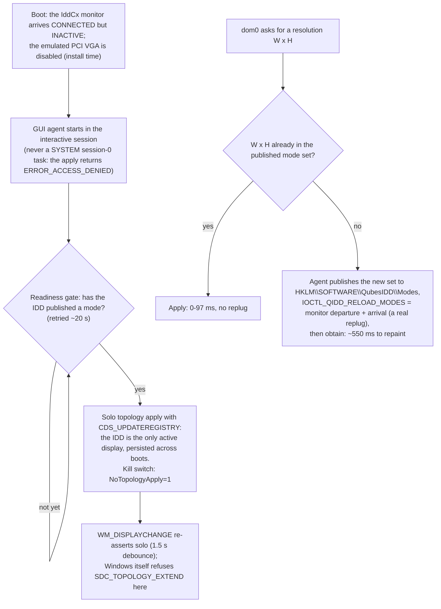

# ADR - display: the IddCx driver and the guest's screen (Track B)

Decisions about the QubesIDD indirect display driver: that it ships on, how the desktop lands on it, why no
other monitor may be active, where the mode list comes from, and the one thing the driver must never do
without the owner. Every decision here was already in force - in `CLAUDE.md` ("Displays (IDD)"), the README
("A real display driver") and the `findings/idd.md` head - and is collected here. Format and status
vocabulary: `docs/ADR-README.md`.

| record | content |
|---|---|
| `findings/idd.md` | the measurements, retractions and instrument traps behind every section |
| `driver/` | the IddCx driver (vendored from Microsoft's IddSample, MIT) |
| `agent/gui-agent/resolution.c` (`EnsureQubesIddSolo`, `IsQubesIddAdapter`, the mode-set builder) | where §2-§5 are enforced |
| `packaging/setup/install.cmd`, `guest/activate-idd.ps1`, `guest/deactivate-idd.ps1` | activation, the switches, the recovery path |
| `guest/health-check.ps1` | `idd_device_bound`, `desktop_on_idd`, `idd_modes_published`, `idd_single_node` |
| `docs/RESEARCH-hypervisor-resize.md` | how every other hypervisor injects modes, and why IddCx cannot |
| `docs/RELEASE-NOTES-idd-default.md` | the default-on decision as released (its "no /noidd" line is stale) |

| § | decision | status | date |
|---|---|---|---|
| 1 | The IddCx driver ships on and is the guest's sole active output | ACCEPTED (owner) | 4.3.1; switches 2026-08-14 |
| 2 | The desktop is put on the IDD by the agent, in the user session, behind a readiness gate | ACCEPTED | 2026-08-14 |
| 3 | A monitor dom0 does not see is INACTIVE, never merely uncaptured | ACCEPTED (owner) | 2026-08-27 |
| 4 | The mode list is ours: the agent is the sole writer, and nothing ever snaps | ACCEPTED | 2026-08-15 |
| 5 | The device is `Qubes Idd`, rebound in place; exactly one node | ACCEPTED (Jev 0.96) | 4.3.31 |
| 6 | The IDD never feeds frames through its own grant path without the owner's approval | ACCEPTED (owner), a standing gate | - |

How the desktop lands on the IDD at boot (§1-§3), and what a resolution request costs (§4):

---

## 1. The IddCx driver ships on and is the guest's sole active output

**Status:** ACCEPTED (owner). Default-on since 4.3.1; the `/noidd`, `/iddoff`, `/iddonly` switches since
2026-08-14.

**Context.** Stock Windows Tools ships no display driver. The guest runs on the emulated Basic Display
Adapter, whose mode list is FIXED at 29 modes (no 1600x1000, nothing arbitrary; `CDS_TEST` returns
`DISP_CHANGE_BADMODE`), so matching the guest resolution to a dom0 window is unreachable by construction. With
the IDD the OS offers only the intersection of monitor and target modes, so arbitrary sizes exist ONLY because
the driver publishes them; probe D2 was negative: no shortcut exists.

**Decision.**

1. The package installs and activates the Qubes IddCx driver by default: `pnputil` plus a `devcon` devnode
   `ROOT\DISPLAY\0000`, and the emulated PCI VGA (`VEN_1234&DEV_1111`) disabled. The IDD becomes the guest's
   sole active output (§3).
2. Activation failure completes the install so the guest stays usable, and is logged ERROR with
   `detail.idd_failed`, never silently.
3. It can be turned off, because arbitrary resolutions are the only thing that depends on it and a guest on
   the Basic Display Adapter is a reduced configuration, not a broken one: `install.cmd /noidd` (fresh install,
   never activate), `/iddoff` (back to the Basic Display Adapter and reboot; the RECOVERY path for a black
   unresponsive window, deliberately runnable over qrexec on a displayless guest: `NoTopologyApply=1`,
   re-enable the VGA, remove the IDD, reboot), `/iddonly` (re-activate; clears `NoTopologyApply`).

**Evidence.** Clean installs activate end to end on Win10 19045 (12/12 health gate, cold boot, IDD sole active
output) and Win11 24H2 (8/8 incl. `desktop_on_idd`), reconfirmed 2026-08-29 across four acceptance cells on one
unmodified CI package. `health-check.ps1` asserts `idd_device_bound`, `desktop_on_idd`, `idd_modes_published`
and is validated both ways (seen to fail on a degraded no-IDD guest). Intended PnP topology: IDD
`ROOT\DISPLAY\0000` err=0, emulated VGA err=22 (deliberate).

## 2. The desktop is put on the IDD by the agent, in the user session, behind a readiness gate

**Status:** ACCEPTED, 2026-08-14.

**Context.** Disabling the VGA is NOT sufficient: an IddCx monitor arrives connected but INACTIVE, and nothing
attaches it to the desktop until something performs a display-topology apply naming its path. The installer
cannot: its boot-resume task runs as SYSTEM in session 0, where the apply returns `ERROR_ACCESS_DENIED`.
Windows 11 happens to perform an apply on its own; Windows 10 does not, and the driver has no OS-build branch.
An earlier build shipped without the apply, so `/idd` worked on 11 and silently did nothing on 10.

**Decision.** `EnsureQubesIddSolo` runs in the GUI agent at startup, in the interactive session:

1. A readiness gate refuses to touch the topology until the IDD publishes a mode (retried about 20 s).
2. A solo apply with `CDS_UPDATEREGISTRY`, so the topology PERSISTS across boots (`tools/modeprobe --solo` is
   the manual equivalent).
3. Kill switch `NoTopologyApply=1`; fault knobs `SoloFaultInject`, `ModeSnapFaultInject`.
4. Never from a SYSTEM ONSTART task.

**Evidence.** Outcome A is formal (exp-9, 3 interleaved cold-boot rounds vs a Basic Display Adapter control,
6/6): `DesktopImageInSystemMemory` stays TRUE on the IDD output, `MapDesktopSurface` OK, pitch tight, zero
ACCESS_LOST or re-duplications, and the agent's adapter-0 selection lands on the IDD. Scope: console IddCx +
WARP + Win10 19045 + solo topology; not to be ported to GPU passthrough. A `WudfRd` event 219 at boot is a
recovered transient (the first UMDF load attempt fails, PnP retries, the IDD binds); `boot_events_clean` fails
on it only when `idd_device_bound` is also false.

## 3. A monitor dom0 does not see is INACTIVE, never merely uncaptured

**Status:** ACCEPTED (owner). Spec in `CLAUDE.md`.

**Decision.** Every display other than the IDD is DETACHED (`SetDisplayConfig`), not merely deprioritised or
left uncaptured. The IDD is the only active output; the emulated VGA stays disabled; AppVMs inherit the
template's VGA disable through the volatile root and boot solo.

**Why.** An additional active display enlarges the desktop bounding box the agent maps as the screen, which
lets Windows place windows in a region dom0 never looks at and breaks seamless coordinates.

**Measured defences.** Windows refuses `SDC_TOPOLOGY_EXTEND` on the IDD guest (returns 31,
`ERROR_GEN_FAILURE`, even with the VGA re-enabled; `DisplaySwitch /extend` no-ops); `WM_DISPLAYCHANGE` fires a
1.5 s-debounced IDD-solo re-assert. **Retracted:** "an active second monitor inflates `g_ScreenWidth`" -
`g_ScreenWidth/Height` is the PRIMARY display mode, not the virtual-desktop bounding box, so a second monitor
cannot mis-size the fullscreen gate; the rule stands for window placement, not for that gate.

**Open.** The never-headless guard (readiness gate + detach rollback, agent 6ea0822) is UNPROVEN: on both Win10
22H2 and Win11 26200 Windows refuses to detach the last attached display, so the persisted-headless state is
structurally unreachable and the rollback has never fired, even with `SoloFaultInject=2`. The gate stands on
its own reasoning; the rollback is defence in depth. `desktop_on_idd`'s fail-proof is still owed (disabling the
apply cannot revert an already-persisted topology).

## 4. The mode list is ours: the agent is the sole writer, and nothing ever snaps

**Status:** ACCEPTED. The snap trap fixed in agent 5e752d6 (2026-08-15); the host-size rule in cb1fa4b.

**Context.** `SelectSupportedMode` never fails: it silently snaps to the nearest cached base-list mode AND
persists the snapped size, so a "default to WxH" change can appear to work while applying a different
resolution. Before the fix, only the `dom0` and `seamless-force` request sources took the publish-and-obtain
path; boot-restore (`lastapplied`) and `xconf` fell through to the snap, pinning a 1920x1200 guest at 1920x1080
forever (GWeck's ~1 cm pointer offset and dead band).

**Decision.**

1. The agent writes the mode list as `REG_MULTI_SZ` `HKLM\SOFTWARE\QubesIDD\Modes` and is its SOLE writer (the
   `resize-sync.ps1` prototype that once raced it is removed). The driver reads the key at monitor arrival and
   accepts 640..16384 x 480..6144.
2. With the Qubes IDD present, EVERY resolution-request source takes the publish-and-obtain path. Snapping is
   forbidden.
3. The mode-set builder publishes target + work-area maximize + tile halves + a 1024x768 fallback, deduped,
   replace-not-append. The HOST size is added ONLY while seamless is active: without it seamless dies with
   `DISP_CHANGE_BADMODE` (5120x1440 not in the set), and with it always present a non-seamless guest could
   select its way to fullscreen (`docs/ADR-windows.md` §5).
4. A live reload is `IOCTL_QIDD_RELOAD_MODES` on the device interface: monitor departure, re-create, arrival -
   a REAL hot replug. The fallback, a PnP device restart, is worse (it disturbs the Xen platform device).
5. The BOOT path publishes with NO reload (`ResolutionPublishBootModeSet`, "live on the next obtain"): the
   boot-time reload was the #1 ACCESS_LOST trigger (17 of 24 recorded events; removing it took
   access_lost/capture-init-fail/retry from 4/1/2 to 1/0/0 across 3 interleaved cold-boot rounds).
6. The single monitor carries a fixed 128-byte Qubes EDID (vendor QBS, product 0x0001, serial "QBS0001",
   preferred 1920x1080@60) with physical size undefined so scaling pins at 96 DPI for every mode; the parse
   callback never gates on EDID content.
7. `DriverVer` is pinned by `build.yml` after stampinf (`<date>,4.3.<build>.<rev>`): stampinf's build-time
   version put some packages into the WDDM-2.x encoding space, where registry modes never surface - that was the
   whole "4.3.8 broke arbitrary resolutions" regression, deterministic per build hour.

**Cost.** Every NOVEL size costs a replug: display re-enumeration and a desktop-duplication teardown, measured
as ~550 ms to repaint (`replug=1`) against 0-97 ms for a size already in the set. Dragging a dom0 window sweeps
through arbitrary sizes, so it pays that on each settle. The device-connect chime a replug plays is silenced
product-side (`guest/quiet-desktop.ps1`, 4.3.13, for every loaded and offline profile). Task #26 (resize
latency/hot-plug) stays open: `IddCxMonitorUpdateModes` was tried and reverted (it removes the replug, but
capture still dies and the new size likely never becomes available); every other hypervisor injects a mode
slot through raw DXGK verbs IddCx hides (`docs/RESEARCH-hypervisor-resize.md`).

**Evidence.** The snap fix was proven with the defect reintroduced (`ModeSnapFaultInject` on the same binary);
an A/B is void unless the mode set is reset between runs. Gate B: seamless on IDD-primary passed on a cold
boot. Instrument traps: `WmiMonitorListedSupportedSourceModes` reports EDID timings, not the effective set;
`EnumDisplaySettings` needs the explicit device name (`\\.\DISPLAY2`) and `dmSize`, and returns nothing from
the qrexec SYSTEM context.

## 5. The device is `Qubes Idd`, rebound in place; exactly one node

**Status:** ACCEPTED (Jev 0.96 over create-new-then-remove-old 0.02), 4.3.31.

**Context.** Before 4.3.31 Device Manager showed the sample's untouched placeholders (`IddSampleDriver
Device`, `<Your manufacturer name>`). Removing the old node to create a new one would run on the guest's only
display.

**Decision.** The device is `Qubes Idd` by `Qubes OS (QWT-NG fork)`, hardware id `root\qubesidd`. The INF
declares BOTH models lines (`Root\QubesIdd` + `Root\IddSampleDriver`) into ONE install section, so a pre-4.3.31
guest keeps the devnode its desktop is on and the package rebinds it in place. Lookups take the id FAMILY
(`Get-IddPnpDevices`/`Get-IddDev` take lists) while `devcon` create/update/remove use the id the node actually
has. The agent matches EITHER name (`IsQubesIddAdapter`: exact on `Qubes Idd`, prefix on the legacy string),
because a new agent can run against an older driver store entry. New checks: `idd_single_node`,
`idd_device_name`, `idd_agent_identified`.

**Evidence.** Measured on the upgrade (win11-up, golden 4.3.17 -> 4.3.31, quick-upgrade 9/9): the rebind
rewrites `DeviceDesc`; the node kept hardware id `root\iddsampledriver` and reads `Qubes Idd`, one node,
desktop on it at 5120x1440; Jev's predicted worst side effect (the name not reaching an upgraded node, 0.91)
did not occur. `idd_single_node` was seen to fail with the defect present: a deliberate second `devcon install
... root\qubesidd` produced `ROOT\DISPLAY\0001` beside `\0000`, and the desktop dropped 5120x1440 -> 1920x1080
- exactly the topology damage the check exists to catch.

## 6. The IDD never feeds frames through its own grant path without the owner's approval

**Status:** ACCEPTED (owner), a standing gate in `CLAUDE.md`.

**Decision.** If the IDD ever has to feed frames to dom0 through its own grant path - a staging copy in the
swapchain loop plus xeniface gnttab IOCTLs - rather than through the existing capture, work STOPS and the plan
is presented to the owner before it starts. Anything touching the GUI protocol, gui-daemon or the grant
lifecycle needs a design writeup, owner review and an upstream design issue (referencing #1861) before code.

**Why.** The frame path is the security boundary of the seamless model; a driver-side grant is a new path
across it, and the project's mission is zero security-model changes.
