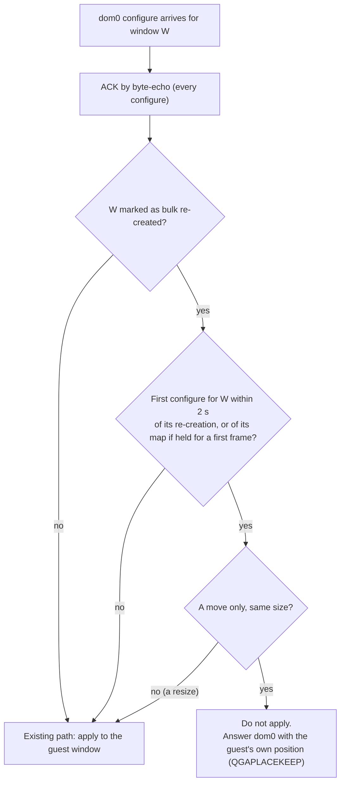
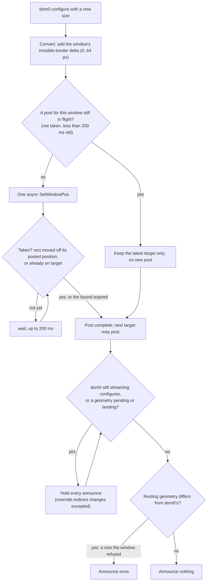

# ADR - geometry: window geometry between the guest and dom0

## In plain English

Two defects in how windows are placed and resized between the guest and dom0, and the rules that fixed them.

Placement after a restart. Each time the agent restarted, every guest window crept 5 pixels right and 25
pixels down. dom0's window manager places a new window's frame where the guest said the window is, then
reports the client area one frame-size further down and right, and the agent applied that reported position to
the guest window. Now a window the agent re-creates in bulk keeps its guest position: dom0's first move-only
placement is acknowledged, as the protocol requires, and then answered with the guest's own position instead
of being applied. The cost is one extra message per re-created window.

Resizing from dom0. Dragging a window's edge in dom0 produced hundreds of resize requests. The guest applied
every one (about 90 ms each for a complex application), lagged seconds behind, kept resizing after the mouse
was released, and announced slightly wrong sizes back, which dom0 then applied in turn. Now at most one resize
is in flight per window until the window has taken it, the guest says nothing about geometry while dom0 is
still dragging, and it announces its resting size once, only if that differs from what dom0 asked for. The
invisible border Windows adds around a window is accounted for, so sizes match exactly. Verified on the
owner's own drag: 310 requests became 54 applied resizes, and the owner's verdict was "all perfect".

How a dom0 placement is handled after the agent re-creates a window (§1):

How a dom0 resize lands (§2):

## The decisions at a glance

| § | decision | status | date |
|---|---|---|---|
| 1 | A re-created window keeps its guest position; dom0's frame placement is answered, not obeyed | ACCEPTED (Jev) | 2026-10-01 |
| 2 | A dom0 resize lands once and settles | ACCEPTED (Jev) | 2026-10-02 |

Status words and the section format are defined in `docs/ADR-README.md`.

---

## The decisions in detail

Where the details live:

| record | content |
|---|---|
| `agent/gui-agent/` | the agent code (`RestartPlacementTick`, the geometry post gate) |
| gui-daemon source (`mkwindow`, `have_queued_configure`, `moveresize_vm_window`) | the dom0 side these decisions answer to; not ours to change |
| `findings/issues.md` | open defects |

## 1. A re-created window keeps its guest position; dom0's frame placement is answered, not obeyed

**Status:** ACCEPTED (Jev 0.84), 2026-10-01. Agent 05492e5 and b4c4fda.

**Context.** Measured 2026-10-01: nine consecutive agent restarts moved every guest window by (+5, +25) each
time. That offset is dom0's window-manager border and title bar (owner). The daemon's source explains it: a
created window is placed with size hints only (`mkwindow`: PSize, no frame compensation), so the window manager
puts the window's FRAME at the guest position and reports the client area one frame-size down and to the right.
The agent then applied that client position to the guest window, and the next restart repeated the shift.

Two more daemon facts shape the fix. While the daemon awaits the ACK of its own configure it ignores any other
geometry (`have_queued_configure`). Once acked, it applies an agent configure with `_NET_FRAME_EXTENTS`
subtracted (`moveresize_vm_window`). So the agent's answer has to follow the ACK, and then the client lands where
the guest says.

Owner: priority P3, "try a cheap fix and drop it if it is complicated". Jev: this candidate 0.84 over dropping
it 0.16; review: correct 0.70, ping-pong 0.22, still cheap 0.71.

**Decision.** Windows the agent re-creates in a bulk pass (its own start; seamless re-entry) are marked.

1. For a marked window, the first configure dom0 sends within 2 s that only MOVES it is ACKed by byte-echo, as
   every configure is, and then answered with the guest's own position instead of being applied to the guest
   window.
2. Everything else takes the existing path: an echo, a resize, a later move, a dom0 that answers with the offset
   again.
3. For a window held for its first frame, the 2 s start at its map, which is where dom0's window manager places
   it (b4c4fda, Jev 0.85).

Code: `RestartPlacementTick`; log tag `QGAPLACEKEEP`.

(The flowchart for this decision is in "In plain English" at the top of this file.)

**Cost.** One extra configure per re-created window. A new window (not a bulk re-creation) is placed by dom0 as
before.

**Evidence.** Seen to fail: the nine-restart creep on rz17 and rz18. Seen to pass: owed on rz21.

**Open.** The daemon-side fix (a position hint or StaticGravity on created windows) is outside this repo;
upstream only with the owner's approval of the exact text.

## 2. A dom0 resize lands once and settles

**Status:** ACCEPTED (Jev), 2026-10-02. Agent 001b525 (build rz23).

**Context.** The owner: "resize and settle its contents if we do resize at all, not iterative self-driven border
changes". Their traced drag of Settings (2026-10-02 00:00) showed three defects at once:

- 650 dom0 configures became 519 size-only SetWindowPos posts, none of them gated. The 2026-08-12 latest-wins
  gate compared only the origin, so a size change always went through. Settings takes about 90 ms to re-lay out
  one step, so the window lagged the drag by p50 1.9 s, max 9.9 s, and kept replaying for 3.6 s after release.
- 444 of its lagging sizes were announced back to dom0 during the drag and 45 after it, and the daemon applied
  each one.
- 392 + 45 of those announced sizes were dom0's size minus 14x7, because SetWindowPos had received
  announce-space sizes, without the window's invisible border.

**Decision.** For every window dom0 resizes (owner: "all windows"):

1. **Gate.** A size-only post is in flight like a move: at most one asynchronous SetWindowPos per window until
   the window TAKES it, bounded by the existing 200 ms. "Taken" means its rect moved away from where it was when
   the post was made, or it already sits on the target. Taking the post, not reaching the exact target, is the
   gate, so a window that snaps or clamps its size still follows a drag.
2. **Hold.** Every geometry announce, size included, is held while dom0 streams configures or while its last
   geometry is pending or landing. The resting geometry is then announced once, and only where it differs from
   dom0's (a size the window refused). Override-redirect changes are not held.
3. **Convert.** The dictated size gets the window's invisible-border delta added back: GetWindowRect minus the
   DWM bounds, measured together with the origin delta, 0..64 px.

(The flowchart for this decision is in "In plain English" at the top of this file.)

**Superseded before commit.** An earlier candidate held a UWP frame's resize until the configures stopped and
applied it once (Jev 0.72 at the time). It rested on the claim that "the app's content stayed at 502x1141",
which was FALSE: WGC's last arrival was 897x728, so the window had resized. The stale picture was the capture
path publishing nothing after the resize, a separate defect then under reproduction. On the corrected facts Jev
chose the root causes above at 0.93. Review before commit: at most one post waits behind a slow layout 0.84;
snapping windows follow 0.91; a refused size reaches dom0 once 0.86; conversion right 0.80; commit 0.62.

**Cost.** A guest-initiated change is announced up to 200 ms late while a lone dom0 configure lands.

**Evidence.**

- Seen to fail: the drag-replay metric (ACKs paired by order) on settings-drag-1, build rz21: 392 own announces
  during the drag (391 of them dom0's size minus 14x7), 45 after it over 3.61 s, final size 897x728 against
  dom0's 911x735.
- Seen to pass (2026-10-02 01:03, build rz23 = 001b525, the owner's own drag; owner: "all perfect"): 310
  configures became 54 posts; 2 own announces during the drag and 3 in the 0.41 s after it, the last one dom0's
  final 1087x850; none dom0-minus-14x7; the capture settled at the final size (published frame = request).
- On an ordinary window (resize-ab-1: dom0's local.WinResize on the largest Win32 window, CTL rz21 / NEW rz23
  interleaved, 3 rounds of shrink + restore): CTL ended 12x6 short in 6 of 6 resizes (the window drifted from
  3802 to 3766 px wide over the rounds); NEW was exact in 6 of 6.

**Residual.** The 3 announces after release: Settings took more than 200 ms per resize at about 1100x860, so the
in-flight bound expired, two more posts queued, and an older post landing read as the newest taken. The border
stepped by up to 10 px for 54 ms, 0.35 s after release, then held. Remedy if it is ever seen again: a longer
in-flight bound for size posts (the bound only guards a window that never changes).
