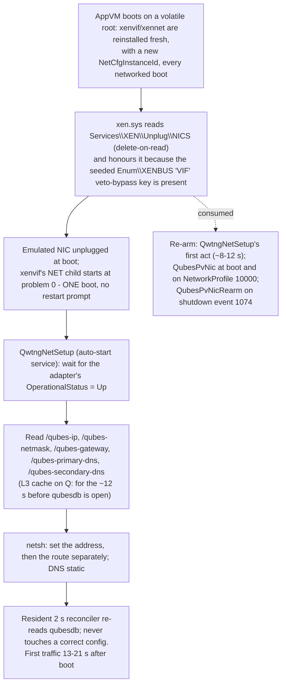

# ADR - network: PV networking with no netvm at install, and no second boot

## In plain English

A Windows qube's network interface is a Xen paravirtual device, like a Linux qube's. Stock Windows Tools never
got it to bind (its own two drivers disagreed on a revision number) and silently fell back to an emulated
Realtek card. We ship a corrected driver.

Binding has a second problem specific to app qubes. Their system disk is reset at every boot, so the network
driver is re-installed on every boot, and the first installation in a boot demands a restart, which an app
qube can never complete: it would reset forever. Windows' Xen driver skips that restart only if a one-shot
"unplug the emulated card" flag is set, and it erases the flag every time it reads it. We set that flag, the
latch, in the template, with no network attached at any point, and re-arm it at every opportunity: at boot, at
shutdown, when the network service starts, when the installer finishes. The build fails if the re-arm cannot
be read back. Attaching a network to a running qube then works in the same boot with no restart, and needing a
second boot is a failure.

The IP configuration comes from the Qubes database and nowhere else. The stock applier ran at the wrong moment
and tore down a correct address, so it is deleted and replaced by our own service, which waits for the adapter
to come up, applies address, route and DNS, and keeps them correct. DHCP is not part of the design and is
scrubbed from the image; the DHCP client service stays enabled because Windows' network awareness depends on
it. Connectivity is proven by transferring a file and checking the adapter's byte counters, never by pinging
the gateway, which a Qubes firewall does not answer. Defects found in the firewall itself (the Mirage
unikernel) were fixed there and submitted upstream with the owner's approval.

What happens on an app qube's boot (§2-§5):

## The decisions at a glance

| § | decision | status | date |
|---|---|---|---|
| 1 | Templates never have a netvm; the guests that test PV networking must | ACCEPTED (owner) | 2026-08-29 |
| 2 | PV networking is primed in the template with the unplug latch, no netvm ever attached | ACCEPTED (owner D1: unconditional) | 2026-08-19 |
| 3 | The latch is re-armed at every layer, because reading it consumes it | ACCEPTED | 2026-08-23 |
| 4 | Stock `network-setup.exe` is deleted; `QwtngNetSetup` owns L3 from qubesdb alone | ACCEPTED | 2026-08-23 |
| 5 | DHCP is not part of the design and is off in the image; the DHCP Client service stays enabled | ACCEPTED | 2026-08-23 |
| 6 | A second boot is a failure; traffic is proven by a file transfer | ACCEPTED (owner) | 2026-08-29 |
| 7 | Our xenvif ships, not stock's | ACCEPTED | 2026-08-23 |
| 8 | A netvm's defects are fixed in the netvm, upstream, with the owner's approval of the text | ACCEPTED (owner) | 2026-08-24 |

Status words and the section format are defined in `docs/ADR-README.md`.

---

## The decisions in detail

Where the details live:

| record | content |
|---|---|
| `findings/network.md` | the measurements, retractions and instrument traps behind every section |
| `guest/pvnic-selfprime.ps1` | the latch installer, the applier and the embedded `QwtngNetSetup` service; its header states the mechanism |
| `mgmt/clone-to-template.sh` (`PRIME_NETVM=latch`, `scrub_net_identity`) | how a template is primed and scrubbed |
| `patches/xenvif-ctrl-ring-fix.patch`, the pv-xenvif CI pipeline | our xenvif |
| `docs/ACCEPTANCE-PROTOCOL.md` (NET-2, NET-6, NET-7, C11) | the acceptance cells |
| `guest/health-check.ps1` | PV NIC bound, traffic by counters |

## 1. Templates never have a netvm; the guests that test PV networking must

**Status:** ACCEPTED (owner). Spec in `CLAUDE.md`.

**Decision.** Templates (`win10-tpl`, `win11-tpl`) carry `netvm=''` forever; a template with a netvm is a
STOP. Installs happen offline and the netvm is attached afterwards. AppVMs and StandaloneVMs that exercise PV
networking MUST have one (`qvm-prefs <vm> netvm fw-net`). Payload still ships via `qtest push`; the netvm
exercises the PV NIC.

**Why.** The template is what every AppVM is restored from; anything a vif leaves in it (a DHCP lease, a
NetworkList profile, an interface GUID) ships to every qube. The priming that used to need a netvm leaked
exactly that (§5).

## 2. PV networking is primed in the template with the unplug latch, no netvm ever attached

**Status:** ACCEPTED. Unconditional for every qube class, StandaloneVMs included (owner decision D1, commit
cace671): a standalone reading `skipped-non-template` is a regression (protocol C11).

**Context.** Measured 2026-08-17/18 and verified in the pvdrivers source: the first time a vif appears,
xenvif's NET-child START handler fails with `STATUS_PNP_REBOOT_REQUIRED` (problem 14) unless the boot-time
emulated-NIC unplug already happened in that same boot. The unplug is gated on `Services\XEN\Unplug\NICS`, which
`xen.sys` CONSUMES (delete-on-read) at every boot and VETOES unless some `Enum\XENBUS` subkey name contains
`VIF`. An AppVM's volatile root discards the half-finished install every boot, so without the latch an AppVM
reset-loops: the field reports of an AppVM dying seconds after start (forum post 89; GWeck 56/70) were this,
reproduced on demand (`NICS=0` -> Dying at ~20 s). Where the root persists it is one surprising restart with a
black window for ~30 s.

**Decision.** The template is primed with the unplug latch (`PRIME_NETVM=latch`): the `NICS` value and the
`VIF` veto-bypass key are seeded, so the per-boot fresh install completes in ONE boot at problem 0 with no
netvm ever attached. One-boot completion of that per-boot install IS the acceptance property (protocol ST4:
"transient by design, never parked"). The installer is transactional: it registers and verifies the tasks
FIRST, and the latch is only ever armed BY the task, so a failed registration leaves the template un-latched
(the known LOUD crash state), never latched without an applier (the forbidden SILENT APIPA state).

**Rejected, all measured dead.** Copying primed registry/device state creates a one-way-door devnode (PnP
problem 31, NIC silently dead forever; tested twice); synthesising the devnode is refused by SetupAPI
(`0xE0000209` on a foreign bus enumerator); GUID pinning has zero consumers (the adapter is born with a new
`NetCfgInstanceId` every boot). Priming through a real netvm (`PRIME_NETVM=<netvm>`) still works and coexists
with the latch, but is never used on templates (§1).

**Cost.** What the latch does NOT provide is L3 configuration: no DHCP exists on the PV vif path (the DHCP
server in the stubdom serves only the emulated NIC), hence §4.

## 3. The latch is re-armed at every layer, because reading it consumes it

**Status:** ACCEPTED, 2026-08-23.

**Context.** Delete-on-read makes re-arming load-bearing: ANY template boot consumes `NICS`, so an innocent
inspection boot ships an un-latched template and reset-loops every AppVM. The 4.3.4 shipped installer left
every user template un-latched (only the internal pipeline re-armed). A PV INF `AddReg` rewrites `NICS` with no
NOCLOBBER, so a QWT or PV-driver upgrade clobbers it too.

**Decision.** The latch is re-armed:

1. by the `QubesPvNic` SYSTEM task at boot and on NetworkProfile event 10000, which then runs a bounded
   verify-retry of the applier with settle re-verification, loud on failure (marker file, event log, interactive
   message);
2. by the `QubesPvNicRearm` SYSTEM task on System/User32 event 1074 (shutdown initiated), covering "boot -> an
   upgrade rewrites NICS=0 -> shutdown" and boots that die before the startup task;
3. by `QwtngNetSetup` as its FIRST act (~8-12 s into the boot);
4. by the installer as its last act before the install shutdown, with readback;
5. by `scrub_net_identity`, which FAILS the build on no readback.

Also seeded: `NewNetworkWindowOff`, `DriverSearching SearchOrderConfig=0` (no Windows Update driver search on
the per-boot install), `powercfg /h off`, and `ExcludeWUDriversInQualityUpdate=1`, which also guards the latch
against WU-delivered Xen PV packages.

**Evidence.** Defect-reintroduction proof: both tasks disabled + one template boot -> the AppVM died at 20 s.

## 4. Stock `network-setup.exe` is deleted; `QwtngNetSetup` owns L3 from qubesdb alone

**Status:** ACCEPTED, 2026-08-23; review fixes shipped in 4.3.7.

**Context.** Stock `network-setup.exe` ran once at QrexecAgent start, usually before the per-boot install
finished, mapped "no matching adapter" to silent success, and its second per-boot run tore down a correct
address (the old mid-boot outage). Hence APIPA on a healthy PV link. Clearing QWT's `Autostart` value did not
stop it: with no `Autostart` present it still ran twice.

**Decision.**

1. The stock binary is DELETED, only AFTER the replacement registers (fail-closed `sc create`). The job belongs
   to `QwtngNetSetup`, a native C# auto-start service (`bin\qwtng-netsetup.exe`, embedded in
   `pvnic-selfprime.ps1`), SCM-recovered (`docs/ADR-supervision.md` §4).
2. The applier is PURE qubesdb: `/qubes-ip`, `/qubes-netmask`, `/qubes-gateway`, DNS from
   `/qubes-primary-dns` and `/qubes-secondary-dns` with 10.139.1.1/.2 as fallback only; stock detection and value
   sources are dropped. The qubesdb client DLL via P/Invoke is what works (the `qubesdb-cmd` CLI is broken in
   both directions).
3. Constraints, each measured: wait for the adapter's `OperationalStatus.Up` (applying mid-PV-install makes
   the AppVM halt itself); `netsh`, not WMI (`EnableStatic` returns 66 on the Qubes /32); address and route set
   SEPARATELY (the combined form pings the gateway, +10 s on mirage); an L3 cache on `Q:\qwtng-netcfg.txt`
   (qubesdb is not open at ~12 s); then a resident 2 s reconciler that re-reads qubesdb and never touches a
   correct config.
4. `VifDevicePresent` is `-PresentOnly` (ghost devnodes from a detached netvm otherwise hang the no-netvm quiet
   exit). The gateway ping is NOT part of any verdict: a Qubes or mirage gateway never echoes, and the ICMP
   check once raised "network configuration FAILED" on a healthy 12 MB/s link.
5. The service's log and L3 cache live on `Q:` (`Q:\Qubes Logs`, `Q:\qwtng-netcfg.txt`) so AppVM post-mortems
   survive the volatile root.

**Evidence.** First traffic 13-21 s, 0 failures in 21 samples per cold boot (~22-28 s from `qvm-start`). A
live netvm switch on a running guest keeps the address, the default route is back ~1.5 s after the vif, total
outage ~4 s. **Unmeasured:** whether a restored subject can carry another lineage's stale `Q:` cache, which the
service would apply early in the boot until qubesdb refreshes it.

## 5. DHCP is not part of the design and is off in the image; the DHCP Client service stays enabled

**Status:** ACCEPTED, 2026-08-23.

**Decision.** `scrub_net_identity` (both prime paths, on its own offline boot) clears leases, the DUID and
`NetworkList`, sets `EnableDHCP=0` on every interface, writes `NameServer=10.139.1.1,10.139.1.2`, re-arms the
latch, and fails the build on residue readback. The DHCP Client SERVICE is NOT disabled: the scrub ENFORCES
`Start=2`.

**Why.** `qvm-firewall` drop rules are FORWARD-only and never stopped DHCP to the gateway itself, so
vif-priming leaked leases into shipped templates; a Linux qube runs no DHCP client at all, and Windows now
matches. Disabling the service was measured WORSE (first traffic 51-58 s against 25-33 s): it drives NLA and
the NetworkProfile event the applier task triggers on.

## 6. A second boot is a failure; traffic is proven by a file transfer

**Status:** ACCEPTED (owner). Spec in `CLAUDE.md`; the retractions in `findings/network.md`.

**Decision.** The PV-network acceptance protocol:

1. An AppVM with our QWT takes an immediate netvm attach with ZERO reboots: the vif appears, the PV NIC binds,
   the emulated adapter unplugs, same boot. Needing a second boot means the latch or the applier is absent or
   broken; a bare StandaloneVM with no applier is not the configuration to accept against. Verify the applier
   is present (`TASK QubesPvNic`, the script, `UNPLUG_NICS=1`) BEFORE grading.
2. Grade no sooner than ~90 s after qrexec comes up (instant: `dns=False`, rx=153,487 B; +90 s: `dns=True`,
   rx=9,463,443 B).
3. Traffic is asserted with a FILE TRANSFER of a few MB, cross-checked against the XENVIF adapter's own
   `rx_bytes` delta, never by pinging the gateway. DNS or a TCP connect is only a smoke test. Throughput goes
   against a fast CDN (NET-8 reference 258.2 Mbit/s); a mirror download characterises the upstream, never the PV
   link.
4. A guest that has already seen a vif cannot test first-vif behaviour: NET-6 needs a guest with the XENVIF
   enum absent including ghosts and zero `XENVIF\*` PnP devices (the seeded `Enum\XENBUS\VEN_XP0001&DEV_VIF`
   key is the latch, not evidence of a vif), with the watcher armed before the vif appears.
5. The premature reboot dialog ("Xen PV Network Class needs to restart the system") is a NETWORK-path event:
   a `netvm=''` result proves nothing about it. Our package raises none (0/69 with the watcher armed before the
   first-ever vif); stock QWT's first-logon install does. The suppressor clears the pending request and disables
   the PV reboot-prompt service (`xenbus_monitor`, stopped and disabled for every qube class since 4.3.7); it
   cannot dismiss an already-displayed dialog.

**Evidence.** NET-2/NET-7 met: AppVM `win11-app` PV NIC bound in 26 s, StandaloneVM `win10-u10` in 25 s,
`LastBootUpTime` byte-identical, 0 dialogs, emulated NIC unplugged. The earlier "first-vif needs two boots" and
"hotplug fails / standalone does not meet acceptance" are RETRACTED: every failing subject had no applier
(pre-cace671). The 4.3.16 campaign: 28 network checks, 0 FAIL, including 3/3 boot soak with a real qubesdb IP
and no APIPA. The health-check instrument traps that once inverted these verdicts (test loopback adapters
graded as physical NICs, the first adapter's APIPA graded, ping-gateway as the criterion) are recorded in
`findings/network.md`, not here.

## 7. Our xenvif ships, not stock's

**Status:** ACCEPTED, 2026-08-23.

**Context.** QWT 4.2.2's own xenvif enumerates the NET child at `REV_09000004` max while its own xennet claims
only `REV_09000005`: no hardware id intersects, PnP code 28, and the guest silently falls back to the emulated
Realtek NIC. Proven on a clean never-touched guest. Separately, with no backend `feature-ctrl-ring` xenvif's
control ring is never created yet `ControllerEnable` sets Enabled, `RING_FULL` is trivially true,
`FrontendEnable` fails and the whole NIC is dead (cmErr 43, reproduced on mirage).

**Decision.** Our xenvif is built from xenbits master (rev 5 / UNPLUG v3, the pv-xenvif CI pipeline) with
`patches/xenvif-ctrl-ring-fix.patch` applied unconditionally (deliberately split from the opt-in diagnostic).
Everything else in the MSI except gui-agent and the IDD is staged bit-for-bit from the GPG-verified stock 4.2.2
MSI. `install_patched_xenvif()` runs BEFORE priming (a PV INF `AddReg` rewrites `NICS`), and the pipeline fails
the build if the driver is not confirmed.

**Open.** The ctrl-ring defect is upstream's (win-pv-devel); the report was drafted and is UNSENT as last
recorded, pending the owner's approval of the text. Re-check before assuming it was sent.

## 8. A netvm's defects are fixed in the netvm, upstream, with the owner's approval of the text

**Status:** ACCEPTED (owner); PRs published 2026-08-24.

**Context.** A Windows HVM on an unpatched qubes-mirage-firewall wedges the guest: xenvif busy-waits at
DISPATCH_LEVEL under `Frontend->Lock`, ~2 cores, no qrexec, no ACPI. Five defects were found: mirage-net-xen's
close/reconnect state machine; `disconnect_backend` deleting the backend dir (read as a hot-unplug, a permanent
NIC eject); an InitWait-to-closing livelock with an unguarded `Lwt.async` (which crashed the live firewall);
and the throughput collapse - mirage never set `NETRXF_data_validated` on aggregated GSO frames, so xenvif's
re-segmented copies failed checksum verification and TCP equilibrated at ~0.05 MB/s (one-line fix 12fc0d4).

**Decision.** Defects in components that are not ours are fixed there and reported upstream, only with the
owner's approval of the exact text (`CLAUDE.md`). mirage/mirage-net-xen#121 and mirage/qubes-mirage-firewall#232
were published 2026-08-24 with the library-first ordering disclosed; the owner's production firewall `fw-net`
has carried the patched unikernel since. Nothing in the guest works around a netvm defect.

**Evidence.** The submitted build measured on the rig: Windows 15-16 MB/s, Linux 15.5-17.7 MB/s on the same
backend, no Linux-pair regression (the `rx_gso_checksum_fixup` falsifier held). Upstream status after
2026-08-24 is unknown; re-check before acting.
