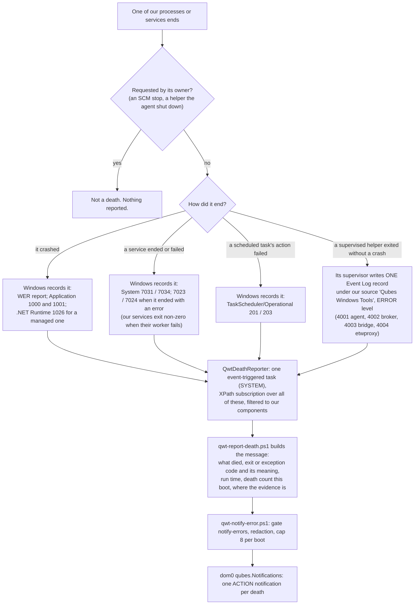

# ADR - supervision: how our components are kept alive, and how their deaths are made loud

## In plain English

When one of our programs or services crashes or quits without being asked, that is a serious error, and the
person using the qube must see it. It is not a warning line buried in a log while a watchdog quietly restarts
the program. Every such death is logged as an error and reported to dom0 as a notification, every time,
counted, up to a storm cap of eight per boot.

Deaths are detected from the records Windows already keeps: crash reports, service-failure events, scheduled-
task failures. We do not write our own watchdog scripts. The one case Windows cannot see, a helper exiting
cleanly but unexpectedly, is written by its supervisor as a single event in the same log. One scheduled task
subscribes to all of those records and sends the one notification, which says what died, the error code and
its meaning, how long the program had run, how many deaths this boot, and where the evidence is.

Restarts use the operating system's own recovery. Every service we install has recovery actions. Helpers use
the scheduler's restart settings where its one-minute minimum interval fits, and our own bounded relaunch only
where a helper must be back within seconds. The GUI agent keeps its small watchdog service, because starting a
system-privileged process inside the user's session is the one job nothing in Windows does for us. There are
no polling loops and no kill loops: a state that must hold is configured at its source. All of this was built
on 2026-10-03. What remains is to demonstrate the chain on a real guest with a forced crash.

The whole chain, from a death to the notification in dom0 (§1-§4):

## The decisions at a glance

| § | decision | status | date |
|---|---|---|---|
| 1 | Anything of ours that dies unexpectedly is a major ERROR, and it is LOUD | ACCEPTED (owner; Jev 0.74) | 2026-10-03 |
| 2 | Detection uses the system's own records | ACCEPTED (owner; Jev 0.86) | 2026-10-03 |
| 3 | ONE reporter, and the notification is ours | ACCEPTED (owner) | 2026-10-03 |
| 4 | Restarts use system recovery; a supervisor service only where nothing else can do the job | ACCEPTED (owner; Jev 0.99) | 2026-10-03 |
| 5 | Nothing of ours relaunches anything: an exit code is a contract, the relauncher is disarmed before its target is ended, and a loud error the user must see reaches them even when dom0 cannot be told | ACCEPTED (owner) | 2026-10-07 |

Status words and the section format are defined in `docs/ADR-README.md`.

---

## The decisions in detail

Where the details live:

| record | content |
|---|---|
| `docs/DESIGN-error-notify.md` | the error-notify route (`service.notify-errors`) that carries the death notification |
| `guest/qwt-report-death.ps1`, `guest/qwt-notify-error.ps1` | the reporter's action and the route it sends through |
| `include/deathevent.h` (agent) | the one Event Log record a supervisor writes per death |
| `patches/windows-utils-service-exit-code.patch` | services exit non-zero when their worker fails |
| `guest/health-check.ps1` (step 2b) | asserts every service's recovery settings |
| `tools/tests/death-reporter-*`, `svc-exitcode-selftest.sh`, `supervision-install-selftest.sh`, `health-recovery-selftest.sh` | the offline proofs |
| `findings/issues.md` | what is still owed on a guest |

## 1. Anything of ours that dies unexpectedly is a major ERROR, and it is LOUD

**Status:** ACCEPTED (owner; Jev 0.74 with the owner's rule as premise), 2026-10-03.

**Context.** On 2026-10-03 a GUI agent crash (fast-fail `0xC0000409`) sat in Windows Error Reporting on a test
guest. The watchdog's single warning line was the only other trace. The owner: "anything that dies unexpectedly
should signal LOUD" and "it is not fucking warning! it is a major error!". A relaunch that only writes a warning
line hides the failure. That is exactly the shape this project's rules forbid for fallbacks and for components
that stop working.

**Decision.**

1. Every unexpected death of one of our processes or services is an **ERROR** in our own logs, never a warning.
2. Every death is an **ACTION** notification to dom0, each one counted. A second death in the same boot is a
   second notification, never hidden by de-duplication. The existing per-boot storm cap (eight) still bounds a
   crash loop; past the cap every death is still logged as an ERROR.
3. This applies to the GUI agent, to every helper a supervisor relaunches (the WGC broker, the notification
   bridge, etwproxy), and to every service we install.
4. "Unexpected" means not requested by the component's owner. A service stop the service manager asked for, or
   a helper the agent shut down, is not a death.
5. A relaunch still follows where the GUI or a channel must come back. It is never a quiet recovery again.

## 2. Detection uses the system's own records

**Status:** ACCEPTED (owner; Jev 0.86), 2026-10-03.

**Context.** The owner: "use system mechanisms, not ad hoc watchdog scripts". Windows already records every
kind of death we care about, on every install, at no cost, in records the platform's own tooling trusts.
Per-component reporting code would be a second, partial, inconsistent copy of them.

**Decision.** A death is detected from the record Windows already writes:

| what died | the system's own record |
|---|---|
| any of our processes CRASHED | Windows Error Reporting; Application log 1000 (faulting application and exception code) and 1001; `.NET Runtime` 1026 for a managed one |
| any of our services ended unexpectedly | System log 7031 / 7034; 7023 / 7024 when it ended with an error |
| a scheduled task's action failed | TaskScheduler/Operational 201 (non-zero return code), 203 (launch failed) |

Two rules make the records complete:

1. **The one death the system cannot see** - a process one of our supervisors started exits without crashing,
   and nobody asked it to - is written by that supervisor as **one Event Log record** under our own registered
   event source. The supervisor writes nothing else. The supervisors today are the GUI watchdog for the agent,
   and the agent for its broker, bridge and etwproxy.
2. **Our services make their failures visible to the service manager.** A worker failure ends the service with
   a **non-zero exit** or a service-specific error, so 7023/7024 and the SCM's recovery fire. At decision time
   QdbDaemon and QrexecAgent ended with exit code 0 when their worker failed, which is invisible; fixed, see the
   implementation notes.

## 3. ONE reporter, and the notification is ours

**Status:** ACCEPTED (owner), 2026-10-03.

**Context.** The owner: "notification that hits user screen should be ours ... for the rest, no kolkhoz
solutions". The alternatives were weighed: a toast inside the guest is invisible in seamless mode, and dom0 has
no other per-qube health surface.

**Decision.**

1. A single **event-triggered scheduled task** subscribes, with an XPath query, to every record in §2, filtered
   to our components.
2. Its action sends **our** dom0 notification through the error-notify route: `qubes.Notifications`, gated by
   `notify-errors`, with its per-boot cap.
3. The notification carries what died, the exit or exception code with its meaning when known, how long the
   component had run, the death count this boot, and where the evidence is (the WER report, the log).
4. No component sends its own death notification.

**Why.** One reporter gives one message format, one place to gate, cap and de-duplicate, and one thing to test.
The trigger is the system's own event delivery, not a poll.

## 4. Restarts use system recovery; a supervisor service only where nothing else can do the job

**Status:** ACCEPTED (owner; Jev 0.99), 2026-10-03.

**Decision.**

| component | how it comes back |
|---|---|
| every service of ours: QdbDaemon, QrexecAgent, QubesGuiWatchdog, QwtngNetSetup | **SCM recovery actions**, with `failureflag` so that non-crash failures count too. At decision time only the first two were armed. |
| task-launched helpers | **SUPERSEDED by §5 (2026-10-07).** At decision time: Task Scheduler's restart settings where its interval fits, and the agent's own bounded relaunch where it did not. The owner withdrew that exception - the agent keeps no relaunch loop at all. |
| the GUI agent | stays under the **QubesGuiWatchdog service**. That is the one job no system mechanism does: starting a SYSTEM-token process inside the user's interactive session. The watchdog service itself is SCM-recovered. |

Rules that follow:

- **No ad hoc watchdog scripts, no polling loops, no kill loops** (process ownership: `docs/ADR-updater.md`
  §12.4).
- A state that must hold is configured at its source: a service start type, a policy, a task setting. It is
  never re-enforced by killing.

**Why.** The platform's recovery is documented and observable (7031 says which action it took), and it survives
our own bugs. Each hand-written relaunch loop is one more thing that can fail quietly.

---

## 5. Nothing of ours relaunches anything; an exit code is a contract; the relauncher is disarmed first

**Status:** ACCEPTED (owner), 2026-10-07. Jev on the parts: the keep-alive owner 0.55, the session-end
mechanism 0.67, the one reconnect relaunch 1.0, the helper loops 1.0 (then overridden by the owner, below),
the guest error window's mechanism 1.0, the installer fix shape 0.89.

**What was measured, 2026-10-07.** On every shutdown of a 4.3.35 guest, Windows' session teardown terminated
the GUI agent with `0x40010004` 33-826 ms after the shutdown began, and the watchdog service relaunched it
13 ms-1 s later **into the session that was being torn down**; that instance was killed too, and a third
lived until the service's own preshutdown notice. Three agent instances per shutdown, two of them killed,
each one a vchan setup with dom0 and an `Application` 4001 death record. The guard written in August to
prevent exactly this read `SM_SHUTTINGDOWN` from a session-0 service, which reports session 0: it logged
`sm_shuttingdown=0` at every death and was never once seen to fire, while `SERVICE_CONTROL_PRESHUTDOWN`
arrived 4-32 s too late. A terminated agent runs no cleanup, so its vchan announcement stayed in xenstore -
which is what dom0's "(0:0) outdated protocol" dialog reads. None of it was hidden: it was logged at ERROR on
every boot for weeks, and nobody read the logs between runs.

The owner, on seeing it: *"OF FUCKING COURSE if you terminate something that relaunches you need to make sure
it STOPS relaunching beforehand"*, *"i asked you to rely on windows system services if we need to keep smth
running"*, *"we agreed that broker death is major failure anyway, so there is no point of making it extra
smooth"*, and - of the other components - *"same of other components."*

**Decision.**

1. **An exit code is a contract.** `WinMain` returns `QGA_EXIT_REQUESTED`, `QGA_EXIT_SESSION_END`,
   `QGA_EXIT_RECONNECT` or `QGA_EXIT_NO_GUI_DOMAIN` on the paths it decides, never a stale `GetLastError`, and
   the service decides what to do from that code alone. An expected exit is logged at INFO with its reason; a
   failure at ERROR with the code that caused it. No ERROR line is written on a path the service asked for.
2. **The session end is a handshake, not a surprise.** The agent's first act - before `Init` - is to create a
   hidden top-level window. On `WM_QUERYENDSESSION` it disarms its helper launches, tells the service the
   session is ending and waits, bounded, for the service's acknowledgement; on `WM_ENDSESSION(TRUE)` it leaves
   through its orderly exit (vchan closed and its announcement withdrawn, helpers told to leave) with
   `QGA_EXIT_SESSION_END`; `WM_ENDSESSION(FALSE)` re-arms. The service never launches into a session that has
   announced its end, and a `0x40010004` with no such notice is read as the system's own record of that
   session ending - loud, and still no relaunch into it.
3. **Nothing of ours relaunches anything.** The agent keeps **no** relaunch loop: each helper is launched once
   per agent life, through its scheduled task, and the task's own `RestartOnFailure` is its only relauncher.
   An unexpected agent death makes the watchdog **end itself** with a service-specific failure code, so the
   SCM's recovery actions restart the service, which launches a new agent. The one relaunch the service still
   performs is `QGA_EXIT_RECONNECT` - dom0's daemon went away, a protocol event, not a death.
4. **The relauncher is disarmed before its target is ended.** Every deliberate termination disarms what would
   bring the target back, first: a helper's task before the helper is ended, and a service's SCM recovery
   before the installer stops it. Measured 2026-10-06: a reinstall stopped `QdbDaemon` cleanly and the SCM
   restarted it ~5 s later, behind the serialized start, because the recovery armed by the *previous* install
   was still live and the service's worker reported an error on a stop the SCM had asked for. Both halves are
   fixed: the installer disarms and re-arms, and windows-utils reports a **requested** stop as clean while
   still logging the worker's outcome.
5. **A loud error reaches the user even when dom0 cannot be told.** When the dom0 notification route fails or
   is switched off, the same text is shown inside the guest with `WTSSendMessage` on the console session,
   under the same per-boot cap and dedupe, so one error is never both a notification and a window. The box
   exists whether or not the agent is alive, and a restarting agent maps it **before** any other window.

**Why no relaunch loop of ours.** Every one of them hid a failure: the watchdog's hid the shutdown kills for
weeks, and the agent's hid the broker deaths. A death that only Windows brings back is a death someone sees.

**Scope.** This does not change the watchdog service's existence: starting a SYSTEM-token process inside the
user's interactive session is still the one job no Windows mechanism does.

**Accepted residuals** (from the Jev review of the change itself, which found one real hole and is the reason the
latch is also a failure detector - `lost_or_dropped` fell from 0.53 to 0.38 once it was):

- **Up to 90 s with no GUI in one rare sequence** (`detector-window`, 0.78 of what is left): a shutdown is
  announced, another application vetoes it, and the agent dies before it can say so. The dead agent cannot send
  the cancellation and no logoff follows, so only the detector's expiry re-allows a launch. Launching sooner is
  the original defect, so this is the trade: the outage is bounded, named in the log (`QGAWDSESSIONSTUCK`) and
  rare, where relaunching into an ending session was neither.
- **An agent killed before its window exists** (early in `Init`) can send no notice, so that case rests entirely
  on reading `0x40010004`. It is the system's own record of the session ending, and the decision table treats a
  missing notice as such, loudly.
- **After a crash the GUI waits for the SCM's recovery delay** (5 s, then 15 s, then 60 s) instead of the old
  ~2 s relaunch. That is the point of decision 3, not a side effect: a death someone has to wait for is a death
  someone notices.

---

## Implementation notes (2026-10-03) - what was built; not decisions

### Built, per section

**§2, our event source.** `Qubes Windows Tools` in the Application log, registered by the installer
(`Register-QwtEventSource`, via `reg.exe`). The message file is
`%SystemRoot%\Microsoft.NET\Framework64\v4.0.30319\EventLogMessages.dll`: every message id renders `%1`, it is
present on every Windows 10/11 as an OS component, and it is the same file `New-EventLog` and the existing
QubesPvNic/QubesNetSetup sources use. The supervisors write ONE event per death with the agent's header-only
`include/deathevent.h`: ids 4001 gui-agent (written by the watchdog), 4002 wgcbroker, 4003 notifhost, 4004
etwproxy; strings %2..%6 = exe, pid, exit code, run time, the supervisor's detail. Sites: `watchdog.c` at its
death line; `main.c` at QGABROKERDIED and QGANOTIFBRIDGEEXIT; `etwproxy.c` in EtwProxyExitCb (every exit that
reaches it; its three relaunch lines and the park line are ERROR now). Uncompiled on the dev qube (gcc
`-fsyntax-only` against stubs plus the real windows-utils headers; CI builds it); the record's contract is
pinned by `gui-agent/deathevent_test.c` via `tools/tests/deathevent-selftest.sh`.

**§2, services visible.** The exit-0 swallow was not in the services but in windows-utils' `SvcMainLoop`:
`SvcSetState` ignored its exit code, in the wrapper of QrexecAgent and of the qubesdb daemon alike. Fixed by
`patches/windows-utils-service-exit-code.patch`, applied by `build.yml` and `qwt-full.yml` like the
interactive-logon patch. `tools/tests/svc-exitcode-selftest.sh` proves it against the exact ref CI clones
(v4.2.2) and sees the unpatched file fail. qrexec-agent.c already returned the worker's Win32 code; the qubesdb
daemon returns `ERROR_UNIDENTIFIED_ERROR` on a failed mainloop. A requested stop stays exit 0.

**§3, the reporter.** Task `QwtDeathReporter` (SYSTEM, EventTrigger, `Queue`, ValueQueries = channel +
EventRecordID only), action `guest/qwt-report-death.ps1` in bin, route `qwt-notify-error.ps1` (gate, redaction,
cap 8). The subscription is data in `Register-QwtDeathReporter` and is evaluated offline by
`tools/tests/death-reporter-xpath-selftest.py`; the reporter's identity, count and text by
`tools/tests/death-reporter-selftest.sh`; the registration by `tools/tests/supervision-install-selftest.sh`.
The installer enables Microsoft-Windows-TaskScheduler/Operational: client Windows ships it disabled, and
201/203 are never written otherwise.

**§4, restarts.** `Set-QubesServiceRecovery` arms QdbDaemon, QrexecAgent and QubesGuiWatchdog;
`pvnic-selfprime.ps1` arms QwtngNetSetup where it creates it; `health-check.ps1` step 2b asserts all four
(`tools/tests/health-recovery-selftest.sh`). Task-launched helpers: Task Scheduler's restart-on-failure
interval is **1 minute at minimum** (`RestartOnFailure/Interval`, PT1M..P31D; count 1..999) and applies to an
instance that ended with a non-zero result. The broker must be back in ~8 s (the agent's relaunch throttle;
QGADESLICEDOWN escalates at 30 s), so 60 s does not fit and the agent's bounded relaunch stays. The bridge's
agent relaunch is already one per 60 s, numerically equal, but it re-validates the gate, restores the banners
and ENDS any stale instance through `schtasks /create /f`, so a second supervisor would race it. The agent's
relaunch therefore stays for both, and their deaths are reported through 4002/4003 (and the task's 201).

### Found and fixed in review before commit (2026-10-03, Jev per claim)

- A pid-less record (1001, 7031/7034, a helper task's 201) attached to any death of its executable within
  600 s. A service that kept exiting without a crash record (7031 only, restarted at 5/15/60 s) produced ONE
  notification for three deaths. Now one death holds at most one record of each type, and a pid match obeys
  the same rule, so a reused pid cannot hide a second crash.
- A WER 1001 and a helper task's 201 only JOIN a death; they never open one. A 1001 carries no path, so a
  foreign same-named executable's 1001 had opened a death of ours. A helper's 201 also follows an end the agent
  asked for, while its own 4002/4003 is the death record.
- A .NET 1026 counts only for our two managed executables. Our install directory comes from the registry
  (`InstallDir`) or from the reporter's own folder, never from a hard-coded default that would refuse every
  crash of an install elsewhere.
- The windows-utils patch keeps a REQUESTED stop clean. Both workers return success on the stop event:
  qrexec-agent sets ERROR_SUCCESS, and qubesdb's mainloop takes its stop branch because its pipe thread has no
  stop path (Jev 0.87).

### Accepted residuals

- Any guest process can write an Application-log record under our source name. The SYSTEM task then reports a
  death of a table executable, with text only from the tables, parsed numbers, and at most 8 notifications per
  boot (Jev: acceptable 0.69).
- etwproxy's 4004 is written under its lock: a hung Event Log service could stall the agent's shutdown (Jev
  0.60 that it cannot wedge).

### Still owed on a guest (the release gate, win11 cell)

1. `Register-QwtEventSource` and `Register-QwtDeathReporter` report `registered` in the RESULT, and
   `schtasks /query /tn QwtDeathReporter /xml` shows the subscription.
2. A forced gui-agent.exe crash yields Application 1000 (+1001) and our 4001, exactly ONE notification
   `gui-agent.death-1` in dom0, one `DEATH #1 NEW` line in `qwt-deaths.log`, and `AGAIN` lines for the
   1001/4001 records. A second forced crash yields `death-2`.
3. A forced `WaitForQdb` timeout (QrexecAgent) yields System 7023 with error 1460 and 7031 with the restart,
   and the SCM restart happens.
4. A clean boot and a clean shutdown produce ZERO notifications and no `DEATH` line (the negative control).
5. `wevtutil gl Microsoft-Windows-TaskScheduler/Operational` reads `enabled: true` after the install.

---

## Rig and developer scripts (2026-10-07) - the agent is restarted through its owner, nothing is ended by name

**Owner:** "if you terminate something that relaunches you need to make sure it STOPS relaunching
beforehand ... thats why we do not kill processes by name" / "find all similar defects, fix, ship and
retest" / "why did you miss kill-by-name during the previous sweep?" (the 2026-10-03 sweep covered SHIPPED
scripts only; every harness and dev script kept its by-name kills).

**The defect class.** A harness that needed a fresh agent did `Stop-Service QubesGuiWatchdog; Get-Process
gui-agent | Stop-Process -Force; Start-Service` (or `.Kill()`, or `taskkill /im`) and polled for a pid it had
not seen; the kill raced the watchdog's own relaunch of the agent it owns, the survivor was adopted, and the
cell measured the previous state - which `failproof-gates.sh` and `gate-preflight.sh` then excused with an
INVALID-INSTRUMENT branch for "the old one survived Stop-Process" instead of fixing. The same shape ended
relays by name (a running pass's, relaunched by its task), control windows by `taskkill /im notepad.exe` (any
notepad, whoever started it), the shell and the shell surface host (Winlogon's and the shell's to relaunch).

**Decisions.**
1. The GUI agent is restarted ONLY through the service that owns it, and the turnover is PROVEN:
   `guest/restart-gui-agent.ps1` (dot-sourced or run; `Stop-GuiAgentOwner` / `Start-GuiAgentOwner` for the swap
   scripts, `Restart-GuiAgent` otherwise) stops `QubesGuiWatchdog`, waits on the HANDLE of the pid the newest
   `gui-agent-<ts>-<pid>.log` names, starts the service, and requires a NEWER log file with a live pid.
   Anything less is `RESTART INVALID-INSTRUMENT <reason>` - never a kill, never a guess. The bash side is
   `mgmt/harness/lifecycle-lib.sh` (`agent_restart_push` proves the pushed copy by hash, `agent_restart_ps`
   composes the one round trip, `agent_restart_grade` grades it); the harness INVALID branches now read "the
   service restart did not produce a new agent" and still fail.
2. A control process the harness starts (notepad, chromerepro, the p5 probe) is stopped by the identity it
   recorded when it started it - pid AND start time (`ctl_start` / `ctl_stop`) - and a leftover it did not
   start is counted and reported, never ended.
3. A relay a test starts is owned by handle (`guest/relay-own.ps1`, the shipped updater's shape): a port that is
   not free is a refusal naming the owner; a running pass is ended through its TASK, never its relay.
4. A relauncher's child is never ended bare: the shell is ended by the `Shell_TrayWnd` owner's pid and Winlogon's
   instance is WAITED for (refused when `AutoRestartShell=0`); `ShellExperienceHost` is never ended
   (`dismiss-toast.ps1` clears the history, which is the mechanism); the rig silencer waits its workers out and
   reports survivors. A supervision DRILL (p3a T5/T8c) ends `etwproxy` by the pid the AGENT logged when it
   launched it - the relaunch is what the drill measures.
5. Enforced in code, every file of ours: `tools/lint-harness.py` L17 (kill/adopt by name) now scans agent/,
   packaging/, guest/, mgmt/ and tools/ - PowerShell, shell, python, cmd; L18 refuses gui-agent ended by any
   named means, any relaunched name (`RELAUNCHED`) ended by name - including a `tasklist` imagename scan followed
   by `taskkill /pid` - and `schtasks /end` on a task whose definition carries `RestartOnFailure` without a disable
   or delete first. Each refusal is driven by a planted violation and a negative control in
   `tools/tests/lint-selftest.sh`.

**Owed on a guest (the retest).** The helper's fail direction has been seen offline only (a wrong guest hash is
refused; an INVALID verdict is graded rc 1; a Linux run reports `service-absent`): the on-guest fail-proof - the
service stop leaving its agent running (a pre-4.3.34 watchdog), or no new log inside the bound - is driven on the
rig before any harness result built on it is written as PASS.
