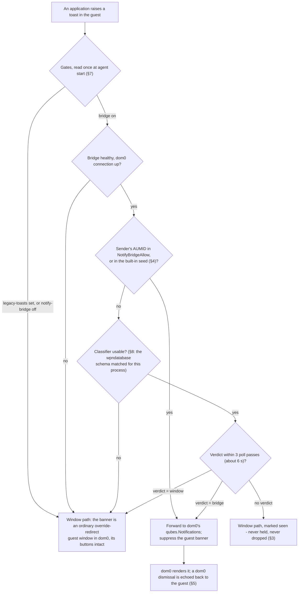

# ADR - guest notifications: the toast bridge

Decisions about how a guest's Windows notifications reach dom0, and why each toast is routed the way it is.
The bridge ships default-on since 4.3.30; per-toast routing since 4.3.31. What a guest did on a given day
belongs in `findings/`; the mechanism lives in the design notes. Format and status vocabulary:
`docs/ADR-README.md`.

| record | content |
|---|---|
| `docs/DESIGN-toast-bridge.md` | the bridge's mechanism, the options considered (A0/A1/B), phase plan |
| `docs/DESIGN-p3-classifier-impl.md` | the per-toast classifier: signals, call sites, tests |
| `docs/DESIGN-error-notify.md` | the separate error route (`service.notify-errors`) |
| `docs/QVM-FEATURES.md` | the features, their defaults and precedence - authoritative |
| `findings/issues.md` | open defects, among them the first-toast double (P1) that §10 addresses |

| § | decision | status | since |
|---|---|---|---|
| 1 | A guest notification is dom0's to render, not the guest's to draw | ACCEPTED | 4.3.30 |
| 2 | The route is decided per toast; the allowlist is a shortcut, not the gate | ACCEPTED | 4.3.31 |
| 3 | Misrouting fails open, never closed | ACCEPTED | 4.3.30 |
| 4 | The allowlist ships with a conservative seed, not empty and not everything | ACCEPTED | 4.3.30 |
| 5 | The dom0 notification is the copy; the guest Notification Center stays in sync | ACCEPTED | 4.3.30 |
| 6 | Error reporting is a sibling route, not this one | ACCEPTED | 4.3.30 |
| 7 | Every gate is read once, at agent start | ACCEPTED | 4.3.30 |
| 8 | When the classifier cannot trust its inputs, it stops classifying | ACCEPTED | 4.3.31 |
| 9 | The allowlist is a guest-side convenience; the switches that matter are dom0's | ACCEPTED | 4.3.30 |
| 10 | The guest banner is suppressed by not mapping it, never by ShowBanner | PROPOSED (Jev), 2026-10-01 | - |

How one toast is routed (§2, §3, §7, §8; §10 changes how the banner is suppressed, not the route):

---

## 1. A guest notification is dom0's to render, not the guest's to draw

**Status:** ACCEPTED.

**Decision.** An allowed guest toast is forwarded to dom0's stock `qubes.Notifications` service and rendered
by dom0. The guest's own banner is suppressed while, and only while, the dom0 connection is up. What dom0 then
does with the text - origin marking, sanitisation, its own rate limits - is dom0's stock behaviour for every
qube, not something this project implements or has measured.

**Why.** A toast drawn by the guest is a guest-controlled surface on the user's desktop, the thing the
seamless model exists to bound. Forwarding text to dom0 puts the rendering on the trusted side, under whatever
treatment dom0 already gives every other qube's notifications. The alternative, prettier guest-drawn banners,
buys nothing and widens what a compromised guest can paint.

## 2. The route is decided per toast; the allowlist is a shortcut, not the gate

**Status:** ACCEPTED, shipped in 4.3.31. Before it, an app in neither the allowlist nor the classifier's
reach was skipped outright; this decision replaces that.

**Context.** An allowlist can only route apps somebody enumerated, and nobody enumerates the app that fires
the toast in front of a user. The property that decides whether dom0 can safely render a toast is
INTERACTIVITY - does acting on it require its buttons - and that is a property of the toast, not of the app
that sent it.

**Decision.**

1. Every toast that is not already allowlisted is classified from its own content. `verdict=bridge` forwards
   it to dom0 and suppresses the guest banner; `verdict=window` leaves it on the ordinary guest-window path
   with its buttons intact.
2. An AUMID in `NotifyBridgeAllow` is forwarded without waiting for a verdict. The allowlist is a per-app
   shortcut for senders whose toasts are known to be informational, saving the classification round trip.
3. **Bound.** A toast with no verdict after 3 poll passes (about 6 s) takes the window path and is marked seen.
   It is never held indefinitely and never dropped.

**Scope.** WHICH inputs the classifier has, and what they carry on each Windows build (the ETW payload on 11;
signal-only on 10 with the payload read from `wpndatabase.db`), is implementation and lives in
`docs/DESIGN-p3-classifier-impl.md`. The decision here is only that the VERDICT routes, and that a missing or
untrustworthy input fails open (§3, §8) rather than changing the route.

**Evidence.** Measured on win11-nfy (package 4.3.30+agent.54347f15b43e, `mgmt/harness/classifier-route-probe.sh`,
2026-09-23): an informational toast from a non-allowlisted app was classified `verdict=bridge` and routed to the
bridge; a buttoned toast from a different non-allowlisted app was classified `verdict=window` and stayed on the
window path; deferrals stayed inside the cap. That measurement covered the ROUTE, not the absence of the guest
banner; the banner defect it missed is §10's subject.

## 3. Misrouting fails open, never closed

**Status:** ACCEPTED.

**Decision.** Anything the bridge is unsure of - an unknown app, an unhealthy bridge, a classifier that cannot
decide, a dom0 connection that is down - keeps the guest-window path. A notification is never dropped to
satisfy the bridge.

**Why.** The failure the user would never forgive is a notification that simply vanishes. Fail-open means the
worst case of a bridge defect is the behaviour that shipped for years. That is why the classifier does not have
to be right to be safe; it only has to be right to be *useful*.

## 4. The allowlist ships with a conservative seed, not empty and not everything

**Status:** ACCEPTED.

**Decision.** With `NotifyBridgeAllow` unset, a small built-in seed of reliably informational apps is used:
Snipping Tool, Camera, Photos, Security & Maintenance, the backup reminder. Operators extend it per guest,
using `notifhost --dump-aumids` to see what a guest actually emits.

**Why.** An empty allowlist would have meant the bridge forwarded nothing on a guest nobody had configured:
the feature present, running, and inert. A seed makes it demonstrably alive on first boot. Seeding
*everything* would make every app bannerless the moment the bridge connects, ahead of any verdict about its
toasts; the seed is a shortcut for senders known to be informational (§2), so it may only contain senders that
are.

## 5. The dom0 notification is the copy; the guest Notification Center stays in sync

**Status:** ACCEPTED.

**Decision.** A dismissal in dom0 is echoed back to the guest, so an action taken on the dom0 copy is reflected
in the guest's own Notification Center.

**Why.** Two independent copies of the same notification is worse than one in the wrong place: the user clears
it in dom0 and the guest still believes it is pending. Sync is what makes forwarding a move rather than a
duplication.

## 6. Error reporting is a sibling route, not this one

**Status:** ACCEPTED.

**Decision.** `service.notify-errors` raises ACTION-severity agent faults to dom0 as notifications, through the
same helper but a different path (`--notify-file`, one-shot). It is bounded - once per distinct error per boot,
at most 8 per boot, secret-shaped text refused - and it is **in addition to** the guest log line, never instead
of it. `service.legacy-toasts` does not affect it.

**Why.** A fault the operator never sees is a fault that does not get fixed, and a log line inside a guest
nobody opens is that. Bounding it keeps a failing guest from becoming a notification storm. Keeping the log
line means the evidence survives even when qrexec, which this route rides, is down.

## 7. Every gate is read once, at agent start

**Status:** ACCEPTED.

**Decision.** `NotifyBridge`, `NotifyErrors` and `LegacyToasts` are read at agent init from the registry and
then qubesdb, with dom0 winning. Changing one takes effect at the next agent start.

**Why.** The project's standing rule: a capability is settled at start and never re-read, so a transient
failure to read a gate cannot silently downgrade a running guest. It also makes the log line at init the
single authoritative statement of what this boot is doing.

## 8. When the classifier cannot trust its inputs, it stops classifying

**Status:** ACCEPTED.

**Context.** The per-toast classifier reads `wpndatabase.db`, whose schema is undocumented and owned by
Windows.

**Decision.** A missing table or column is treated as PERMANENT for the life of the process: the shadow
classifier is disabled for that run, logged once and loudly
(`WPNDB SCHEMA MISMATCH: ... (shadow classifier disabled for this run, fail-open)`), and every unlisted toast
then takes the window path. Allowlisted apps are unaffected; they never needed a verdict.

**Why.** The alternative is worse in both directions: retrying a query the OS will never satisfy turns every
toast into a stall, and guessing at a changed schema would route notifications on a misread. A Windows build
that moves the schema must degrade to the behaviour that shipped for years, not to a coin flip. And it must SAY
so, because a silently disabled classifier looks exactly like a classifier that decided "window" every time
(the standing rule: a fallback that fires is an anomaly and is logged).

## 9. The allowlist is a guest-side convenience; the switches that matter are dom0's

**Status:** ACCEPTED.

**Decision.** `NotifyBridgeAllow` lives in the guest registry and is extended by whoever administers that
guest, on the evidence of `notifhost --dump-aumids`, for senders whose toasts are informational. dom0 keeps the
controls that decide whether anything is forwarded at all (`service.notify-bridge`, and `service.legacy-toasts`,
which wins), and dom0's own qrexec policy decides whether the qube may reach `qubes.Notifications` in the first
place.

**Why.** A list of application ids is a routing convenience, not a privilege boundary: a guest that can write
its own HKLM can widen it, so nothing may depend on it being honest. What that buys the guest is bounded by
design: its text reaches dom0 only over a service dom0 policy already governs, and it is rendered by dom0 under
the treatment dom0 gives every qube. Putting the list in dom0 would dress it up as a control it is not, and
would make a per-guest, per-application list a policy edit.

## 10. The guest banner is suppressed by not mapping it, never by ShowBanner

**Status:** PROPOSED (Jev), 2026-10-01. The defect it addresses is the first-toast double, P1 in
`findings/issues.md` (reprioritized by the owner 2026-10-04: "first toast shown twice is fucking ugly P1").

**Context.** Two defects measured on 2026-10-01 come from the per-application `ShowBanner=0` switch the bridge
writes:

- It is set only when a toast is forwarded, so the first classified toast of an app is already on screen and
  reaches dom0 twice: the guest banner (captured as a window) and the dom0 notification. Seen by the owner
  2026-10-01 ~11:59 on w11-ds: Windows Security raised "Microsoft Defender summary" at 11:59:52, the shell showed
  its banner at once, the bridge held it for the classifier, routed it to dom0 at 11:59:55 and only then set
  `ShowBanner=0` for that app, which suppresses LATER banners, not the one already up. After every bridge
  restart the first classified toast of each app duplicates again.
- It stays set until the bridge exits, so a later toast of the same app whose own verdict sends it to the
  window path - an interactive one - is shown nowhere: a misroute that fails CLOSED, against §3.

In seamless mode the user sees a guest banner only because the agent maps its window into dom0, so not mapping
it is the whole suppression. Nothing in Windows' settings has to change, and every uncertain case (no verdict,
unhealthy bridge, a window the agent cannot tie to a toast) falls to mapping the window: the behaviour that
shipped. The owner: an occasional ~3 s delay on a first toast is fine, a flash of the guest banner before it
disappears is not; Win10 may take the delay (its classifier reads the payload from the notification database,
11 has it in the ETW record). Jev: agent-side hold 1.00 against per-toast ShowBanner toggling (racy with
concurrent toasts) and RemoveNotification after forwarding (deletes the guest's Notification Center copy, §5)
0.00; fails open by construction 0.89.

**Proposal.** For a toast the bridge forwards, the agent keeps that toast's banner window unmapped until the
toast's verdict arrives:

| verdict | the banner window |
|---|---|
| `bridge` | never mapped; the guest banner times out unseen |
| `window` | mapped at once |
| none within §2's bound | mapped (fail open) |

The per-application `ShowBanner=0` switch is retired: the bridge no longer writes it at all.

**Open before design detail.** How a banner window corresponds to a notification on the target build was not
measured when this was written (Jev: measure first, 0.58), and that measurement precedes the agent change,
after the acceptance then running. It has since been taken on Win11 26300 and Win10 19045 (one shared banner
window, FIFO, identity by non-localized UI Automation ids; recorded under the P1 in `findings/issues.md`), and
the fix is in progress.
