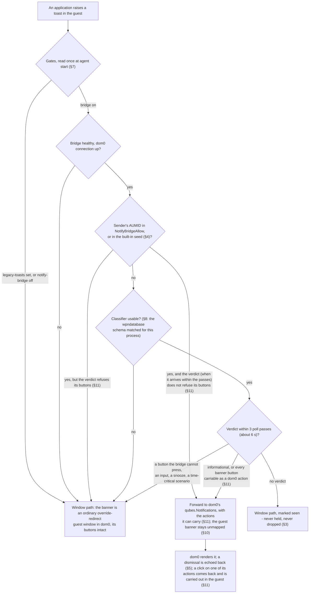

# ADR - guest notifications: the toast bridge

## In plain English

A Windows notification (a "toast") in a seamless qube used to appear as a small window drawn by the guest on
your desktop. Now, by default, it is forwarded to dom0's own notification service and shown the way a
notification from any other qube is shown, and the banner inside the guest is suppressed while the forwarding
connection is up. The guest is not trusted to paint on your desktop; dom0 renders the text under its usual
treatment.

Not every toast can be forwarded. One that carries buttons needs them to work. Since 4.3.31 that choice is
made per notification, by a classifier that looks at the toast's own content, not per application. A short
list of applications whose notifications are always informational (Snipping Tool, Camera, Photos, Security
and Maintenance, the backup reminder) is forwarded even when the classifier cannot answer, and operators can
extend the list per guest - but since the buttons route (§11) a toast of theirs whose verdict has arrived
follows that verdict like any other: a listed application cannot smuggle a toast with buttons to dom0 as text.

Buttons can now travel too (§11, built, not yet proven on a guest). When every button of a toast is one the
bridge can press on your behalf - a link the button opens, or a classic Windows application that registered
the hook the notification system itself calls when you click - the toast is forwarded with its buttons, dom0
shows them as the buttons of its own notification, and your click in dom0 is carried out inside the guest the
way the guest's own click would have been. A toast with a button the bridge cannot press (a Store app's
button, a reply box, a snooze, a button that works in the background) stays a guest window, whole: a toast is
never forwarded with half its buttons. If a click cannot be carried out after all, the guest's own banner is
shown again if it is still there, and otherwise dom0 tells you that the action did not run.

Whenever the bridge is unsure, the toast keeps the old guest-window path: an unknown application, no verdict
within about six seconds, the connection down, a Windows build whose notification database looks different. A
notification may lose its dom0 rendering, never its delivery. Dismissing the dom0 copy clears it in the guest
too. Agent faults travel to dom0 on a separate, bounded route that these switches do not affect. All switches
are read once when the agent starts, and dom0's settings win over the guest's.

The first toast of an application routed by the classifier used to appear twice, because the guest banner was
already on screen when the verdict arrived. Now the agent does not show the banner window at all until that
toast's own verdict is in (§10): forwarded, it is never shown; kept on the window path, it is shown at once; no
verdict within about three seconds, it is shown and the fall-back is logged. Windows' per-application banner
setting is no longer touched. In non-seamless mode, where the guest's banner is visible inside the desktop window,
the bridge forwards nothing, so no toast is shown twice there either.

How one toast is routed (§2, §3, §7, §8, §11). §10 changes how the banner is suppressed, not the route:

## The decisions at a glance

| § | decision | status | since |
|---|---|---|---|
| 1 | A guest notification is dom0's to render, not the guest's to draw | ACCEPTED | 4.3.30 |
| 2 | The route is decided per toast; the allowlist is a shortcut, not the gate | ACCEPTED | 4.3.31 |
| 3 | Misrouting fails open, never closed | ACCEPTED | 4.3.30 |
| 4 | The allowlist ships with a conservative seed, not empty and not everything | ACCEPTED | 4.3.30 |
| 5 | The dom0 notification is the copy; the guest Notification Center stays in sync | ACCEPTED | 4.3.30 |
| 6 | Error reporting is a sibling route, not this one | ACCEPTED | 4.3.30 |
| 7 | Every gate is read once, at agent start | ACCEPTED | 4.3.30 |
| 8 | When the classifier cannot trust its inputs, it stops classifying | ACCEPTED | 4.3.31 |
| 9 | The allowlist is a guest-side convenience; the switches that matter are dom0's | ACCEPTED | 4.3.30 |
| 10 | The guest banner is suppressed by not mapping it, never by ShowBanner | ACCEPTED (owner, Jev); built for 4.3.35, guest acceptance owed | 2026-10-04 |
| 11 | A toast's buttons travel to dom0 as actions, and a dom0 click is carried out in the guest - all of them or none | PROPOSED (owner queued it, Jev scoped it); built 2026-10-07, offline evidence only, guest test owed | 2026-10-07 |

Status words and the section format are defined in `docs/ADR-README.md`.

---

## The decisions in detail

Where the details live:

| record | content |
|---|---|
| `docs/DESIGN-toast-bridge.md` | the bridge's mechanism, the options considered (A0/A1/B), phase plan |
| `docs/DESIGN-p3-classifier-impl.md` | the per-toast classifier: signals, call sites, tests |
| `docs/DESIGN-error-notify.md` | the separate error route (`service.notify-errors`) |
| `docs/QVM-FEATURES.md` | the features, their defaults and precedence - authoritative |
| `findings/issues.md` | open defects, among them the first-toast double (P1) that §10 addresses |

## 1. A guest notification is dom0's to render, not the guest's to draw

**Status:** ACCEPTED.

**Decision.** An allowed guest toast is forwarded to dom0's stock `qubes.Notifications` service and rendered
by dom0. The guest's own banner is suppressed while, and only while, the dom0 connection is up. What dom0 then
does with the text - origin marking, sanitisation, its own rate limits - is dom0's stock behaviour for every
qube, not something this project implements or has measured.

**Why.** A toast drawn by the guest is a guest-controlled surface on the user's desktop, the thing the
seamless model exists to bound. Forwarding text to dom0 puts the rendering on the trusted side, under whatever
treatment dom0 already gives every other qube's notifications. The alternative, prettier guest-drawn banners,
buys nothing and widens what a compromised guest can paint.

## 2. The route is decided per toast; the allowlist is a shortcut, not the gate

**Status:** ACCEPTED, shipped in 4.3.31. Before it, an app in neither the allowlist nor the classifier's
reach was skipped outright; this decision replaces that.

**Context.** An allowlist can only route apps somebody enumerated, and nobody enumerates the app that fires
the toast in front of a user. The property that decides whether dom0 can safely render a toast is
INTERACTIVITY - does acting on it require its buttons - and that is a property of the toast, not of the app
that sent it.

**Decision.**

1. Every toast that is not already allowlisted is classified from its own content. `verdict=bridge` forwards
   it to dom0 and suppresses the guest banner; `verdict=window` leaves it on the ordinary guest-window path
   with its buttons intact.
2. An AUMID in `NotifyBridgeAllow` is forwarded without waiting for a verdict. The allowlist is a per-app
   shortcut for senders whose toasts are known to be informational, saving the classification round trip.
   **CORRECTED 2026-10-07 (§11, guest finding):** the shortcut no longer forwards a toast whose verdict has
   arrived against that verdict - an allowlisted toast with buttons the bridge cannot carry takes the window
   path like any other, and one forwarded with buttons carries them. The shortcut stands only where the
   classifier has not answered within the listing's passes: that toast is still forwarded, loudly logged.
3. **Bound.** A toast with no verdict after 3 poll passes (about 6 s) takes the window path and is marked seen.
   It is never held indefinitely and never dropped.

**Scope.** WHICH inputs the classifier has, and what they carry on each Windows build (the ETW payload on 11;
signal-only on 10 with the payload read from `wpndatabase.db`), is implementation and lives in
`docs/DESIGN-p3-classifier-impl.md`. The decision here is only that the VERDICT routes, and that a missing or
untrustworthy input fails open (§3, §8) rather than changing the route.

**Evidence.** Measured on win11-nfy (package 4.3.30+agent.54347f15b43e, `mgmt/harness/classifier-route-probe.sh`,
2026-09-23): an informational toast from a non-allowlisted app was classified `verdict=bridge` and routed to the
bridge; a buttoned toast from a different non-allowlisted app was classified `verdict=window` and stayed on the
window path; deferrals stayed inside the cap. That measurement covered the ROUTE, not the absence of the guest
banner; the banner defect it missed is §10's subject.

## 3. Misrouting fails open, never closed

**Status:** ACCEPTED.

**Decision.** Anything the bridge is unsure of - an unknown app, an unhealthy bridge, a classifier that cannot
decide, a dom0 connection that is down - keeps the guest-window path. A notification is never dropped to
satisfy the bridge.

**Why.** The failure the user would never forgive is a notification that simply vanishes. Fail-open means the
worst case of a bridge defect is the behaviour that shipped for years. That is why the classifier does not have
to be right to be safe; it only has to be right to be *useful*.

## 4. The allowlist ships with a conservative seed, not empty and not everything

**Status:** ACCEPTED.

**Decision.** With `NotifyBridgeAllow` unset, a small built-in seed of reliably informational apps is used:
Snipping Tool, Camera, Photos, Security & Maintenance, the backup reminder. Operators extend it per guest,
using `notifhost --dump-aumids` to see what a guest actually emits.

**Why.** An empty allowlist would have meant the bridge forwarded nothing on a guest nobody had configured:
the feature present, running, and inert. A seed makes it demonstrably alive on first boot. Seeding
*everything* would make every app bannerless the moment the bridge connects, ahead of any verdict about its
toasts; the seed is a shortcut for senders known to be informational (§2), so it may only contain senders that
are.

## 5. The dom0 notification is the copy; the guest Notification Center stays in sync

**Status:** ACCEPTED.

**Decision.** A dismissal in dom0 is echoed back to the guest, so an action taken on the dom0 copy is reflected
in the guest's own Notification Center.

**Why.** Two independent copies of the same notification is worse than one in the wrong place: the user clears
it in dom0 and the guest still believes it is pending. Sync is what makes forwarding a move rather than a
duplication.

## 6. Error reporting is a sibling route, not this one

**Status:** ACCEPTED.

**Decision.** `service.notify-errors` raises ACTION-severity agent faults to dom0 as notifications, through the
same helper but a different path (`--notify-file`, one-shot). It is bounded - once per distinct error per boot,
at most 8 per boot, secret-shaped text refused - and it is **in addition to** the guest log line, never instead
of it. `service.legacy-toasts` does not affect it.

**Why.** A fault the operator never sees is a fault that does not get fixed, and a log line inside a guest
nobody opens is that. Bounding it keeps a failing guest from becoming a notification storm. Keeping the log
line means the evidence survives even when qrexec, which this route rides, is down.

## 7. Every gate is read once, at agent start

**Status:** ACCEPTED.

**Decision.** `NotifyBridge`, `NotifyErrors` and `LegacyToasts` are read at agent init from the registry and
then qubesdb, with dom0 winning. Changing one takes effect at the next agent start.

**Why.** The project's standing rule: a capability is settled at start and never re-read, so a transient
failure to read a gate cannot silently downgrade a running guest. It also makes the log line at init the
single authoritative statement of what this boot is doing.

## 8. When the classifier cannot trust its inputs, it stops classifying

**Status:** ACCEPTED.

**Context.** The per-toast classifier reads `wpndatabase.db`, whose schema is undocumented and owned by
Windows.

**Decision.** A missing table or column is treated as PERMANENT for the life of the process: the shadow
classifier is disabled for that run, logged once and loudly
(`WPNDB SCHEMA MISMATCH: ... (shadow classifier disabled for this run, fail-open)`), and every unlisted toast
then takes the window path. Allowlisted apps are unaffected; they never needed a verdict.

**Why.** The alternative is worse in both directions: retrying a query the OS will never satisfy turns every
toast into a stall, and guessing at a changed schema would route notifications on a misread. A Windows build
that moves the schema must degrade to the behaviour that shipped for years, not to a coin flip. And it must SAY
so, because a silently disabled classifier looks exactly like a classifier that decided "window" every time
(the standing rule: a fallback that fires is an anomaly and is logged).

## 9. The allowlist is a guest-side convenience; the switches that matter are dom0's

**Status:** ACCEPTED.

**Decision.** `NotifyBridgeAllow` lives in the guest registry and is extended by whoever administers that
guest, on the evidence of `notifhost --dump-aumids`, for senders whose toasts are informational. dom0 keeps the
controls that decide whether anything is forwarded at all (`service.notify-bridge`, and `service.legacy-toasts`,
which wins), and dom0's own qrexec policy decides whether the qube may reach `qubes.Notifications` in the first
place.

**Why.** A list of application ids is a routing convenience, not a privilege boundary: a guest that can write
its own HKLM can widen it, so nothing may depend on it being honest. What that buys the guest is bounded by
design: its text reaches dom0 only over a service dom0 policy already governs, and it is rendered by dom0 under
the treatment dom0 gives every qube. Putting the list in dom0 would dress it up as a control it is not, and
would make a per-guest, per-application list a policy edit.

## 10. The guest banner is suppressed by not mapping it, never by ShowBanner

**Status:** ACCEPTED (owner: "i thought we agreed on design, delay and everything"; Jev), 2026-10-04; proposed by Jev
2026-10-01. Built 2026-10-06 for 4.3.35; the guest acceptance (`mgmt/harness/toast-hold-test.sh`, control first) is owed.
The defect it fixes is the first-toast double, P1 in `findings/issues.md` (owner 2026-10-04: "first toast shown twice is
fucking ugly P1").

**Context.** Two defects measured on 2026-10-01 come from the per-application `ShowBanner=0` switch the bridge wrote:

- It was set only when a toast was forwarded, so the first classified toast of an app was already on screen and reached
  dom0 twice: the guest banner (captured as a window) and the dom0 notification. Seen by the owner 2026-10-01 ~11:59 on
  w11-ds (Windows Security, "Microsoft Defender summary"). After every bridge restart it happened again.
- It stayed set until the bridge exited, so a later toast of the same app whose own verdict sent it to the window path
  was shown nowhere: a misroute that fails CLOSED, against §3.

Measured 2026-10-04 on retail Windows 11 26300 and Windows 10 19045: ONE ShellExperienceHost banner window
(`Windows.UI.Core.CoreWindow`, "New notification") serves every toast of the session; the shell shows banners one at a
time, first in first out, a queued one seconds after its arrival; a new banner arrives either by a collapse-and-grow
cycle or in place (same rectangle, a burst of location changes). The card's UI Automation tree names it by
non-localized ids: `NormalToastView` (the card), `SenderName`, `Title` (11) or `TitleText` (10), `MessageText`. So a
banner is identified by its content, never by its window or by arrival order alone.

**Decision.**

1. The agent keeps each toast's banner window unmapped in dom0 until THAT toast's verdict is known: `bridge` (or
   `forwarded`) - never mapped; `window` - mapped at once; none within 3 s - mapped, and the fall-back is logged loudly
   (`QGATOASTHOLDLATE`). A double is better than a loss; neither is the target.
2. The bridge no longer writes `ShowBanner` (a sweep still restores markers older versions left). It publishes one
   record per listed notification - content identity hashes (sender, title, message; normalized the same way on both
   sides), verdict pending/bridge/window/forwarded, arrival tick - into a section the agent created, and signals an event
   the agent's main loop waits on. Nothing polls.
3. Matching is by content; arrival order only breaks ties between identical texts - by arrival tick, then by the
   record's publish sequence, never by its position in the ring (which reorders across a wrap). A record with the same
   sender and title but another message is taken only when it is the unique such candidate. A banner re-claims the
   record it already consumed only when a later reading COMPLETES the earlier one (same sender and title, the message
   empty before or a prefix of the new one); other content in the same window is a new toast and must match its own
   record or fail open. The identity is read in the UI Automation raw view, on the toastcrop worker, bounded.
4. A suppression is not final: a record that turns `window`, a bridge that dies before dom0's acknowledgement (unless
   the record says `forwarded`), and a suppression not acknowledged within 3 s each show the banner after all, loudly.
   A dead bridge's unacknowledged records read as `window`.
5. While a newer record is still `bridge` or `pending`, a displayed window-path banner is unmapped before an in-place
   swap can paint (pre-emption), bounded (3 s for `pending`, 15 s for `bridge`, never while the bridge is down).
6. Only the banner is held: the ShellExperienceHost banner surface (a surface >= 90 % of the screen is not one); a window
   with no toast card in two reads at least 250 ms apart is a flyout and is shown at once.
7. Nothing runs at rest: deadlines are armed only while something is held, suppressed or pre-empted.
8. In non-seamless mode the agent publishes the mode in the section header and the bridge forwards nothing: every toast
   takes the window path there, its banner visible inside the desktop window (Jev 0.95).

Implementation: `agent/gui-agent/toastident.h` (the contract both binaries compile), `toasthold-core.h` (the state
machine), `toasthold.c`, every UI Automation call in `toastcrop.c`, `tools/notifhost/notifhost.cpp`.

**Why.** In seamless mode the user sees a guest banner only because the agent maps its window into dom0, so not mapping
it is the whole suppression; nothing in Windows' settings has to change, and every uncertain case falls to mapping the
window - the behaviour that shipped before. Owner: an occasional ~3 s delay on a first toast is fine, a flash is not.
Jev 2026-10-01: agent-side hold 1.00 against per-toast ShowBanner toggling and RemoveNotification after forwarding
(0.00); fails open by construction 0.89. Two independent reviews of the implementation (2026-10-06) found a flash path
(pre-emption released during an identity read), a loss path (a suppression that ignored a later `window`), a permanent
pre-emption for an unreadable card, an unpaced not-a-banner verdict and a pixel-based size cut; all fixed, each with a
defect knob in the offline suite. Jev on the result: no doubles 0.79, the bounds are failure states 0.94, nothing at
rest 0.71, nothing lost 0.54, top residual an identity mismatch on real banners (measured by the guest test).

**Cost.** A first toast waits for its verdict: the identity read plus the verdict latency, at most 3 s, then shown. A
window-path banner followed within its display time by a bridged toast loses the tail of its dom0 display (it stays in
the guest's Notification Center). A flyout (Quick Settings, volume, clock) appears up to ~250 ms plus one read later.

**Evidence.** Offline: `agent/gui-agent/toasthold_test.c` (176 checks, as C99 and as C++17) and
`tools/notifhost/toasthold_bridge_test.cpp` (25 checks), every defect knob (15 + 2) seen to fail; CI builds and runs
both suites. On a guest: owed - `mgmt/harness/toast-hold-test.sh` first on a build without the hold, where the first
classified toast must come out as a DOUBLE (the detectors seen to fail), then on the candidate.

**Open.** Not fixed by this section: a toast whose banner timed out before a correction is only in the guest's
Notification Center; the identity of system toasts whose display name differs between the notification database and
the card is unmeasured (a mismatch fails open: the double returns, logged).

## 11. A toast's buttons travel to dom0 as actions, and a dom0 click is carried out in the guest - all of them or none

**Status:** PROPOSED. Queued by the owner 2026-10-02 ("an ok/cancel choice can be backrouted?", "how feasible is it to
re-render toast xml to dom0 actionable notification?" - "queue it after the acceptances and gwecks update fix");
scope by Jev 2026-10-02 (1.00: text + buttons + default click, back-route protocol 3.7/4 and Win32 COM-activator 2.8/4
actions, UWP 0.0, system/background 0.1); the capability question by Jev 2026-10-06 (0.76); the failure handling by Jev
2026-10-06 (0.71). Built 2026-10-07 on `feat/toast-actions`; the evidence is offline only and the guest test is owed
(below); not in any release.

**Context.** §2 keeps every toast with real-choice buttons (the classifier's row 4) on the window path, because the
bridge sent dom0 no actions and could not have carried a click back. The stock dom0 proxy can: it relays the guest's
action list (key/label pairs, keys validated by `is_valid_action_name`, labels sanitized) to dom0's daemon when that
daemon advertises `actions`, and relays the daemon's `ActionInvoked{id, action}` back to the guest over the same
connection (`findings/issues.md`, the P3 entry of 2026-10-02; upstream `lib.rs` / `notification-proxy-client.rs`).
What a click does in Windows depends on the button's activation type: a `protocol` button launches a URI; a
`foreground` button of a classic (unpackaged) Win32 app makes the shell CoCreate the app's registered toast activator
(`HKCR\AppUserModelId\<AUMID>\CustomActivator`, or `System.AppUserModel.ToastActivatorCLSID` on the Start-menu shortcut
that carries the AUMID) and call `INotificationActivationCallback::Activate(aumid, arguments, inputs, count)`; a
packaged (UWP) app's activation is a UWP activation nobody else can make; a `background` button runs the activator
without a window; `system` snooze is shell-internal; an `<input>` needs a surface dom0 has no field for. The
`arguments` string is the app's own, read from the toast's payload XML the classifier already has.

**Decision.**

1. **Scope.** Carried: PROTOCOL activations (a button's `arguments`, the toast's `launch`), launched in the guest with
   `ShellExecute` as the user; Win32 COM-ACTIVATOR foreground activations (`activationType="foreground"`, the schema
   default) of an UNPACKAGED sender with a registered toast activator, carried out with the shell's own call. Not
   carried, on the window path exactly as before: packaged (UWP) foreground or background activation, background
   activation of any sender, system actions other than dismiss, inputs (rows 1-2), time-critical scenarios (row 3),
   anything unrecognised.
2. **All or nothing** (owner: no doubles, nothing lost; never half-way). A row-4 toast is forwarded, WITH its actions,
   only when every banner button can be carried; one button that cannot keeps the whole toast on the window path, where
   its buttons work. Rows 5 and 6 are forwarded as before and carry what they can; a button that cannot be carried (a
   protocol button without a launchable URI) sends them to the window path too. The default click is an enrichment:
   carried as the `default` action when it can be, otherwise omitted and the reason logged - what shipped since 4.3.30.
   **The activator lookup never delays a route that does not depend on it** (guest-test regression 2026-10-07: a cold
   3.4 s lookup for a sender without an activator pushed an informational toast's verdict past the listing's budget and
   it lost forwarding). The cache is asked without blocking; a miss starts the lookup in the background - its result,
   negative ones too, is cached for 10 minutes whether anyone waited or not - and only a row-4 toast with COM buttons
   waits for it, within the listing's own budget (750 ms); not done by then, that toast takes the window path and its
   late result warms the cache. An informational toast is published at once, its default click left out that time (logged).
   At bridge start the unpackaged senders already in the Notification Center (at most 8) are looked up in the background.
   **The allowlist never forwards a toast against its plan** (guest finding 2026-10-07: a row-4 toast from an allowlisted
   sender reached dom0 as text while the hold suppressed its banner). With its verdict in hand an allowlisted toast
   follows its plan like any other - forwarded with its actions, or the window path when the plan refuses; while the
   verdict is pending it waits within the listing's passes; only a toast whose verdict never comes is forwarded without
   a plan, as the shortcut's contract for a classifier that cannot answer, logged loudly (`ALLOWLIST ... WITHOUT a
   verdict`). An allowlisted informational toast therefore goes out on the first pass that has its verdict - the pass
   after its listing, tens of milliseconds later - and never waits for a lookup. The `SENT` line carries an assertion:
   a row-4 toast sent with `actions=none` logs `ANOMALY`.
3. **Keys are the bridge's** (`default`, `b0`..`b4`), never the toast's; labels are the buttons' `content`. The toast is
   forwarded WITH its actions regardless of dom0's daemon (the guest cannot learn whether it renders actions; the stock
   Linux client advertises them unconditionally too); the `SENT` line says what went.
4. **Bounded.** One table of forwarded toasts with actions, keyed by the proxy's id: 64 entries, a 1 h TTL, removed 5 s
   after dom0 dismissed the notification (reasons 2 and 3; an expiry keeps it - a daemon that lists notifications still
   lets the user click), cleared on connection loss (dom0 ids are per connection, like the dismissal table). A burst
   coalesced into one dom0 notification (more than three new toasts) never carries actions: an actionable toast inside
   it takes the window path.
5. **A click** (`ActionInvoked{id, key}`, the id being the one the proxy's `Id` reply gave that notification - the id
   space `Dismissed` uses too; the table entry exists before the frame is sent and learns the id from that reply) runs
   in a SHORT-LIVED CHILD PROCESS of the bridge (`notifhost --act-exec <file>`, same user and session, started with
   CreateProcess): the URI launch or `CoCreateInstance(CLSCTX_LOCAL_SERVER)` + `Activate(aumid, arguments, nullptr, 0)`,
   its exit code the outcome (0 carried out, 2 failed with the HRESULT in its own `ACTEXEC` log line). **Every click
   reaches an outcome within 30 s whatever the activation does**: a server that never comes up or never returns from
   `Activate`, a hung ShellExecute handler, leave a process the main loop TERMINATES at the bound - reporting the click
   as failed (rule 6) in the same step, exactly once - never a thread the bridge would carry for ever and could not
   cancel. The main loop keeps each child's handle in its wait array (its exit wakes the loop) and its bound on the
   deadline machinery. At most 4 children at once; a click refused by that cap is a failure too (rule 6), never
   silence.
6. **A failed click** turns the toast's hold record `window`: the agent reopens the banner if it is still displayed
   (rule 4 of §10) and writes the record's own SEQUENCE into the record's agent field - the one record field the agent
   writes; a sequence and not a flag, because the agent's store races the bridge's reuse of the slot and a late flag
   would read as the next toast's banner shown. No mark for that sequence within 2 s, or a record already gone from the
   ring, means there was no banner to reopen: dom0 gets an ERROR notice (stays until dismissed) that names the button
   and the toast and says the action did not run, retried while dom0 is unreachable for at most 60 s, then given up
   loudly. Every outcome is an `ACTION` line.
7. **Logs.** `CLASSIFY` gains `actions=` (what the forward carries, `none`, or `refused:<why>`) and `activator=`
   (registry / shortcut / none / cache); `SENT` gains `actions=` and `dom0=`; every window-path `skip` line carries the
   toast's title (the owner's 2026-10-02 fold-in, which ties the UAC A/B cell's skip line to its toast by content).
8. **No new switch.** The route is governed by the gates of §7 and §9 like every forward; nothing is read at runtime.

Implementation: `tools/notifhost/toastactions.h` (the pure rules: plan, table, dispatch, wire shapes, the click
ledger, the bounded lookup hand-off, the choice after a failure), `notifhost.cpp` (the activator lookup on a
short-lived STA thread of its own, bounded at 5 s, cached 10 minutes - the shadow worker keeps its apartment; the
`--act-exec` child and the main loop's spawn/reap/kill pump that also sends the notices; `--resolve-activator` /
`--invoke-activator`),
`agent/gui-agent/toastident.h` (`AgentShownSeq`, `ThIpcAgentMarkShown`, `ThIpcAgentState`; layout, size and ABI
unchanged), `toasthold.c` (the mark), `tools/toastfire` (a real recording activator and the `actionable` /
`protocol` classes).

**Why.** The owner asked for the round trip; the proxy already carries it; only the guest side was missing. The scope
follows what the shell itself does for each activation type: the two carried kinds reproduce the shell's own calls
with the toast's own arguments, the rest cannot be reproduced from outside the shell and misreproducing them would be
worse than a guest window (Jev: UWP 0.0, background 0.1). All-or-nothing is the owner's rule applied to a toast whose
buttons are its purpose. The agent's mark exists because only the agent can see whether a banner is still there: the
bridge sees records, the agent sees windows, and the record is the channel both already share - a bound with a loud
failure state, armed only while a failed click awaits its outcome, is the standing pattern (§10). Capability: forward
anyway (Jev 0.76) because the alternative, a per-boot probe of dom0's daemon, has no channel and would make the route
depend on a guess.

**Cost.** Whether dom0 shows the buttons depends on its notification daemon; on one without `actions` the user sees the
text and acts in the guest's Notification Center, as for every forwarded toast today. A click runs under the bridge's
token, which has no foreground rights: an activated app may not come to the front (a taskbar flash) - to be measured on
the guest. An actionable toast inside a burst of more than three loses its dom0 rendering. The activator lookup walks
the Start menu once per sender per 10 minutes, bounded (depth 4, 1024 shortcuts), in the background; a toast whose
route depends on it waits at most 750 ms for it (past which it takes the window path that time), an informational toast
never - whose default click is then missing until the sender's next toast. An allowlisted toast is forwarded one pass
(tens of milliseconds) later than before: on the pass that has its verdict. A failed click shows the banner late (within 2 s plus the agent's pass) or
costs one dom0 error notice. A click whose activation never answers is reported failed after 30 s and its process
is terminated (an app that was mid-launch for it may be killed with it; nothing of the bridge is left behind). Every
click costs one short-lived process. A toast with actions stays correlated for up to an hour (64 small entries).

**Evidence.** Offline: `tools/notifhost/toastactions_test.cpp` (135 checks; sixteen defect knobs each seen to fail:
background carried, half-way forward, packaged treated as COM, invalid keys, silent failure, unbounded table, the
table keyed by our sequence instead of the proxy's id, no click bound, the bound reporting the failure but leaving the
hung child alive, a second outcome for a click already reported, no lookup bound, an informational toast's route
awaiting the lookup, a pending lookup refusing an informational toast, a pending lookup taken for a registered
activator, a lookup result nobody waited for dropped, the allowlist forwarding blind against the plan), `toasthold_bridge_test.cpp` (+11 checks) and `agent/gui-agent/toasthold_test.c` (+7)
for the agent mark - including the store that races the slot's republish - with the knob
`TOASTIDENT_DEFECT_MARK_BY_SLOT` seen to fail in both; `tools/tests/toastactions-selftest.sh` and
`toasthold-selftest.sh` run the matrices with g++, CI with msbuild. Independent review 2026-10-07 (Jev, five parts)
raised four concerns: the mark race (real - fixed by the sequence-carrying mark), an unbounded activation (real -
fixed in two rounds: first a click ledger bounding the outcome, then - because a stuck in-process thread could still
not be cancelled and would have been leaked - the child process per click that the bound terminates), the id space of
a click (not real: the table was keyed by the proxy's id from the Id reply all along; hardened so the entry exists
before the send), the shadow worker's apartment (a regression risk, not a defect - that thread makes no COM call of
its own; the lookup moved to a bounded thread so its apartment is as before). Guest test of the first package
(toast-hold-test on win11r, 2026-10-07): two findings against the 4.3.35 release - (1) the first informational toast
of a sender without an activator took the window path, its verdict delayed 3.4 s by the cold activator lookup
(release: 16-94 ms), fixed by the non-blocking lookup above; (2) a row-4 toast from an allowlisted sender was SENT
`actions=none` while its banner was held - the allowlist's blind forward, fixed by the plan-following allowlist above.
Everything else matched the release. On a guest: OWED again, on the fixed package. (a) `toastfire --register --method com-activator` then
`--fire --class actionable`: `CLASSIFY ... verdict=bridge ... actions=default:com,b0:com,b1:com activator=registry`,
`SENT ... actions=... dom0=N`, no guest banner (the hold); the control, the same fire with the activator unregistered:
`actions=refused:...` and the window path. (b) `notifhost --invoke-activator QubesToastfire.ComActivator ok` with
toastfire registered: `INVOKE ... result=OK` and an `ACTIVATED aumid=QubesToastfire.ComActivator args='ok'` line in
`%LOCALAPPDATA%\toastfire-activations.log` - the activation path end to end without dom0. (c) `--fire --class protocol`:
`actions=default:protocol,b0:protocol`. (d) The dom0 click itself cannot be driven from the rig: a human clicks the
dom0 button and the log must show `ACTION ... OK` plus toastfire's `ACTIVATED ... args='ok'`; the failure path is
provoked by `toastfire --unregister` between the forward and the click (`ACTION ... FAILED`, then either the agent's
`QGATOASTHOLD ... record-turned-window` with the banner mapped, or the dom0 error notice). Whether dom0's daemon shows
the buttons at all is read off the dom0 screen by that human.

**Open.** Foreground rights of the activated app (measured on the guest). Packaged (MSIX) desktop apps register COM
activators through their manifest and could be carried later from the package's registration - not now. Which
`NotificationClosed` reason dom0's daemon sends after an action (the table keeps an entry through an expiry and drops it
5 s after a dismissal; a daemon that reports a click as reason 1 would keep entries until the TTL, harmless). The
dom0 notification's buttons live as long as its daemon shows them (20 s for an informational notice on a daemon that
honours the timeout; in the list on one that keeps notifications).
