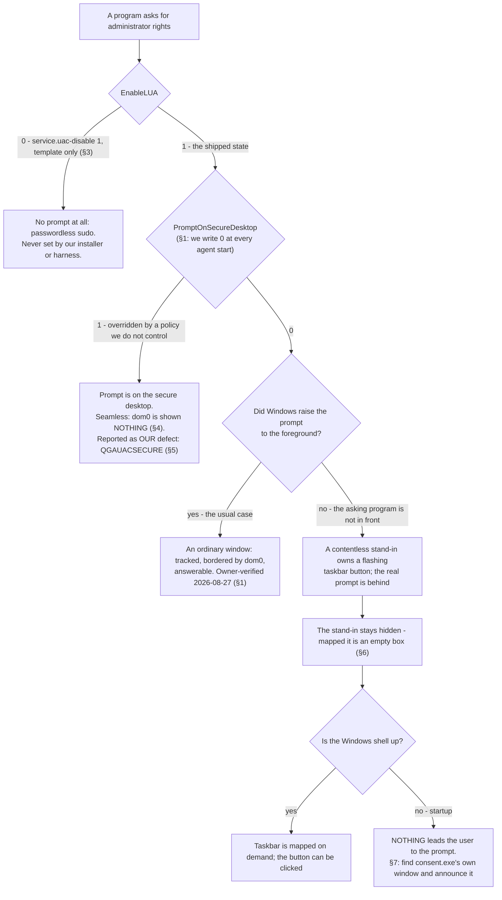

# ADR - UAC: elevation prompts a user in dom0 can actually answer

## In plain English

Windows asks for consent before anything runs with administrator rights. On real hardware it draws that
question on a separate, protected screen that no other program can draw on or click - the point being that
nobody can fake the question or answer it for you. Inside a Qubes guest that protected screen is a problem:
dom0 is never shown it, by a standing rule, because a window drawn from it would appear as its own ordinary
window next to dom0's own user interface and nothing would distinguish the two. An elevation prompt drawn
there is a question nobody can see and nobody can answer, and the program that asked waits for ever.

So we do not hide the question and we do not turn the protection off. We move the question. Windows has a
setting that draws the consent prompt on the normal desktop instead, and with that set the prompt is simply a
window: the guest's window tracking picks it up like any other, dom0 draws it with its own border and title,
and clicking Yes elevates. That was verified end to end by the owner the day it was built. Turning UAC off
altogether is possible and is a single dom0 feature, but it is the Windows equivalent of passwordless sudo,
it is written down as exactly that, and nothing in our installer or harness ever sets it.

What is left is the case where Windows does not put the prompt in front of you. When the program asking for
rights is not the one you are using - a task that runs at sign-in, a service-launched installer - Windows
does not steal focus. It creates a contentless, often zero-sized stand-in window whose only job is to own a
flashing taskbar button, and leaves the real prompt behind everything else. The guest agent hides that
stand-in, which is right: mapped into dom0 it would be an empty box, not a prompt. The agent then shows the
taskbar so the button can be clicked - and before the Windows shell has started there is no taskbar to show.
That is the hole: during startup the question exists, is answerable in principle, and has nothing anywhere
that leads a user to it. It was never a regression; the register has carried it as open work since August.

The fix is to stop depending on the taskbar and go to the prompt itself: find the window that belongs to the
consent process, which under our setting is already on the normal desktop, and make sure it is announced to
dom0 whether or not Windows chose to put it in front. We never answer it. The agent does not send clicks or
keystrokes into another program's windows, and least of all into this one - a guest agent that could answer
its own elevation prompts would make the prompt worthless.

## The decisions at a glance

| § | decision | status |
|---|---|---|
| 1 | UAC stays ON and the prompt is converted into an ordinary window (`PromptOnSecureDesktop=0`) | ACCEPTED |
| 2 | Where the prompt is drawn is not configurable | ACCEPTED (one knob removed the day it was written) |
| 3 | `service.uac-disable` acts only on an explicit `1`, is reversible, and belongs on the template | ACCEPTED |
| 4 | The secure desktop is frozen out on the frame path, not denied in the accept filter | ACCEPTED (v1 CORRECTED) |
| 5 | A secure desktop is classified before it is advised about; a UAC prompt there is OUR defect | ACCEPTED |
| 6 | The interim stand-in window stays hidden | ACCEPTED |
| 7 | A prompt Windows did not raise is found by its process and announced; the taskbar is not the remedy | PROPOSED |
| 8 | The agent never answers an elevation prompt | ACCEPTED |
| 9 | Turning UAC off is not a security improvement and is never framed as one | ACCEPTED |
| 10 | Nothing of ours elevates during startup; an unasked-for elevation is a P1 defect of ours | ACCEPTED |

## The records this rests on

- `findings/autologon.md` lines 22-28: the black-window root cause, the UAC mechanism measured in both
  directions (`EnableLUA` boot-latched, `ConsentPromptBehaviorAdmin` live per elevation,
  `FilterAdministratorToken` irrelevant for RID-1000), the `consent.exe` trap, and the 25H2 environment guard.
- `findings/install.md` lines 44-45: what the installer seeds, and the AppVM defect.
- `findings/issues.md`: the open P2 (a pending elevation is invisible in seamless) and task #28.
- `docs/ADR-windows.md` §4 (the secure desktop by mode) and §10 (autologon). This file is the UAC-specific
  record; §4 stays the window-mapping record.
- Agent commits: 6b5b298, 07fb32d, 878ae5e, 7e3f0b6, 637299e, 1e45b8c, 149c930, 71fa0a4, ea2dad1, f821c06,
  3cb057e, d3273de, 00a3e24.

## The decisions in detail

## 1. UAC stays ON, and the prompt is converted into an ordinary window

**Status:** ACCEPTED (owner, verified end to end 2026-08-27).

**Context.** The standing rule is that the secure desktop is NEVER granted to dom0 (owner, 2026-08-19): a
surface drawn from it becomes its own standalone dom0 window, indistinguishable from dom0's own UI. The rule
leaves elevation with nowhere to be drawn - and an elevation nobody can answer blocks the program that asked.
The owner's own framing of the way out was to "convert the elevation prompt to a normal in-desktop dialog".

**Decision.**
1. UAC is left enabled. We do not solve prompt visibility by removing the prompt.
2. `ApplyUacPromptPolicy` writes `HKLM\SOFTWARE\Microsoft\Windows\CurrentVersion\Policies\System`
   `PromptOnSecureDesktop=0` so Windows draws consent on the Default desktop, where it is an ordinary window:
   tracked, bordered and titled by dom0, answerable. `consent.exe` reads the value per prompt, so no reboot is
   needed.
3. It is written unconditionally and re-asserted at every agent start and on every dom0 mode change, so drift
   - a policy refresh, a restored template value - is repaired without a reinstall. It is also seeded by the
   installer (`Install-QwtImproved.ps1`), so the value is already right before the agent first runs.
4. The write is not silent: `QGAUAC` states the value and what it means on success, and warns with the Win32
   error on failure.

Code: agent `gui-agent/main.c` `ApplyUacPromptPolicy`, called from `SetSeamlessMode`, which runs on the normal
start path from `StartFrameProcessing`.

**Why.** Of the three possible answers - hide the prompt, remove the prompt, move the prompt - only moving it
keeps both the security model and the user's ability to answer. Protocol step SG5 calls this load-bearing.

**Cost.** Windows' anti-spoofing guarantee for the prompt is given up inside the guest: a program running as
the guest user can draw a window that looks like a consent prompt. This is accepted because the guest is a
single trust domain to begin with - anything that can draw there can also keylog there - and because the
alternative is a prompt nobody can answer. Nothing outside the guest is affected: dom0 still draws its own
border and title around the window, which is what distinguishes guest content from dom0's own UI.

**Evidence.** Owner-verified 2026-08-27 (agent 1e45b8c): with the value at 0 the consent prompt arrived as its
own dom0 window and clicking Yes elevated. Seen to fail: with `EnableLUA=1` and the value at 1, pre-fix agents
mapped the dimming backdrop as the field-reported unclosable black window (07fb32d). Reproduction requires
`EnableLUA=1`; the rigs default to `EnableLUA=0`, which is why it was never seen locally, and `win11-tpl` is
kept at `EnableLUA=1` as the field-faithful rig.

**Open.** The value is a machine policy that a domain GPO or a template policy can overwrite between our
write and the next prompt. §5 reports that case rather than fighting it.

## 2. Where the prompt is drawn is not configurable

**Status:** ACCEPTED (owner: "simplify"). The knob existed for one afternoon and was removed.

**Context.** The first version of dom0-driven UAC policy shipped two features (637299e):
`service.uac-secure-desktop` chose between the normal and the secure desktop, and `service.uac-disable` turned
UAC off. The owner asked for one feature. The replacement (1e45b8c) made placement follow the display mode -
`PromptOnSecureDesktop=0` in seamless, `1` in non-seamless "so the secure desktop displays as it would on
physical hardware". That was wrong on its own terms and was removed the same day (149c930): it contradicted the
standing rule outright, and it had been exercised by enabling the gating feature on a live rig.

**Decision.** There is no control over where the prompt is drawn. `PromptOnSecureDesktop=0` is unconditional.
The display mode decides only where dom0 draws the resulting window - standalone in seamless, inside the
desktop window in non-seamless - which is how the two modes render every guest window and needs no special
case (ea2dad1).

**Why.** A knob here can only select between a working configuration and one that hides the prompt. An option
whose other setting is a defect is not an option.

**Cost.** A deployment that wants Windows' secure-desktop behaviour inside a guest cannot have it. Bounded:
such a deployment can run non-seamless, where the whole guest desktop is one bounded dom0 window
(`ADR-windows` §5) and the sign-in screen is shown inside it.

## 3. `service.uac-disable` acts only on an explicit `1`, is reversible, and belongs on the template

**Status:** ACCEPTED (owner, 2026-08-27; the footgun fixed the same day in 71fa0a4).

**Context.** Measured on the testbed: `qvm-features <vm> service.uac ""` - the ordinary way to clear a feature
- stores `FALSE`, which the first implementation read as "disable UAC" and applied. Clearing a feature must
never disable a security control.

**Decision.**
1. Only an explicit `"1"` disables UAC (`EnableLUA=0`). Absent, cleared or `"0"` leaves `EnableLUA` alone.
2. The agent records under its own config key whether IT applied the disable, and restores `EnableLUA=1` only
   in that case - so a guest that had UAC off before QWT is never silently re-enabled, and turning the feature
   off again actually undoes our change.
3. A reboot is required: `EnableLUA` is latched inside LSA at boot. A live write changes nothing, not even for
   a fresh logon in the same boot.
4. It belongs on the TEMPLATE. On an AppVM the system drive is restored at every boot, so the agent's write is
   discarded before the boot that would honour it. The agent warns when the feature is set on a volatile-root
   guest (3cb057e).

**Cost.** Setting it removes the administrator/kernel barrier inside the guest, which is real guest-to-host
attack surface. §9 is how that is stated.

**Evidence.** Seen to fail in both directions: the cleared-feature read (`FALSE` → applied) was measured
before 71fa0a4; the AppVM path was measured as `0x0` → reboot → `0x1` with the prompt still shown, while the
registry read-back check passed. That is why a read-back is not accepted as evidence here.

**Open.** OPEN DEFECT, register task #28: the feature cannot work on an AppVM at all, and its
set → reboot → elevate acceptance has never been run. Direction: apply in the template plus a loud agent log
on volatile roots. On a volatile root there is in any case a per-boot window before the agent's first write.

## 4. The secure desktop is frozen out on the frame path, not denied in the accept filter

**Status:** ACCEPTED (2026-08-27, v3). **CORRECTED 2026-10-08:** `ADR-windows` §4 and
`findings/autologon.md` line 22 both still say "`ShouldAcceptWindow` rejects everything while it is set". That
was v1 (07fb32d) and it was replaced the same day. In the code today `ShouldAcceptWindow` consults
`g_OnSecureDesktop` only in the Mode-1 fullscreen phase guard; the suppression is three early returns.

**Context.** v1's accept-filter deny overshot: re-evaluating every window the moment UAC appeared unmapped
every already-open Default-desktop window (measured: `PwDetachWindow` of the open Explorer right after
"secure-desktop ENTERED"; dom0 dropped to zero windows). v2 gated only the frame loop, which left the
input-rate event path live and it mapped the consent dialog as a damage-starved black box - measured, and seen
live by the owner.

**Decision.** While the input desktop name is not `Default`, in seamless mode nothing flows, at three gates:
1. `ProcessNewFrame` returns early - the secure framebuffer is never published;
2. `ProcessWindowEvents` returns early - no tracking mutation from events;
3. `AddAllWindows` returns early - which covers an agent *respawning* while a prompt is up, the field
   respawn-during-consent case, and stops it enumerating the Winlogon desktop at init.

Capture itself also idles there and the attach helper refuses to switch to it (6b5b298): `PrintWindow`
round-trips synchronously into the owning process, and on the secure desktop those windows belong to LogonUI,
so a SYSTEM agent in session 1 can stall logon itself - observed as a guest stuck at "Welcome" across three
reboots. Leaving the secure desktop invalidates the frame signature and queues a full re-enumeration, so
nothing that changed while frozen is lost.

**Why.** Suppression has to be one gate over everything rather than a predicate per window: a predicate
re-decides windows that are still there and still fine, and that is what unmapped the user's desktop.

**Cost.** For as long as a secure desktop is up, dom0 is shown nothing at all in seamless. A few seconds at
boot is normal (autologon); longer means the guest is waiting for a human. `QGADESKSTUCK` says so after 30 s
and every 120 s after that, and a dom0 notification carries it (`desktop-stuck`).

## 5. A secure desktop is classified before it is advised about, and a UAC prompt there is OUR defect

**Status:** ACCEPTED (owner, 2026-10-08: "if it sits on the uac prompt we need to know what path brought us
there and how to handle it properly"). Agent 00a3e24.

**Context.** The desktop NAME is `Winlogon` for the sign-in screen, the lock screen and a UAC consent prompt
alike, so one message covered three states and gave advice ("arm autologon") that is right for only one.

**Decision.** `QGADESKSTUCK` reports the PATH with the evidence it used, and reads back the
`PromptOnSecureDesktop` actually in force:
- `consent.exe` present → a UAC prompt is on the secure desktop. §1 writes the value that is supposed to
  prevent exactly this, so being here means it was not honoured: a template policy, or admin-approval-mode.
  That is OUR defect, it gets its own `QGAUACSECURE` ERROR, and the autologon advice is suppressed for it.
- `LogonUI.exe` present → the sign-in or lock screen, which the existing advice is for.
- neither → `unclassified`, stated as such rather than guessed.

**Cost / the trap this rests on.** `findings/autologon.md` line 26: a RUNNING `consent.exe` is NOT evidence a
prompt is shown - it also runs under `ConsentPromptBehaviorAdmin=0` and exits by itself after about 4 s. The
valid signals are that the process PERSISTS, or that a consent window is mapped in dom0. The classification is
therefore evaluated only on the 30 s re-warn tick, by which point a 4 s `consent.exe` is gone; a snapshot
failure returns FALSE so the message degrades to `unclassified` rather than asserting what it did not observe.

**Open.** 25H2 runs `TypeOfAdminApprovalMode=1` with `ConsentPromptBehaviorEnhancedAdmin=1`. If Administrator
protection (`TypeOfAdminApprovalMode=2`) is ever enabled, `ConsentPromptBehaviorAdmin` stops governing and
every UAC measurement in the record needs re-doing.

## 6. The interim stand-in window stays hidden

**Status:** ACCEPTED (Jev 0.92). Inherited from upstream QubesOS/qubes-gui-agent-windows; kept deliberately.

**Context.** When the program requesting elevation is not in the foreground, Windows does not steal focus. It
creates a window of class `$$$Secure UAP Dummy Window Class For Interim Dialog` whose only job is to own a
flashing taskbar button, and leaves the real prompt unraised. Upstream's own comment records that these "don't
show as normal windows, just flash their icon in the taskbar as if minimized", that "sometimes these windows
don't have the iconic flag set, and their size is 0", and that activating them programmatically does not work.

**Decision.** `GetWindowData` sets `IsVisible = FALSE` for that class and does not announce it. The owner's
objection on 2026-10-08 - "if UAC emits a dialog, it should be presented as dialog, a normal dialog window, not
some hidden bullshit" - is answered by what the window is: it is not the dialog. It carries no prompt and often
no pixels, so mapped into dom0 it is an empty box with a border and a title, and clicking it does nothing.
Hiding it is not what makes the prompt unanswerable; §7 is.

Jev, asked whether the hide is defensible on its own terms - that this window is not the dialog, and that
mapping it would give dom0 an empty box rather than an answerable prompt: 0.92.

**Open.** The class is interrogated on every resync by design (it is excluded from the rejected-window cache,
because interrogating it is what maintains the flag §7 replaces). It is matched by class name, which is a
literal from upstream; nothing verifies that 25H2 still uses it.

## 7. A prompt Windows did not raise is found by its process and announced; the taskbar is not the remedy

**Status:** PROPOSED (Jev 0.99 for this option over four alternatives), 2026-10-08. Not a regression: the
register has carried "a pending UAC elevation is invisible in seamless; UAC visibility is declared future work"
as an open P2 since 2026-08-28 (Jev `never-closed` 1.00).

**Context.** Hiding the stand-in (§6) is paired with a remedy: `g_ShowTaskbar = TRUE`, so the taskbar is mapped
on demand and the user can click the flashing button. That remedy has two holes, both read from the code:
1. the flag is set in `GetWindowData`, but the taskbar is actually mapped only at the end of `AddAllWindows`.
   The per-window runtime admit path sets the flag and then returns on `!ShouldAcceptWindow`, never reaching
   that block. Bounded, not a defect: the resync runs `AddAllWindows` every `WINDOW_RESYNC_INTERVAL_MS` = 2 s.
2. that block is guarded by `if (g_TaskbarWindow)`, and `g_TaskbarWindow` is `FindWindow("Shell_TrayWnd", 0)`.
   **Before the shell is up there is no taskbar**, so the flag has no effect at all and nothing is mapped.
   During startup the prompt exists, is answerable in principle, and nothing anywhere leads a user to it.

Nothing in the agent has ever located or raised the real consent window: there is no `consent.exe` window
lookup, no owner-of-stand-in walk, no foreground call.

Jev, asked by which mechanism a prompt can appear during a normal startup and remain both invisible and
blocking: `placeholder-hidden-no-taskbar` 0.69 at confidence 0.63, with `insufficient-evidence` 0.29 and both
`prompt-on-secure-desktop` and `created-while-frozen-never-re-enumerated` at 0.01 or below - the last because
the resume path's full re-enumeration was read and does exist.

**Decision.** Stop depending on the taskbar and go to the prompt itself.
1. The agent locates the top-level windows owned by `consent.exe` - which under §1 are on the Default desktop -
   and ensures they are admitted and announced whether or not Windows raised them.
2. The stand-in stays hidden (§6). The taskbar remedy stays as it is for everything else it covers.
3. It is announced, not activated: see §8. The user is given a window; the decision stays theirs.
4. A pending elevation that cannot be announced is reported, because dom0 showing nothing while a program
   waits is exactly the state no log named for days in the field.

**Cost.** A consent window is announced in a phase - no shell yet - where §4's phase guard denies
fullscreen-sized windows. A consent dialog is not fullscreen-sized, so the guard does not reach it; a
fullscreen dimming backdrop is, and stays denied. That split is the reason the safety criterion is geometry
and not window identity (`ADR-windows` §4).

**Evidence.** OWED, and the shape is chosen deliberately. Jev on which test to build first:
`offline-source-selftest` 0.48, `live-guest-elevation` 0.36, both 0.16 - confidence 0.31, which is weak and is
recorded as a finding rather than rounded up. The offline check is built first because it is cheap and can be
driven with the defect reintroduced; the live cell - a real non-foreground elevation at startup, graded on what
dom0 is shown - is owed and named. No guest in our possession has yet been observed with a consent window, so
nothing here is claimed as reproduced.

## 8. The agent never answers an elevation prompt

**Status:** ACCEPTED (owner, standing).

**Decision.** The agent never sends input to a consent window: no `SendInput`, no synthesized click, no
`WM_KEYDOWN` to a window it does not own. §7 makes the prompt visible and does nothing else.

**Why.** An agent that could answer its own elevation prompts would make the prompt worthless - every
guest-side elevation would be automatic, and the barrier `service.uac-disable` is loudly warned about (§3,
§9) would be gone silently instead. The same rule is why the one keystroke the agent does send - Escape, to
dismiss a Start surface - was changed from a global `SendInput` to a `PostMessage` addressed to that specific
window.

**Cost.** A prompt raised while nothing can display it stays unanswered. §7 reports that instead of resolving
it.

## 9. Turning UAC off is not a security improvement and is never framed as one

**Status:** ACCEPTED (owner, 2026-08-28; agent d3273de).

**Decision.** When `service.uac-disable` is honoured the agent says plainly what it is: the Windows equivalent
of passwordless sudo. It is never described as hardening, simplification or a fix for prompt visibility, and
neither the installer nor any harness cell sets it.

**Why.** The only reason to reach for it is that prompts were unanswerable, and that is the problem §1 and §7
solve. A convenience knob that removes the administrator/kernel barrier would quietly become the answer to
every UAC complaint.

## 10. Nothing of ours elevates during startup; an elevation nobody asked for is a P1 defect of ours

**Status:** ACCEPTED (owner, 2026-10-08: "normal windows startup does not elevate", "if something elevates out
of order it is us", "if it does it is fucking P1").

**Context.** §7 makes an unraised prompt reachable, which is a remedy and not an explanation. A normal Windows
startup raises no elevation prompt at all, so a prompt appearing during one means something asked for it - and
the first suspect is us.

**Decision.**
1. Nothing we ship may request elevation except as the direct result of a user action. A prompt during
   startup, logon or an unattended path is a P1 defect of ours until shown otherwise - not a UAC question.
2. The two sites that do elevate, both user-initiated, are the whole permitted set:
   - `install.cmd` self-elevates with `-Verb RunAs` when `net session` shows it is not already elevated. Under
     the qrexec install path it runs as SYSTEM, where that test succeeds and nothing is requested; the prompt
     appears only when a person runs the installer from inside the guest, and it is theirs to answer.
   - `start-app.ps1` elevates for the `cmd-admin` and `powershell-admin` menu entries only, deliberately: a
     menu entry that silently handed out admin would be a hole. It no longer waits on the launched process.
3. Every scheduled task we create runs as SYSTEM (`S-1-5-18`), which is never prompted. The one task that runs
   in the user's session - the notification bridge - is registered `LeastPrivilege`, so it cannot prompt
   either. No `Run`, `RunOnce` or Startup-folder entry is created by anything of ours: the installer's
   stage-resume uses an ONSTART SYSTEM task instead, and says why.
4. No executable we ship carries a `requireAdministrator` manifest, so none of them prompts when the user's
   shell launches it.

**Evidence.** Swept 2026-10-08 over the whole shipped tree (`guest/`, `core-agent/`, `packaging/`, `tools/`,
`agent/`): zero `requireAdministrator` manifests, zero `Run`/`RunOnce`/Startup entries, every task principal
`S-1-5-18` except the `LeastPrivilege` bridge task, and exactly the two `-Verb RunAs` sites above. The owner's
premise holds and our code does not add a startup elevation.

**Open - the one residual the sweep found, NOT established as a cause.** The MSI is built in CI from
QubesOS/qubes-installer-qubes-os-windows-tools at tag v4.2.2-1, whose `CoreComponents.wxs` declares three
**advertised** `SendTo` shortcuts (key path `qrexec-client-vm.exe`), with upstream's own comment that they are
installed for the current user only. An advertised shortcut is the one mechanism in our package that can make
Windows Installer start a repair, and therefore request elevation, without anyone asking - per-user advertised
resources are re-resolved when a user first logs on. We patch other parts of that `.wxs` and leave these as
upstream wrote them. NOTHING HAS BEEN OBSERVED: no guest in our possession has been seen with a `consent.exe`
at startup, and no `MsiInstaller` repair event appears in any sweep we hold. The probe that would settle it is
guest-side and cheap - `MsiInstaller` events in the Application log at first logon of a fresh user, against
`consent.exe` in the process list - and it is owed before this is called a cause or reported anywhere.
