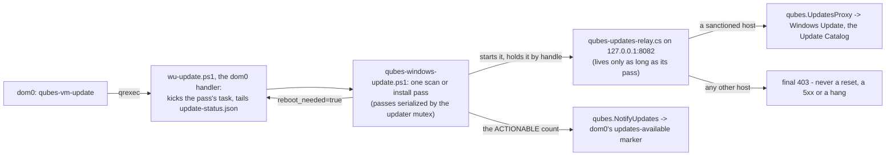
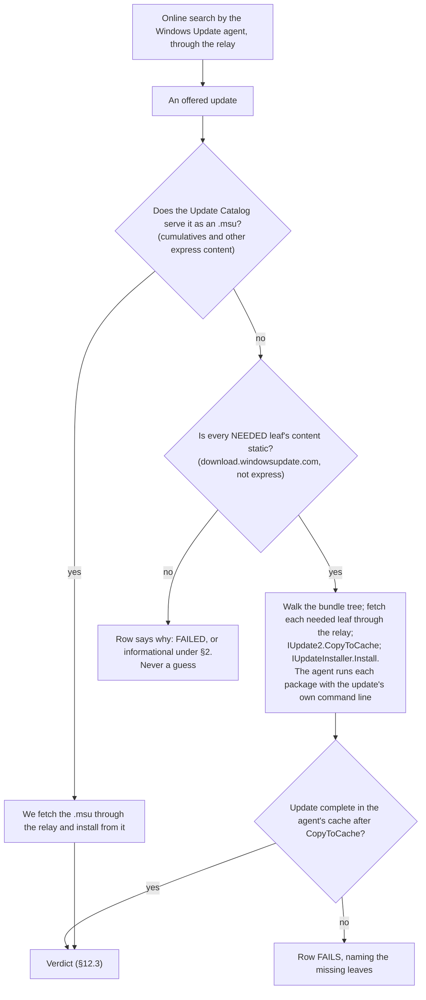
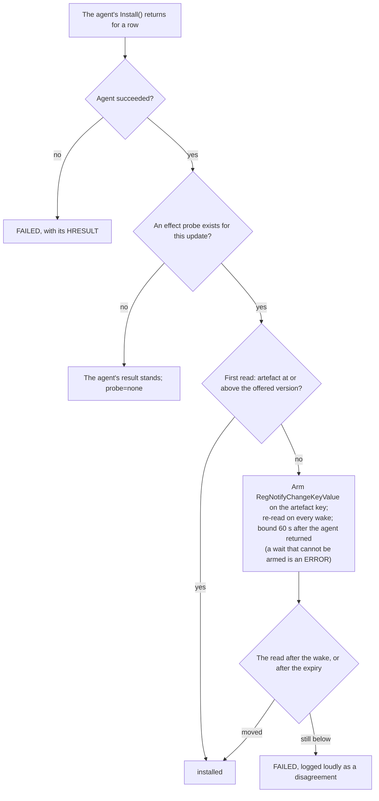

# ADR - the Windows updater (Track C)

## In plain English

Windows updates for a Windows qube are driven by dom0, exactly as for Linux templates. Automatic updates
inside the guest are off, the qube reports whether updates are available, and the Qubes Update tool installs
them through a proxy that exists only while a pass runs. The guest has no network route of its own, so the
updater fetches the update files itself through that proxy; Windows' peer-to-peer and background download
mechanisms are never used.

Everything serves one invariant: what dom0 is told must be true. Never "up to date" when it is not, never
stuck at "updates available" because of an item that can never install here. So an install counts only when
its effect is measured, since an exit code of zero alone is not success. Any item that cannot be installed on
this path is reported as informational with a reason. The relay answers a disallowed request with a final
refusal, never a hang that Windows Update would wait out. Nothing is matched by its display title, because the
catalog answers in whichever language it likes.

After a failure in which we had run a vendor installer with the wrong switch, the rule became: our code never
runs a vendor installer and never chooses its switches. Cumulative updates come from the catalog as .msu
packages. Everything else with static content is handed to Windows Update's own installer, which runs each
package with the update's own command line. A row counts as installed only when the installer succeeded and
the thing the update changes actually changed; when the two disagree, the row fails loudly. Reboots are
counted: the guest requests them, dom0 performs them, and none is taken speculatively. No component ever kills
or adopts a process by name; it touches only what it started.

The installer installs the update agent even when the previous agent's own update check is running at that
moment, which is the ordinary case right after a template boots: it waits for that check to let go of its
lock, for at most the time the check is allowed anyway, and installs then. It refuses only when the holder is
an installation in progress or cannot be identified, and then it says so loudly: the whole install is marked
failed, the last lines it prints say what was not installed and what to do, and dom0 is told. A failed agent
install used to be one warning line nobody read, and the qube quietly kept its old updater.

The update path as a whole (§1, §4, §5, §12.1):

How an offered update is installed (§12.2):

How a row's verdict is decided (§12.3):

## The decisions at a glance

| § | decision | status | date |
|---|---|---|---|
| 1 | dom0 owns updates; the guest never installs on its own | ACCEPTED | - |
| 2 | The invariant: dom0's reported state must be true | ACCEPTED | - |
| 3 | Verify by effect, never by exit code | ACCEPTED | - |
| 4 | Sanctioned paths hard-fail; never a timeout instead of an answer | ACCEPTED | - |
| 5 | Routeless by construction | ACCEPTED | - |
| 6 | Structured data only; no title parsing | ACCEPTED | - |
| 7 | A field report is reproduced on the reporter's measured environment | ACCEPTED | - |
| 8 | Reboots are counted: performed must equal requested | ACCEPTED | - |
| 9 | The test is the product | ACCEPTED | - |
| 10 | The guest cannot restart itself; a restart is REQUESTED, never taken | ACCEPTED | - |
| 11 | A cause outside our code, with a measured remedy, is CLOSED BY DECISION | ACCEPTED; applied once (`0x8024402C`) | - |
| 12 | Architecture: who does what, and who may touch which process | ACCEPTED (owner, Jev); shipped in 4.3.33 | 2026-10-03 |
| 13 | The installer waits for a running scan; a refused updater deploy is never quiet | ACCEPTED (Jev); shipped in 4.3.35 | 2026-10-04 |

Status words and the section format are defined in `docs/ADR-README.md`.

---

## The decisions in detail

Where the details live:

| record | content |
|---|---|
| `findings/updates.md` | standing facts about the update path, and retracted approaches |
| `findings/issues.md` | the open issue register (P1/P2/P3), maintained in place |
| `findings/rig.md` | rig and harness behaviour, including instrument traps |
| `findings/install.md` | getting a build onto a guest |
| `guest/qubes-windows-update.ps1`, `guest/qubes-updates-relay.cs`, `guest/wu-update.ps1`, `guest/install-updater-agent.ps1` | the components (§12.1) |
| `tools/wu-pass-judge.py`, `tools/wu-log-judge.py`, `mgmt/harness/wu-e2e.sh` | the judges and the end-to-end harness (§9) |

## 1. dom0 owns updates; the guest never installs on its own

**Status:** ACCEPTED.

**Decision.** Guest auto-update is off (`NoAutoUpdate=1`). dom0 drives every install. The guest reports
availability to dom0 over `qubes.NotifyUpdates`. A guest with no netvm reaches Windows Update only through
`qubes.UpdatesProxy`, and only while a pass is running.

**Why.** This is the Qubes model: the admin decides when a template changes, and a template with no netvm
cannot be left to update itself.

## 2. The invariant: dom0's reported state must be true

**Status:** ACCEPTED.

**Decision.** dom0 must never be told that a template is up to date when it is not, and must never be held at
"updates available" by an item this path can never install.

1. "Offered" and "actionable" are different numbers. dom0 is told the actionable one.
2. An item that cannot be installed on this path is reported as `severity=info` with a reason and left out of
   the count, but only when that classification is correct for that item.
3. The invariant breaks in two directions: too little (silence about a pending update) and too much (a count
   that can never clear). They are one defect class. Fixing one direction does not close the other, and the
   open direction may not be re-filed at a lower priority in order to call the work done.

**Why.** dom0's reported state is the product. Every other rule in this file exists to keep it true.

## 3. Verify by effect, never by exit code

**Status:** ACCEPTED.

**Decision.**

1. If an installer's effect can be measured, `rc=0` without that effect is not success.
2. A probe that ran and measured no change is a NEGATIVE RESULT, not missing data. It means the install
   failed; it does not mean there was nothing to do.
3. A probe measures the artefact the installer actually changes, and is proven on a known-good install before
   a negative from it is believed.
4. Where no probe exists the row says `probe=none`. It never implies verification.

**Why.** An installer that returns 0 and changes nothing is the exact shape of a silent failure. It reaches
dom0 either as "pending forever" or as "nothing to do", and both break §2.

## 4. Sanctioned paths hard-fail; never a timeout instead of an answer

**Status:** ACCEPTED.

**Decision.** The relay serves a sanctioned host, or refuses with a final 403. Never a reset, a 5xx, or a hang.

**Why.** A transient answer sends Windows Update into its "network is not connected" wait, which parks a
synchronous search until something kills the pass. A refusal is an answer; a timeout is not.

## 5. Routeless by construction

**Status:** ACCEPTED.

**Context.** A guest with no netvm has no default route, so Delivery Optimization and BITS cannot work. The
guest is offline by design, and that is not going to change.

**Decision.** The updater fetches content itself through the proxy: a catalog `.msu`, or a self-contained
static URL. A path that needs DO/BITS is classified, not retried.

**Cost.** Some offers are structurally uninstallable here and must be classified under §2.

## 6. Structured data only; no title parsing

**Status:** ACCEPTED.

**Decision.** Match rows by key, KB content by filename family, and an offer by its identity (`UpdateID` +
`RevisionNumber`). Never on displayed title text. A version number inside a title is the one exception,
because digits are language-free.

**Why.** The catalog's response language is not deterministic: one KB comes back German, English or French,
and the reporter's environment is German. Any logic keyed on a title is a defect waiting for a locale to
expose it.

## 7. A field report is reproduced on the reporter's measured environment

**Status:** ACCEPTED.

**Decision.** The reporter's environment is data: `mgmt/reporters/<name>.json`. `mgmt/harness/env-assert.sh`
measures a guest against it and exits non-zero on any mismatch, and on any fact it could not measure.
"Diagnostically similar" is not an environment. If the environment does not exist on the rig, building it is
the first task.

## 8. Reboots are counted: performed must equal requested

**Status:** ACCEPTED.

**Decision.**

1. No speculative reboots. Every power cycle traces to a request: the guest powered itself off, or
   `update-status.json` said `reboot_needed=true`.
2. A reboot counts as PERFORMED only when the guest has gone down and come back with qrexec answering. An
   issued command is not a cycle.
3. If `reboot_needed` cannot be read it is UNKNOWN, and missing data fails. It is never read as false.
4. The harness fails the run on a mismatch in either direction: an extra cycle nobody asked for, or a
   requested cycle skipped.

**Why.** Rebooting until things settle is unfalsifiable (reboot often enough and something eventually works),
and it conceals the defect that needed the extra cycle. It also stops reproducing what a user gets, because a
user reboots when Windows asks.

## 9. The test is the product

**Status:** ACCEPTED.

**Context.** Every wrong verdict in this track came from an instrument, not from the code under test. The
known instrument traps are recorded in `findings/rig.md` and `findings/updates.md`, and kept out of this file on
purpose: they are observations, and they change.

**Decision.**

1. Passes are judged by code, not read by eye: `tools/wu-pass-judge.py` at workflow level (did the pass tell
   dom0 the truth) and `tools/wu-log-judge.py` at engine level (did the search enter the transient wait).
   `mgmt/harness/wu-e2e.sh` drives repeated passes through dom0's own `qubes-vm-update` sequence and judges
   every one.
2. Before grading, the artefact under test is proven to be the one on the guest: the installed file is compared
   against the package by byte count and guard markers. An installer's own success message is not evidence.
3. A wait keys on a property that DISTINGUISHES the new artefact from the old one. A marker both builds carry
   is not a wait.
4. An excluded item is an open question until it is judged individually, against evidence measured outside the
   updater. The updater's own reason string is not evidence for itself. A verdict file must cover every
   excluded item; one that omits an item says nothing about that item. `wu-e2e.sh` exit codes: **0** every
   round passed and every excluded item is positively judged (or nothing was excluded); **3** a round failed;
   **4** rounds passed but exclusions are unjudged.
5. Missing data fails. A check that cannot fail is not a check: every gate here must have been seen to FAIL
   on a build with the defect put back.

## 10. The guest cannot restart itself; a restart is REQUESTED, never taken

**Status:** ACCEPTED.

**Context.** A Qubes HVM is `on_reboot=destroy` / `on_poweroff=destroy`. A guest-initiated restart leaves the
qube Halted, and only dom0 can start it again. So when the guest needs a boot, it cannot take one.

**Decision.**

1. A state the guest cannot leave on its own is REPORTED as a request (`reboot_needed=true`) with a message
   naming the action, and the pass stops there. It is not worked around by powering the guest off, and not
   hidden by retrying.
2. The guest powers itself off only where an admin-driven install or update pass asked for it (§8).
3. A guard that cannot measure what it needs says so and lets the pass proceed. An unmeasured guard is
   announced, never assumed in either direction.

**Why.** A guest that halts itself to fix its own problem takes the machine away from the admin without being
asked, and §8's accounting cannot tell that cycle from a requested one.

## 11. A cause outside our code, with a measured remedy, is CLOSED BY DECISION

**Status:** ACCEPTED. Applied once, below.

**Decision.** We chase a cause until either it is NAMED, or it is BOUNDED to a component that is not ours
**and** a remedy is measured. In the second case we stop deliberately, and the stop is recorded here rather
than left in the issue register.

1. A decision to stop states four things: what is ESTABLISHED, what is NOT, the REMEDY that makes the residue
   tolerable, and what would REOPEN it.
2. An item parked this way does not remain in `findings/issues.md` as open work. "Still open" there reads as
   unfinished work and invites the next session to re-derive it, which this project has paid for more than
   once.
3. The remedy is in the product and FAILS LOUDLY if it stops working. A parked cause with no remedy is not
   parked, it is ignored.

### Applied: Windows Update's own proxy selection (`0x8024402C` on a routeless guest)

**Established.** On a guest whose updater was installed and which has not restarted since, Windows Update's
request omits the proxy configuration (WebIO request option 10, `ProxyConfig`), goes to an endpoint with
`Proxyendpunkt: 0x0`, resolves the hostname itself and gets `11001`, which surfaces as `0x8024402C`. Both
polarities were traced on one guest and reproduced on a second. Everything outside Windows Update is excluded
by measurement: the relay and qrexec path; .NET *and* WinHTTP through the same proxy at the same instant; the
machine WinHTTP configuration (re-applied); the service account's WinINET configuration (populated); WPAD
(off); the autoproxy inputs and the proxy arbiter's answers (identical on both sides); the update datastore
(moved aside); network adapters; servicing state; and nine services actually cycled.

**Not established.** Why Windows Update omits the proxy early and attaches it later. Jev: `wu-internal-state`
0.80, `trigger_known` 0.11. A fixed delay must NOT be claimed: the subjects only bracket a quarter of an hour
(`timer_claim` 0.25).

**Remedy** (`GUARD:proxystateremedy`). The pass reports the reason it MEASURED in that same pass (WinHTTP
through our proxy reaching the same endpoint, with the HTTP status carried in the message) and requests the
restart that is measured to clear the state, once per boot, through the existing `reboot_needed` channel that
§8 counts and §10 keeps a request. dom0 is told no availability number either way.

**Reopens if** the state survives a restart on any guest (the pass already says so, and stops asking rather
than looping); if the once-per-boot guard is seen to fire twice in the field; or if a Windows change makes the
state persist. Reporting it outside this project is the other live option, since this is Windows Update
declining a proxy the system is handing it.

## 12. Architecture: who does what, and who may touch which process

**Status:** ACCEPTED (owner, Jev), 2026-10-03, after the KB5007651 failure. Implemented in QWT-NG 4.3.33
(released 2026-10-03). Before it, the updater ran installer-type packages itself with `/q`, and adopted and
killed relays by name. Every fork below was put to Jev with the owner's rules as its premise; the measurements
behind it are in `findings/updates.md` and `findings/issues.md`.

### 12.1 Components

| component | file | role |
|---|---|---|
| the pass | `guest/qubes-windows-update.ps1` | one scan or install pass; passes are serialized by the updater mutex (a second one refuses, `QWTUPDMUTEXHELD`) |
| the relay | `guest/qubes-updates-relay.cs` | the pass's only way out: `127.0.0.1:8082` -> `qubes.UpdatesProxy`; serves sanctioned hosts, refuses others with a final 403 (§4) |
| the dom0 handler | `guest/wu-update.ps1` | dom0's `qubes-vm-update` entry point: kicks the pass's task, tails `update-status.json`, cleans up after a pass that was killed |
| the scheduled tasks | `QubesWindowsUpdateScan` / `...Run` | the boot-time and periodic scan; the install pass dom0 asks for |
| the installer | `guest/install-updater-agent.ps1` | installs or upgrades the above (compiles the relay in place) |

### 12.2 Install routes

**Decision.**

1. **Search** is always the Windows Update agent's own online search, through the relay.
2. **What the Update Catalog serves as an `.msu`** (cumulatives and other express-content updates, which the
   agent could only fetch through Delivery Optimization) is fetched by us and installed from the `.msu`.
3. **Every other offered update whose NEEDED content is static** (`download.windowsupdate.com`, not express)
   is installed by the **Windows Update agent's own installer**: we walk the update's bundle tree recursively
   (a needed leaf has content, is not installed and is not downloaded), fetch each needed leaf's files through
   the relay, hand them to the agent with `IUpdate2.CopyToCache`, and call `IUpdateInstaller.Install`. The
   agent then runs each package with **the update's own command line** and interprets its exit code by the
   update's own rules.
4. **Anything else** gets a row that says why: FAILED, or informational under §2. It never gets a guess.

Rules that follow:

- **No code of ours runs a vendor installer, and no code of ours chooses an installer's switches.** No switch
  table, no per-package special case.
- **The agent's downloader is never called on this path.** It needs Delivery Optimization / BITS (§5).
- If the update is not complete in the agent's cache after `CopyToCache`, the row FAILS and names the leaves
  that are missing.
- **A vendor payload is never carved, repacked, extracted or provisioned by us.**

(The flowchart for this decision is in "In plain English" at the top of this file.)

**Why.** The switches are not ours to know. Where we guessed them we were wrong twice: `/q` made the Security
platform installer exit 0 and do nothing; running the Defender delta ourselves, bare and with `/q`, failed,
and we concluded it "cannot self-apply", while the agent applies it through Microsoft's installer stub
(`MpSigStub ... /program <delta> WD /q`). Where a guessed switch happened to work (MRT, the signature package),
it still was not the package's own command line: the agent runs MRT with `/Q /W`. The workaround built on the
first wrong guess, carving the app out of the Security platform installer, made the app current while the
platform stayed uninstalled, and the updater then reported the update ALREADY CURRENT (§2 broken: too little).
The update's metadata is the authoritative source, and the agent is the only component that reads it. So the
agent runs the package, and we only supply the bytes it cannot fetch for itself.

### 12.3 Verdicts

**Decision.** A row's result is the agent's per-update result AND our effect probe where one exists (§3).

| agent result | probe | row |
|---|---|---|
| succeeded | artefact moved to the offered version or above | installed |
| failed | - | FAILED, with its HRESULT |
| succeeded | artefact stayed below the offered version | FAILED, logged loudly as a disagreement |
| succeeded | none exists | the agent's result stands, `probe=none` recorded (§3) |

- The probe measures what the update changes. For the Windows Security platform that is the platform's own
  registration (`Windows Security Health\Platform\CoreLocation` and `\Updates\wu`), never the Security app.
- **ALREADY CURRENT** means the measured artefact is at or above the version the offer carries. Nothing else
  qualifies.

**Why.** The agent's result says the package ran to completion; the probe says the thing dom0 is told about
changed. Either alone has read as success on a failed install (§3), and the case where they disagree is exactly
the case that needs saying.

**The effect is waited for, never assumed to be there** (decided 2026-10-03). The agent's `Install()` can
return before the package's work is done: for KB5007651 it returned ResultCode 2 after 2 s, the platform read
1 s later was still the inbox one, and the platform had switched within 10 s. The rz38b validation pass
therefore failed an update that had installed.

- **Mechanism:** a registry change notification on the probe's own artefact key (`RegNotifyChangeKeyValue`, as
  the CBS settle uses), armed before every read; the artefact is re-read on every wake. Jev 0.72.
- **Scope:** only the rows the verdict would otherwise fail as a disagreement. Every other row is decided on its
  first read, and there is no per-package list. Jev 0.92.
- **Bound:** 60 s after the agent returned. Jev 0.55. Measured with the wait on a fresh clone of the German
  golden: the platform switched 2.8 s after the agent returned. Every wait logs the latency it saw.
- **The expiry passes nothing.** The read taken after the expiry decides, so "never a timeout as a fix" holds.
  Jev 0.83.
- **A wait that cannot be armed is an ERROR.** The read decides, and no poll takes its place.
- The Defender probes read the service's view (`Get-MpComputerStatus`), not the key that is watched, so their
  wake can come early. The cost is lateness up to the bound, never a wrong row (Jev 0.93).

(The flowchart for this decision is in "In plain English" at the top of this file.)

**A reboot left pending: at most ONCE** (the owner, 2026-10-03). The normal dom0-initiated update may leave
the reboot pending: "It is ok if we show that updates are still pending and reboot is required to dom0 once, we
just want to avoid doing that more than once." So dom0 may be told once that work is staged or deferred and a
reboot is required. A second such report for the same update cycle is a defect: a repeated reboot request, or
a pending count that comes back after the reboot because the work did not land. The test judges the count of
those reports; no special machinery is built for the pending state itself.

### 12.4 Process ownership

**Context.** Measured 2026-10-03: the boot-time scan adopted a relay another process had started, and at the
end of its pass `Remove-Proxy` TerminateProcess'ed every process with that name, mid-transfer, leaving no log
line and no crash record. A process found by name is any process with that name. Killing it is a decision about
something we did not start and cannot identify, and adopting it hands our traffic to it. This hazard was listed
by the 2026-10-02 process audit and left in place, which is why it is a rule here now.

**Decision.**

1. **A component touches only processes it started, and holds them by handle** (`Start-Process -PassThru`;
   identity = pid + start time).
2. **Nothing is ever killed or adopted by process name.**
3. **The pass owns exactly one relay,** the one it started, and stops exactly that one. It never uses a relay
   it did not start. If `127.0.0.1:8082` is held by any other process, the pass refuses with a named reason.
   Under the mutex that is an anomaly, not a race to win.
4. **A relay lives only as long as its pass.** It is started with `--parent-pid` and its own watchdog ends it
   within seconds of the pass's process going away.
5. **The handler's dead-pass cleanup kills nothing.** It waits for that watchdog (bounded, every exit reported)
   and reports a relay that outlives it as an anomaly, naming its pid and parent.
6. **The installer kills nothing.** Holding the mutex, it waits for any relay to exit. If one remains, it keeps
   the previous relay exe and says why.
7. A commit-time lint refuses kill-by-name and adopt-by-name in shipped guest scripts.

## 13. The installer waits for a running scan, and a refused updater deploy is never quiet

**Status:** ACCEPTED (Jev), 2026-10-04; shipped in 4.3.35.

**Context.** Field report (4.3.33, a German Windows 11 25H2 template): dom0 showed no updates while Windows Update
listed one. Reproduced 2026-10-04 on the reporter's registered environment with the released 4.3.34: stage 2 of
the installer reached the updater deploy about three minutes after boot, inside the previous updater's boot scan
(`QubesWindowsUpdateScan`, boot + 2 min, limit PT20M), which held the updater mutex. The deploy refused
(`QWTUPDMUTEXHELD`); the installer recorded one WARN line and `updater_agent='error: ...'` in a RESULT that said
`ok:true`, printed INSTALL COMPLETE, and never told dom0; the guest kept its old updater. A 4.3.32 updater never
recorded its owner and 4.3.29 has no owner field, so the status record alone cannot name those holders.

**Decision.**

1. **A running SCAN is waited for, on the mutex itself.** `guest/install-updater-agent.ps1` identifies the holder
   first: the status record says `scan` AND either (A) its recorded owner (pid + start time, since 4.3.33) is a
   live process, or (B) the registered Scan task is Running, no Run/Download task is, and the record was written
   by that running instance (its time not older than the task's LastRunTime).
2. The wait is one kernel wait on the mutex (`WaitOne`, in 30 s slices only so that a line is logged while it
   lasts), bounded by the scan task's own `ExecutionTimeLimit` as registered (PT20M when unreadable or
   unlimited), less the time the scan already ran, plus PT3M for the scheduler's stop-then-terminate. Expiry is
   a loud refusal (`QWTUPDSCANWAITEXPIRED`); there is no proceed-anyway branch.
3. **Nothing else is waited for.** An install or download pass, a stale record, an unreadable task state: refused at
   once (`QWTUPDMUTEXHELD`), naming the holder, the three task states and the remedy.
4. Abandoned after a scan: the deploy takes the mutex and proceeds (a scan installs nothing). Abandoned after
   anything else: given back, refused.
5. **A refused or failed deploy is an ERROR of the install.** `updater_agent_failed` (error-class in
   `mgmt/harness/result-flags.py`) folds the RESULT into `ok:false`; the deploy's lines are streamed into the log
   as they arrive; the last lines before the RESULT say "Windows Update agent was NOT installed: ... What to do:
   ..."; dom0 is notified (`installer.updater-not-installed`) once QrexecAgent runs - on `-Auto -RebootAtEnd`
   it does not run in that boot, and the log says so.
6. **The deploy runs after the stage-2 qrexec release**, not inside the hold (`docs/ADR-boot.md` §2 rule 8): the
   scan it may wait for reaches dom0's update proxy over qrexec.
7. The remedy is the existing `install.cmd /updatesonly`. No boot-time retry is built.

**Why.** A scan is the one holder that installs nothing and ends on its own; refusing it made the ordinary sequence
(boot the template, run the installer) keep the previous updater. Jev: loud refusal + wait for a running scan over
a boot-time retry; four reviews of the diff - fixes the reporter's path 0.84, the wait is a legitimate wait on an
observed event 0.95, scan misidentification 0.19, move after the release 0.99.

**Cost.** An install that meets a running scan waits for it: measured 18 s and 28 s; the bound is the scan task's
limit (PT20M) less its run time plus PT3M, with a line every 30 s. A real scan that holds the mutex in its first
second, before its first record write, is refused (loudly) instead of waited for.

**Evidence.** Seen to fail: 4.3.34 on the reporter's environment, RESULT `ok:true` with `updater_agent=error
QWTUPDMUTEXHELD` (2026-10-04). Seen to pass (4.3.35 RC, release-package 37230058013, 2026-10-06): witness B - a fresh
clone of the 4.3.29 golden, its old Scan task Running with its own fresh record: the deploy waited 18 s, took the
mutex at the release, deployed; witness A - the upgraded 4.3.35 guest, its own scan (owner pid alive): waited 28 s,
deployed. Offline: `tools/tests/wu-deploy-loud-selftest.sh` (a real second process holding the real named mutex,
the shipped notify route, the real grader), 42 checks, 11 defect knobs each failing.

**Open.** The dom0 notification of a REFUSED deploy arriving in dom0 is not measured (no refusal occurred on the
rig); a scan reaching its limit during the wait is tested offline only.
