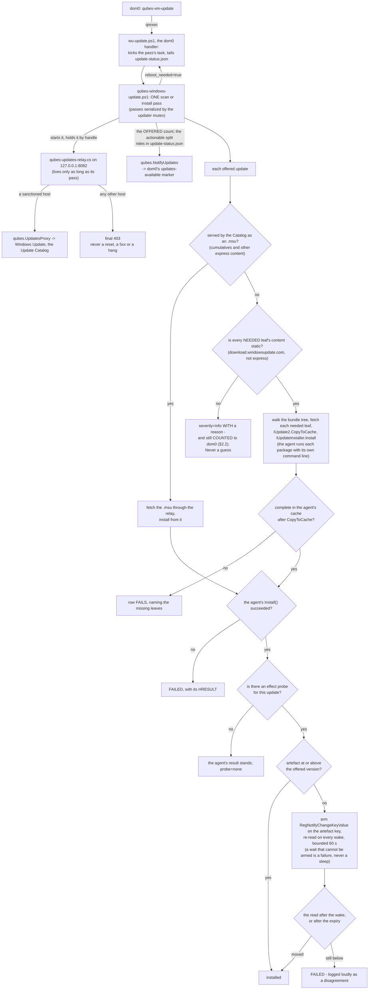

# ADR - the Windows updater (Track C)

## In plain English

dom0 drives Windows updates for a Windows qube, exactly as for Linux templates: automatic updates in the
guest are off, the qube reports what Windows offers, and the Qubes Update tool installs through a proxy that
exists only while a pass runs. The guest has no route of its own, so the updater fetches the files itself
through that proxy; Windows' peer-to-peer and background download mechanisms are never used.

One invariant governs the rest: what dom0 is told must be true. dom0 hears the number of updates Windows is
OFFERING, with whether we can place each one recorded beside it and never subtracted from that number. An
install counts only when its effect is measured, because an exit code of zero is not success. The relay
refuses a disallowed request finally, never with a hang Windows Update would wait out. Nothing is matched by
display title. Our code never runs a vendor installer and never chooses its switches: cumulatives come from
the catalog as `.msu`, everything else with static content goes to Windows Update's own installer with the
update's own command line, and a row is installed only when the installer succeeded AND the artefact moved -
a disagreement fails loudly. Reboots are counted: the guest requests, dom0 performs, none is speculative.
Nothing is killed or adopted by name.

**The qrexec protocol, and what the guest does with it.** dom0's STOCK `qubes-vm-update` - and so the
Qubes Update GUI - drives a Windows qube with no dom0-side command and no dom0 changes. The chain, every
link of it in the tree:

```
dom0 qubes-vm-update
  -> qubes.VMExec                      (the service definition the package ships; the `vmexec` feature
                                        is REQUIRED and must be set FROM DOM0 - the guest cannot
                                        advertise it, and both fallback shapes fail before the shim)
  -> VMExec.ps1                        (the definition runs: cmd /c powershell -file
                                        "%QUBES_TOOLS%\qubes-rpc-services\VMExec.ps1" "%1")
  -> vmupdate-shim.ps1                 (ONLY for commands naming the updater workdir or entrypoint.py;
                                        every other VMExec command goes to cmd.exe as before)
  -> wu-update.ps1                     (qubes-rpc-services\wu-update.ps1 - the protocol end)
  -> QubesWindowsUpdateRun             (a SYSTEM scheduled task: a qrexec handler runs unelevated and
                                        DISM needs admin)
  -> qubes-windows-update.ps1          (the pass; rewrites update-status.json at every phase)
```

dom0's updater does not call an agent living in the guest - it INJECTS one on every run
(`qubes-core-admin-linux`, `vmupdate/qube_connection.py`): untar a tarball into `/run/qubes-update/`, run
`/usr/bin/python3 .../entrypoint.py <flags>`, collect the log. That is why any Linux qube is updatable with
nothing preinstalled, and exactly why Windows never can be: no `python3`, no dnf/apt, no Windows branch in
`get_os_data()`. So the shim answers those command shapes and runs our updater where dom0 expects the
injected agent to run; the injected Python is accepted and discarded.

The contract is the Linux agent's own (`vmupdate/agent/source/common/exit_codes.py`):

* progress is **bare float lines, 0..100, on STDERR**; dom0 parses each with `float(line)`, `100.0` ends the
  progress phase, and any stderr line that is NOT a number is shown to the user as a message;
* **stdout is logs**;
* **exit 0 = success, exit 100 = no updates, anything else = an error.**

Those floats must be formatted in the INVARIANT culture. PowerShell's `-f` formats with the current one,
where `.` in a numeric format string is the decimal-separator placeholder - so on a German guest it emitted
`75,0`, `float()` raised on every progress line from the first, and each was displayed as a message instead
of moving the bar. Only formatting that crosses this protocol needs that care; log text does not.

`wu-update.ps1` is a protocol end and nothing more: baseline `update-status.json`, kick the task, tail that
file as the pass rewrites it, translate phases into floats. Its waits are bounded - it never blocks dom0
indefinitely. WHICH on-demand task runs is dom0's decision: a full pass by default, and
`QubesWindowsUpdateDownload` when dom0 asked for `--download-only`, so a download-only request cannot install.

In the other direction the guest uses two stock services: `qubes.NotifyUpdates` for the count (§2) and
`qubes.UpdatesProxy`, through the relay, for every byte it fetches (§5).

**There is no `qubes.WindowsUpdate` service, and no dom0 script.** The service definitions the package
ships are `qubes.ClipboardCopy`, `ClipboardPaste`, `Filecopy`, `GetAppMenus`, `GetAppmenus`,
`GetImageRGBA`, `OpenInVM`, `OpenURL`, `SetDateTime`, `SetGuiMode`, `StartApp`, `SuspendPostAll`, `VMExec`,
`VMShell` and `WaitForSession` - fifteen, none of them for updates. `wu-update.ps1` is deployed into
`qubes-rpc-services\` and reached by the shim, not by a service definition; its own file header still
calls itself an rpc handler, which is stale.

**The dom0 side applies nothing and runs nothing.** Until 2026-10-07 the dom0 RPM installed three scripts
into `%{_bindir}` and its `%post` EXECUTED two of them: one walked every qube whose `os` feature read
Windows and changed its features and prefs, one rewrote `qvm-create-windows-qube`'s files, and one called
the `qubes.WindowsUpdate` service that has never existed in this tree. All three are removed, along with
the `%post` execution. What a Windows qube needs from dom0 is stated, not done: `qvm-features <qube>
vmexec 1` and `qvm-prefs <qube> qrexec_timeout 600`, which the `%post` message and `docs/QVM-FEATURES.md`
spell out for the admin to apply. Neither can be set from inside the guest - the Windows build of
`qubesdb-cmd` cannot write to QubesDB at all - which is why they are a prerequisite rather than part of
the install.

The whole path, in one picture (§1, §2, §4, §5, §12):



## The decisions at a glance

| § | decision | status | date |
|---|---|---|---|
| 1 | dom0 owns updates; the guest never installs on its own | ACCEPTED | - |
| 2 | The invariant: dom0's reported state must be true | ACCEPTED; point 1 amended | 2026-10-07 |
| 3 | Verify by effect, never by exit code | ACCEPTED | - |
| 4 | Sanctioned paths hard-fail; never a timeout instead of an answer | ACCEPTED | - |
| 5 | Routeless by construction | ACCEPTED | - |
| 6 | Structured data only; no title parsing | ACCEPTED | - |
| 7 | A field report is reproduced on the reporter's measured environment | ACCEPTED | - |
| 8 | Reboots are counted: performed must equal requested | ACCEPTED | - |
| 9 | The test is the product | ACCEPTED | - |
| 10 | The guest cannot restart itself; a restart is REQUESTED, never taken | ACCEPTED | - |
| 11 | A cause outside our code, with a measured remedy, is CLOSED BY DECISION | ACCEPTED; applied once (`0x8024402C`) | - |
| 12 | Architecture: who does what, and who may touch which process | ACCEPTED (owner, Jev); shipped in 4.3.33 | 2026-10-03 |
| 13 | The installer waits for a running scan; a refused updater deploy is never quiet | ACCEPTED (Jev); shipped in 4.3.35 | 2026-10-04 |
| 14 | The cumulative goes first, and Windows is asked whether it registered it | ACCEPTED (Jev) | 2026-10-04 |
| 15 | Outside data never becomes a command | ACCEPTED | 2026-10-07 |

Status words and the section format are defined in `docs/ADR-README.md`.

---

## The decisions in detail

Where the details live:

| record | content |
|---|---|
| `findings/updates.md` | standing facts about the update path, and retracted approaches |
| `findings/issues.md` | the open issue register (P1/P2/P3), maintained in place |
| `findings/rig.md` | rig and harness behaviour, including instrument traps |
| `findings/install.md` | getting a build onto a guest |
| `guest/qubes-windows-update.ps1`, `guest/qubes-updates-relay.cs`, `guest/wu-update.ps1`, `guest/install-updater-agent.ps1` | the components (§12.1) |
| `tools/wu-pass-judge.py`, `tools/wu-log-judge.py`, `mgmt/harness/wu-e2e.sh` | the judges and the end-to-end harness (§9) |

## 1. dom0 owns updates; the guest never installs on its own

**Status:** ACCEPTED.

**Decision.** Guest auto-update is off (`NoAutoUpdate=1`). dom0 drives every install. The guest reports
availability to dom0 over `qubes.NotifyUpdates`. A guest with no netvm reaches Windows Update only through
`qubes.UpdatesProxy`, and only while a pass is running.

**Why.** This is the Qubes model: the admin decides when a template changes, and a template with no netvm
cannot be left to update itself.

## 2. The invariant: dom0's reported state must be true

**Status:** ACCEPTED; amended 2026-10-07 (point 1, which had said the opposite).

**Decision.** dom0 must never be told that a template is up to date when it is not.

1. "Offered" and "actionable" are different numbers, and BOTH are reported. dom0 is told the OFFERED
   count - what Windows is offering - and the actionable split rides in `update-status.json` (`offered`,
   `actionable`) with a reason per item.
2. An item that cannot be installed on this path is `severity=info` with a reason, and is still COUNTED:
   what we cannot install is not the same as nothing being available. A classification may narrow what a
   PASS acts on; it may not narrow what the guest admits to.
3. An offer whose own identity a pass installed and proved installed is GONE, and does not count. That is
   not the same as point 2, and only this one may reduce the number: Windows re-presents satisfied
   signatures under one KB, and counting them makes dom0's marker oscillate.
4. The invariant breaks in two directions: too little (silence about a pending update) and too much (a count
   that can never clear). They are one defect class. Fixing one direction does not close the other, and the
   open direction may not be re-filed at a lower priority in order to call the work done.
5. ONE exception, owner-ruled: under the ESU servicing notice (netvm-free Win10 22H2, past end of
   servicing) dom0 is told the actionable count - "a Win10 22H2 guest reporting 0 actionable updates with
   ESU items as info is CORRECT".

**Why.** dom0's reported state is the product. Every other rule in this file exists to keep it true - and a
count reduced by our own inability to install something is the "too little" direction of this very
invariant, which is how a field reporter came to see "no updates available" while his own Windows Update
window listed one.

## 3. Verify by effect, never by exit code

**Status:** ACCEPTED.

**Decision.**

1. If an installer's effect can be measured, `rc=0` without that effect is not success.
2. A probe that ran and measured no change is a NEGATIVE RESULT, not missing data. It means the install
   failed; it does not mean there was nothing to do.
3. A probe measures the artefact the installer actually changes, and is proven on a known-good install before
   a negative from it is believed.
4. Where no probe exists the row says `probe=none`. It never implies verification.

**Why.** An installer that returns 0 and changes nothing is the exact shape of a silent failure. It reaches
dom0 either as "pending forever" or as "nothing to do", and both break §2.

## 4. Sanctioned paths hard-fail; never a timeout instead of an answer

**Status:** ACCEPTED.

**Decision.** The relay serves a sanctioned host, or refuses with a final 403. Never a reset, a 5xx, or a hang.

**Why.** A transient answer sends Windows Update into its "network is not connected" wait, which parks a
synchronous search until something kills the pass. A refusal is an answer; a timeout is not.

## 5. Routeless by construction

**Status:** ACCEPTED.

**Context.** A guest with no netvm has no default route, so Delivery Optimization and BITS cannot work. The
guest is offline by design, and that is not going to change.

**Decision.** The updater fetches content itself through the proxy: a catalog `.msu`, or a self-contained
static URL. A path that needs DO/BITS is classified, not retried.

**Cost.** Some offers are structurally uninstallable here and must be classified under §2.

## 6. Structured data only; no title parsing

**Status:** ACCEPTED.

**Decision.** Match rows by key, KB content by filename family, and an offer by its identity (`UpdateID` +
`RevisionNumber`). Never on displayed title text. A version number inside a title is the one exception,
because digits are language-free.

**Why.** The catalog's response language is not deterministic: one KB comes back German, English or French,
and the reporter's environment is German. Any logic keyed on a title is a defect waiting for a locale to
expose it.

## 7. A field report is reproduced on the reporter's measured environment

**Status:** ACCEPTED.

**Decision.** The reporter's environment is data: `mgmt/reporters/<name>.json`. `mgmt/harness/env-assert.sh`
measures a guest against it and exits non-zero on any mismatch, and on any fact it could not measure.
"Diagnostically similar" is not an environment. If the environment does not exist on the rig, building it is
the first task.

## 8. Reboots are counted: performed must equal requested

**Status:** ACCEPTED.

**Decision.**

1. No speculative reboots. Every power cycle traces to a request: the guest powered itself off, or
   `update-status.json` said `reboot_needed=true`.
2. A reboot counts as PERFORMED only when the guest has gone down and come back with qrexec answering. An
   issued command is not a cycle.
3. If `reboot_needed` cannot be read it is UNKNOWN, and missing data fails. It is never read as false.
4. The harness fails the run on a mismatch in either direction: an extra cycle nobody asked for, or a
   requested cycle skipped.

**Why.** Rebooting until things settle is unfalsifiable (reboot often enough and something eventually works),
and it conceals the defect that needed the extra cycle. It also stops reproducing what a user gets, because a
user reboots when Windows asks.

## 9. The test is the product

**Status:** ACCEPTED.

**Context.** Every wrong verdict in this track came from an instrument, not from the code under test. The
known instrument traps are recorded in `findings/rig.md` and `findings/updates.md`, and kept out of this file on
purpose: they are observations, and they change.

**Decision.**

1. Passes are judged by code, not read by eye: `tools/wu-pass-judge.py` at workflow level (did the pass tell
   dom0 the truth) and `tools/wu-log-judge.py` at engine level (did the search enter the transient wait).
   `mgmt/harness/wu-e2e.sh` drives repeated passes through dom0's own `qubes-vm-update` sequence and judges
   every one.
2. Before grading, the artefact under test is proven to be the one on the guest: the installed file is compared
   against the package by byte count and guard markers. An installer's own success message is not evidence.
3. A wait keys on a property that DISTINGUISHES the new artefact from the old one. A marker both builds carry
   is not a wait.
4. An excluded item is an open question until it is judged individually, against evidence measured outside the
   updater. The updater's own reason string is not evidence for itself. A verdict file must cover every
   excluded item; one that omits an item says nothing about that item. `wu-e2e.sh` exit codes: **0** every
   round passed and every excluded item is positively judged (or nothing was excluded); **3** a round failed;
   **4** rounds passed but exclusions are unjudged.
5. Missing data fails. A check that cannot fail is not a check: every gate here must have been seen to FAIL
   on a build with the defect put back.

## 10. The guest cannot restart itself; a restart is REQUESTED, never taken

**Status:** ACCEPTED.

**Context.** A Qubes HVM is `on_reboot=destroy` / `on_poweroff=destroy`. A guest-initiated restart leaves the
qube Halted, and only dom0 can start it again. So when the guest needs a boot, it cannot take one.

**Decision.**

1. A state the guest cannot leave on its own is REPORTED as a request (`reboot_needed=true`) with a message
   naming the action, and the pass stops there. It is not worked around by powering the guest off, and not
   hidden by retrying.
2. The guest powers itself off only where an admin-driven install or update pass asked for it (§8).
3. A guard that cannot measure what it needs says so and lets the pass proceed. An unmeasured guard is
   announced, never assumed in either direction.

**Why.** A guest that halts itself to fix its own problem takes the machine away from the admin without being
asked, and §8's accounting cannot tell that cycle from a requested one.

## 11. A cause outside our code, with a measured remedy, is CLOSED BY DECISION

**Status:** ACCEPTED. Applied once, below.

**Decision.** We chase a cause until either it is NAMED, or it is BOUNDED to a component that is not ours
**and** a remedy is measured. In the second case we stop deliberately, and the stop is recorded here rather
than left in the issue register.

1. A decision to stop states four things: what is ESTABLISHED, what is NOT, the REMEDY that makes the residue
   tolerable, and what would REOPEN it.
2. An item parked this way does not remain in `findings/issues.md` as open work. "Still open" there reads as
   unfinished work and invites the next session to re-derive it, which this project has paid for more than
   once.
3. The remedy is in the product and FAILS LOUDLY if it stops working. A parked cause with no remedy is not
   parked, it is ignored.

### Applied: Windows Update's own proxy selection (`0x8024402C` on a routeless guest)

**Established.** On a guest whose updater was installed and which has not restarted since, Windows Update's
request omits the proxy configuration (WebIO request option 10, `ProxyConfig`), goes to an endpoint with
`Proxyendpunkt: 0x0`, resolves the hostname itself and gets `11001`, which surfaces as `0x8024402C`. Both
polarities were traced on one guest and reproduced on a second. Everything outside Windows Update is excluded
by measurement: the relay and qrexec path; .NET *and* WinHTTP through the same proxy at the same instant; the
machine WinHTTP configuration (re-applied); the service account's WinINET configuration (populated); WPAD
(off); the autoproxy inputs and the proxy arbiter's answers (identical on both sides); the update datastore
(moved aside); network adapters; servicing state; and nine services actually cycled.

**Not established.** Why Windows Update omits the proxy early and attaches it later. Jev: `wu-internal-state`
0.80, `trigger_known` 0.11. A fixed delay must NOT be claimed: the subjects only bracket a quarter of an hour
(`timer_claim` 0.25).

**Remedy** (`GUARD:proxystateremedy`). The pass reports the reason it MEASURED in that same pass (WinHTTP
through our proxy reaching the same endpoint, with the HTTP status carried in the message) and requests the
restart that is measured to clear the state, once per boot, through the existing `reboot_needed` channel that
§8 counts and §10 keeps a request. dom0 is told no availability number either way.

**Reopens if** the state survives a restart on any guest (the pass already says so, and stops asking rather
than looping); if the once-per-boot guard is seen to fire twice in the field; or if a Windows change makes the
state persist. Reporting it outside this project is the other live option, since this is Windows Update
declining a proxy the system is handing it.

## 12. Architecture: who does what, and who may touch which process

**Status:** ACCEPTED (owner, Jev), 2026-10-03, after the KB5007651 failure. Implemented in QWT-NG 4.3.33
(released 2026-10-03). Before it, the updater ran installer-type packages itself with `/q`, and adopted and
killed relays by name. Every fork below was put to Jev with the owner's rules as its premise; the measurements
behind it are in `findings/updates.md` and `findings/issues.md`.

### 12.1 Components

| component | file | role |
|---|---|---|
| the pass | `guest/qubes-windows-update.ps1` | one scan or install pass; passes are serialized by the updater mutex (a second one refuses, `QWTUPDMUTEXHELD`) |
| the relay | `guest/qubes-updates-relay.cs` | the pass's only way out: `127.0.0.1:8082` -> `qubes.UpdatesProxy`; serves sanctioned hosts, refuses others with a final 403 (§4) |
| the dom0 handler | `guest/wu-update.ps1` | dom0's `qubes-vm-update` entry point: kicks the pass's task, tails `update-status.json`, cleans up after a pass that was killed |
| the scheduled tasks | `QubesWindowsUpdateScan` / `...Run` | the boot-time and periodic scan; the install pass dom0 asks for |
| the installer | `guest/install-updater-agent.ps1` | installs or upgrades the above (compiles the relay in place) |

### 12.2 Install routes

**Decision.**

1. **Search** is always the Windows Update agent's own online search, through the relay.
2. **What the Update Catalog serves as an `.msu`** (cumulatives and other express-content updates, which the
   agent could only fetch through Delivery Optimization) is fetched by us and installed from the `.msu`.
3. **Every other offered update whose NEEDED content is static** (`download.windowsupdate.com`, not express)
   is installed by the **Windows Update agent's own installer**: we walk the update's bundle tree recursively
   (a needed leaf has content, is not installed and is not downloaded), fetch each needed leaf's files through
   the relay, hand them to the agent with `IUpdate2.CopyToCache`, and call `IUpdateInstaller.Install`. The
   agent then runs each package with **the update's own command line** and interprets its exit code by the
   update's own rules.
4. **Anything else** gets a row that says why: FAILED, or informational under §2. It never gets a guess.

Rules that follow:

- **No code of ours runs a vendor installer, and no code of ours chooses an installer's switches.** No switch
  table, no per-package special case.
- **The agent's downloader is never called on this path.** It needs Delivery Optimization / BITS (§5).
- If the update is not complete in the agent's cache after `CopyToCache`, the row FAILS and names the leaves
  that are missing.
- **A vendor payload is never carved, repacked, extracted or provisioned by us.**

(The flowchart for this decision is in "In plain English" at the top of this file.)

**Why.** The switches are not ours to know. Where we guessed them we were wrong twice: `/q` made the Security
platform installer exit 0 and do nothing; running the Defender delta ourselves, bare and with `/q`, failed,
and we concluded it "cannot self-apply", while the agent applies it through Microsoft's installer stub
(`MpSigStub ... /program <delta> WD /q`). Where a guessed switch happened to work (MRT, the signature package),
it still was not the package's own command line: the agent runs MRT with `/Q /W`. The workaround built on the
first wrong guess, carving the app out of the Security platform installer, made the app current while the
platform stayed uninstalled, and the updater then reported the update ALREADY CURRENT (§2 broken: too little).
The update's metadata is the authoritative source, and the agent is the only component that reads it. So the
agent runs the package, and we only supply the bytes it cannot fetch for itself.

### 12.3 Verdicts

**Decision.** A row's result is the agent's per-update result AND our effect probe where one exists (§3).

| agent result | probe | row |
|---|---|---|
| succeeded | artefact moved to the offered version or above | installed |
| failed | - | FAILED, with its HRESULT |
| succeeded | artefact stayed below the offered version | FAILED, logged loudly as a disagreement |
| succeeded | none exists | the agent's result stands, `probe=none` recorded (§3) |

- The probe measures what the update changes. For the Windows Security platform that is the platform's own
  registration (`Windows Security Health\Platform\CoreLocation` and `\Updates\wu`), never the Security app.
- **ALREADY CURRENT** means the measured artefact is at or above the version the offer carries. Nothing else
  qualifies.

**Why.** The agent's result says the package ran to completion; the probe says the thing dom0 is told about
changed. Either alone has read as success on a failed install (§3), and the case where they disagree is exactly
the case that needs saying.

**The effect is waited for, never assumed to be there** (decided 2026-10-03). The agent's `Install()` can
return before the package's work is done: for KB5007651 it returned ResultCode 2 after 2 s, the platform read
1 s later was still the inbox one, and the platform had switched within 10 s. The rz38b validation pass
therefore failed an update that had installed.

- **Mechanism:** a registry change notification on the probe's own artefact key (`RegNotifyChangeKeyValue`, as
  the CBS settle uses), armed before every read; the artefact is re-read on every wake. Jev 0.72.
- **Scope:** only the rows the verdict would otherwise fail as a disagreement. Every other row is decided on its
  first read, and there is no per-package list. Jev 0.92.
- **Bound:** 60 s after the agent returned. Jev 0.55. Measured with the wait on a fresh clone of the German
  golden: the platform switched 2.8 s after the agent returned. Every wait logs the latency it saw.
- **The expiry passes nothing.** The read taken after the expiry decides, so "never a timeout as a fix" holds.
  Jev 0.83.
- **A wait that cannot be armed is an ERROR.** The read decides, and no poll takes its place.
- The Defender probes read the service's view (`Get-MpComputerStatus`), not the key that is watched, so their
  wake can come early. The cost is lateness up to the bound, never a wrong row (Jev 0.93).

(The flowchart for this decision is in "In plain English" at the top of this file.)

**A reboot left pending: at most ONCE** (the owner, 2026-10-03). The normal dom0-initiated update may leave
the reboot pending: "It is ok if we show that updates are still pending and reboot is required to dom0 once, we
just want to avoid doing that more than once." So dom0 may be told once that work is staged or deferred and a
reboot is required. A second such report for the same update cycle is a defect: a repeated reboot request, or
a pending count that comes back after the reboot because the work did not land. The test judges the count of
those reports; no special machinery is built for the pending state itself.

### 12.4 Process ownership

**Context.** Measured 2026-10-03: the boot-time scan adopted a relay another process had started, and at the
end of its pass `Remove-Proxy` TerminateProcess'ed every process with that name, mid-transfer, leaving no log
line and no crash record. A process found by name is any process with that name. Killing it is a decision about
something we did not start and cannot identify, and adopting it hands our traffic to it. This hazard was listed
by the 2026-10-02 process audit and left in place, which is why it is a rule here now.

**Decision.**

1. **A component touches only processes it started, and holds them by handle** (`Start-Process -PassThru`;
   identity = pid + start time).
2. **Nothing is ever killed or adopted by process name.**
3. **The pass owns exactly one relay,** the one it started, and stops exactly that one. It never uses a relay
   it did not start. If `127.0.0.1:8082` is held by any other process, the pass refuses with a named reason.
   Under the mutex that is an anomaly, not a race to win.
4. **A relay lives only as long as its pass.** It is started with `--parent-pid` and its own watchdog ends it
   within seconds of the pass's process going away.
5. **The handler's dead-pass cleanup kills nothing.** It waits for that watchdog (bounded, every exit reported)
   and reports a relay that outlives it as an anomaly, naming its pid and parent.
6. **The installer kills nothing.** Holding the mutex, it waits for any relay to exit. If one remains, it keeps
   the previous relay exe and says why.
7. A commit-time lint refuses kill-by-name and adopt-by-name in shipped guest scripts.

## 13. The installer waits for a running scan, and a refused updater deploy is never quiet

**Status:** ACCEPTED (Jev), 2026-10-04; shipped in 4.3.35.

**Context.** Field report (4.3.33, a German Windows 11 25H2 template): dom0 showed no updates while Windows Update
listed one. Reproduced 2026-10-04 on the reporter's registered environment with the released 4.3.34: stage 2 of
the installer reached the updater deploy about three minutes after boot, inside the previous updater's boot scan
(`QubesWindowsUpdateScan`, boot + 2 min, limit PT20M), which held the updater mutex. The deploy refused
(`QWTUPDMUTEXHELD`); the installer recorded one WARN line and `updater_agent='error: ...'` in a RESULT that said
`ok:true`, printed INSTALL COMPLETE, and never told dom0; the guest kept its old updater. A 4.3.32 updater never
recorded its owner and 4.3.29 has no owner field, so the status record alone cannot name those holders.

**Decision.**

1. **A running SCAN is waited for, on the mutex itself.** `guest/install-updater-agent.ps1` identifies the holder
   first: the status record says `scan` AND either (A) its recorded owner (pid + start time, since 4.3.33) is a
   live process, or (B) the registered Scan task is Running, no Run/Download task is, and the record was written
   by that running instance (its time not older than the task's LastRunTime).
2. The wait is one kernel wait on the mutex (`WaitOne`, in 30 s slices only so that a line is logged while it
   lasts), bounded by the scan task's own `ExecutionTimeLimit` as registered (PT20M when unreadable or
   unlimited), less the time the scan already ran, plus PT3M for the scheduler's stop-then-terminate. Expiry is
   a loud refusal (`QWTUPDSCANWAITEXPIRED`); there is no proceed-anyway branch.
3. **Nothing else is waited for.** An install or download pass, a stale record, an unreadable task state: refused at
   once (`QWTUPDMUTEXHELD`), naming the holder, the three task states and the remedy.
4. Abandoned after a scan: the deploy takes the mutex and proceeds (a scan installs nothing). Abandoned after
   anything else: given back, refused.
5. **A refused or failed deploy is an ERROR of the install.** `updater_agent_failed` (error-class in
   `mgmt/harness/result-flags.py`) folds the RESULT into `ok:false`; the deploy's lines are streamed into the log
   as they arrive; the last lines before the RESULT say "Windows Update agent was NOT installed: ... What to do:
   ..."; dom0 is notified (`installer.updater-not-installed`) once QrexecAgent runs - on `-Auto -RebootAtEnd`
   it does not run in that boot, and the log says so.
6. **The deploy runs after the stage-2 qrexec release**, not inside the hold (`docs/ADR-boot.md` §2 rule 8): the
   scan it may wait for reaches dom0's update proxy over qrexec.
7. The remedy is the existing `install.cmd /updatesonly`. No boot-time retry is built.

**Why.** A scan is the one holder that installs nothing and ends on its own; refusing it made the ordinary sequence
(boot the template, run the installer) keep the previous updater. Jev: loud refusal + wait for a running scan over
a boot-time retry; four reviews of the diff - fixes the reporter's path 0.84, the wait is a legitimate wait on an
observed event 0.95, scan misidentification 0.19, move after the release 0.99.

**Cost.** An install that meets a running scan waits for it: measured 18 s and 28 s; the bound is the scan task's
limit (PT20M) less its run time plus PT3M, with a line every 30 s. A real scan that holds the mutex in its first
second, before its first record write, is refused (loudly) instead of waited for.

**Evidence.** Seen to fail: 4.3.34 on the reporter's environment, RESULT `ok:true` with `updater_agent=error
QWTUPDMUTEXHELD` (2026-10-04). Seen to pass (4.3.35 RC, release-package 37230058013, 2026-10-06): witness B - a fresh
clone of the 4.3.29 golden, its old Scan task Running with its own fresh record: the deploy waited 18 s, took the
mutex at the release, deployed; witness A - the upgraded 4.3.35 guest, its own scan (owner pid alive): waited 28 s,
deployed. Offline: `tools/tests/wu-deploy-loud-selftest.sh` (a real second process holding the real named mutex,
the shipped notify route, the real grader), 42 checks, 11 defect knobs each failing.

**Open.** The dom0 notification of a REFUSED deploy arriving in dom0 is not measured (no refusal occurred on the
rig); a scan reaching its limit during the wait is tested offline only.

## 14. The cumulative goes first, and Windows is asked whether it registered it

Decided 2026-10-04. Jev: picking the cumulative by DISM's identity 0.63 (Q1); a registration check is
needed 0.88 (Q3); the order rule itself unsettled at 0.49 (Q2) - which is why the check, not the rule,
carries the invariant. In `guest/qubes-windows-update.ps1` as `WU-PASS-ORDER`, `WU-INSTALL-MSUS`,
`WU-CUMULATIVE-REGISTERED` and `WU-MSU-VERDICT`; replayed offline by
`tools/tests/wu-cumulative-order-test.ps1`. (Written as 13 on its own branch; main had taken that number for the scan-wait section, so it is 14 here.)

- **Only the `.msu` route is reordered.** The offer loop still resolves and fetches every offer in offer
  order, and the Windows Update agent route (Defender, the Security platform, MSRT, no-KB offers with
  static content) and the drivers resolved from the catalog by title still install inline, where they
  always did and where 4.3.33 was measured working (Jev review 2026-10-04: moving them behind a staged
  cumulative was the biggest risk, 0.78; the narrow design 0.73). The catalog `.msu` are queued and
  installed after the loop: the cumulative first, then every other `.msu` in offer order.
- **The inline routes are not CBS packages** and are NOT EXPECTED to set CBS `RebootPending` - not
  measured. If one ever does, the gate below defers the cumulative truthfully, at the cost of one extra
  restart; nothing is concealed.
- **Which package is the cumulative is DISM's answer** - the package identity it reports for the file
  (`OnePackage` or `RollupFix`) - never the title and never the filename (§6).
- **The cumulative is installed only while nothing is pending.** CBS `RebootPending` is read at that
  moment. Set - by Windows or by an earlier pass - the cumulative is DEFERRED with exactly that reason
  and the restart is requested through `reboot_needed` (§8, §10). Unreadable, the cumulative proceeds
  and the pass says so (§10: an unmeasured guard is announced, never assumed in either direction).
- **The one-package-per-pass rule has exactly one relaxation.** A package that is not itself a
  cumulative may stage behind a cumulative that this pass staged AND Windows registered. A second
  cumulative is deferred. With no registered cumulative the rule stands as it was.
- **For the cumulative, DISM's 3010 is not the answer; the package list is.** It is read before and
  after the DISM call as structured data - `Get-WindowsPackage -Online`, the package name and the
  `PackageState` enum, never `dism /format:table`, whose state words are localized (§6). A `RollupFix`
  package must be NEWLY `InstallPending`: absent before, or not pending before. If it is not, the KB
  FAILS, and its reason says that DISM accepted the package, that Windows did not register it, that it
  is not staged, and that the pass after the requested restart retries it. An unreadable list is the
  same failure with "unknown" in place of "did not register": missing data fails, and nothing
  unverified is ever reported as staged.

**Why:** measured on the reporter's German 25H2 template with 4.3.33, four fresh clones. .NET staged
first and the cumulative second: DISM returned 3010 for both, no `RollupFix` package was ever
registered, the build did not move at the restart and the update was re-offered - so DISM's 3010 alone
would have had the updater report it staged, a §2 break in the direction that conceals. (That run lifted
the one-package rule on purpose; shipped 4.3.33 defers the cumulative behind .NET instead - its second
restart - and a cumulative it stages alone was verified to land, UBR 9457.) The same two packages
in one DISM call: the same loss. The cumulative alone: its servicing stack installed online at once and
the rollup registered `InstallPending`. The cumulative first and .NET second: both landed at one
restart. The mechanism - the cumulative's bundled servicing stack must install online, and a pending
restart blocks it - is inferred, not established, so the design does not rest on it: any miss of the
order rule ends in a truthful deferral or a failed row that requests the restart. The cost is at most
one extra restart, and dom0 is told once that work is pending and a restart is required - the owner's
rule - never that something will complete when it will not.

---

## 15. Outside data never becomes a command

**Status:** ACCEPTED.

**Decision.** The updater turns data it did not author - a host some process on the guest asked for, a file
name from the Update Catalog, arguments from dom0 - into decisions and into arguments, never into a command
line that something else parses.

1. **No shell, anywhere on this path.** The relay spawns with `UseShellExecute = false`
   (`guest/qubes-updates-relay.cs`, the `ProcessStartInfo` block); PowerShell calls native tools with `&` and
   an argument array (`pnputil` takes `@('/add-driver', $inf.FullName, '/install')`). Nothing on this path
   builds a string and hands it to `cmd /c`. A metacharacter in outside data therefore has nothing to mean.
2. **A requested host decides a verdict; it never reaches an argument.** The relay parses the destination out
   of `GET http://host/path` or `CONNECT host:443` only to answer the one question `Allowed(target)` asks,
   and a disallowed one gets a FINAL 403 (§4). The spawn's four fields are
   `target|qubes.UpdatesProxy|user|<self> --relay <port> <token>`: `<port>` is an int we bound, `<token>` is
   one we minted, and the pass starts the relay with `--target @default --user SYSTEM` explicitly. **The host
   the caller asked for appears in none of them** - that is the claim this section makes, and it is the one
   that matters, because the relay is the one component whose input comes from whatever on the guest can
   reach `127.0.0.1:8082`.
   Two surfaces here are OURS rather than the caller's, and are written down so they are not mistaken for
   guarantees:
   - `target` falls back to the `QUBES_UPDATES_TARGET` environment variable when `--target` is absent, so
     whoever can set this process's environment selects the qrexec target. The shipped path never relies on
     that fallback, and dom0's qrexec policy - not this code - decides whether a call to any target is
     allowed at all; that policy is the boundary, and this is a convenience inside it.
   - the fields are joined with `|` and qrexec-client-vm splits on `|` without stripping quotes, so **no
     field may contain a `|`** - including `<self>`, our own installed path. Nothing checks this today; it
     holds because the path is `C:\Program Files\Qubes Tools\bin\...`.
3. **A catalog file name is a path in our own working directory, passed as one argument.** `DISM /Online
   /Add-Package /PackagePath:"$f"` quotes it, and `$f` is a file this pass fetched into `$WorkDir` - the name
   comes from outside, the location does not.
4. **dom0's arguments narrow, they do not compose.** `-OnlyKb` / `-OnlyUid` are matched against the offers a
   pass already has; they are never interpolated into a command line, and they never narrow what dom0 is told
   (§2.2).
5. **Where a native tool's own parser forces a shape, the shape is documented at the call site AND asserted
   by a test.** Two of ours have a parser of their own and both have bitten us:
   `qrexec-client-vm.exe` splits its RAW command line on `|` and does not strip quotes, so the pipe string is
   passed UNQUOTED and no field may contain a `|`; and `sc.exe failure <svc> ... actions=` rejects an empty
   argument, which Windows PowerShell 5.1 silently produces from a bare `""`. The second one shipped three
   times because its suite stubbed `sc.exe` as a PowerShell function - which cannot reproduce native argument
   passing - and asserted the broken form as acceptable.
6. **The verdict on such a call is the effect, not the exit code** (§3). A command line that a tool rejected,
   or accepted and ignored, returns indistinguishably from one that worked; only reading back what it was
   supposed to change tells them apart.

**Why.** Our code never runs a vendor installer and never chooses its switches (§12): the vendor's own command
line comes from the update's metadata and is executed by Windows Update's own installer. That rule removes the
largest surface by construction. What remains is the handful of native tools we do call, and the rule for them
is the same one: outside data is an argument or a decision, never syntax.
