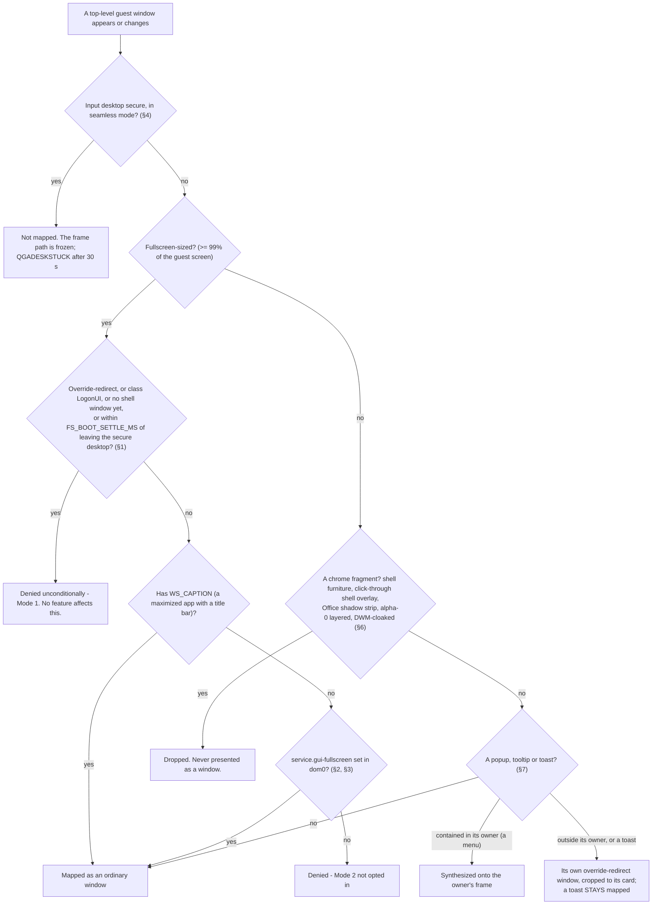

# ADR - windows: which guest surfaces become dom0 windows, and how the guest keeps a session

## In plain English

Not every window a Windows guest has should become a window on your desktop. The agent decides, and these are
the rules.

Windows' own boot, sign-in, lock and shutdown screens are never shown, recognised by class and by phase, and
no setting changes that. A borderless window filling the whole guest screen (a game, a video) is shown only if
you opted in for that qube with a single dom0 feature; a maximized application with a title bar is always
fine. That feature is the only control, and the README's table is its specification. Windows' secure desktop
(UAC prompts, the lock screen) is never presented as free-standing windows in seamless mode, because each
would be indistinguishable from dom0's own interface. A UAC prompt is therefore configured to appear on the
normal desktop as an ordinary window, and while the secure desktop is up a seamless qube shows nothing new. In
the whole-desktop mode the secure desktop is shown inside the one bounded window, which the guest can never
grow to your screen size on its own.

Fragments of application chrome that are not windows (Office's shadow strips, shell overlays, the shell window
itself) are dropped rather than bordered. The fix for a mis-bordered fragment is always to stop presenting it,
never to weaken dom0's borders. Menus and tooltips are sent borderless, as the Linux agent does; toasts
likewise, and they stay shown. The Start menu is not presented in seamless mode. If the capture helper the
design relies on is missing or dead, the agent fails visibly, with a black window that stays mapped and an
error in dom0, rather than silently falling back to copying the whole desktop. Everything the agent changes in
the guest for seamless mode (title bars stripped, Windows key blocked, shadows off) is applied in one place
and undone when the mode switches.

Finally, autologon is enforced, because a guest parked at the sign-in screen is unreachable: dom0 cannot run
anything in it, and in seamless mode it is invisible. The password is validated before anything is written and
stored only as a protected system secret, and a boot-time task re-asserts the arming.

How the agent decides whether a guest window becomes a dom0 window (§1, §2, §4, §6, §7):

## The decisions at a glance

| § | decision | status | date |
|---|---|---|---|
| 1 | The boot, logon and shutdown screen is never shown to dom0 (Mode 1) | ACCEPTED (owner), unconditional | 2026-08-28 |
| 2 | A borderless true-fullscreen app window is shown only when dom0 opts in (Mode 2) | ACCEPTED (owner) | 2026-08-28 |
| 3 | ONE control: `service.gui-fullscreen`, and the README table is its specification | ACCEPTED (owner) | 2026-09-01 |
| 4 | The secure desktop is handled by mode; the safety criterion is geometry, not desktop identity | ACCEPTED (owner) | 2026-08-28 |
| 5 | The non-seamless desktop is one bounded window the guest can never grow to the host | ACCEPTED (owner) | 2026-08-27 |
| 6 | Chrome fragments are not windows; dom0's bordering is never weakened | ACCEPTED (owner) | 2026-08-26 |
| 7 | Popups, tooltips and toasts are override-redirect windows; a contained menu is synthesized onto its owner | ACCEPTED (owner) | 2026-08-16 |
| 8 | No composite fallback on a direct-capable guest: fail hard and visibly | ACCEPTED (owner) | 2026-09-06 |
| 9 | Seamless tweaks are applied in one place and reversed by construction | ACCEPTED (Jev 1.00) | 2026-09-25 |
| 10 | Autologon is enforced: a guest without a session is unreachable | ACCEPTED (owner) | 2026-08-28 |

Status words and the section format are defined in `docs/ADR-README.md`.

---

## The decisions in detail

Where the details live:

| record | content |
|---|---|
| `CLAUDE.md`, "Product decisions (binding)" | the owner-approved spec for fullscreen, the secure desktop, autologon, window filtering |
| README, "Configuration" table | the specification of `service.gui-fullscreen` and the other features |
| `docs/QVM-FEATURES.md` | every feature, its default and precedence, generated from the source |
| `findings/windowing.md`, `findings/autologon.md` | the measurements behind each section |
| `docs/DESIGN-nonseamless-buildout.md` | the non-seamless desktop: what works, what is still owed (2026-09-25) |
| `guest/set-autologon.ps1`, `guest/ensure-autologon.ps1` | autologon as built; the header states the reasons |
| `agent/gui-agent/main.c` (`ShouldAcceptWindow`, `ProcessNewFrame`, `ApplySeamlessTweaks`) | where §1-§4, §6-§9 are enforced |

## 1. The boot, logon and shutdown screen is never shown to dom0 (Mode 1)

**Status:** ACCEPTED (owner), unconditional; not governed by any feature. Spec in `CLAUDE.md`; measured
2026-08-28 and 2026-09-01 (`findings/windowing.md`).

**Context.** Windows renders its login, lock, "shutting down" and initial-desktop screens through a single
full-screen `LogonUI` window. Mapping it produced a black or blue frame that took over the qube's window at
every boot and shutdown. Class-only matching once let a fullscreen boot surface through, so the rule matches
by PHASE as well.

**Decision.** In `ShouldAcceptWindow`, a fullscreen-sized window (>= 99% of the guest screen) is denied:

1. by class, when the class contains `LogonUI`;
2. by phase, while no shell window exists (boot, logon, shutdown), while the input desktop is secure, and for
   `FS_BOOT_SETTLE_MS` after it stops being secure;
3. unconditionally when it is override-redirect.

An already-announced window that becomes ineligible (it animates into borderless fullscreen with the feature
off) is unmapped at once in the tracking pass, not on the next remove, so there is no map-then-unmap flash. A
guest that reaches a *visible* sign-in screen is a misconfiguration to fix with autologon (§10), not something
the agent renders.

**Evidence.** Fault-injection bit `FI_GATE_MODE1` lets the acceptance see the gate fail on one binary. The
"fullscreen flash" history (window 0 at shutdown, Progman by class, gui-emulated, seamless-mode defaults) is
superseded: the flash was per-window LogonUI, and this clause is what removed it.

## 2. A borderless true-fullscreen app window is shown only when dom0 opts in (Mode 2)

**Status:** ACCEPTED (owner). Spec in `CLAUDE.md` and the README table.

**Decision.** A borderless window (no `WS_CAPTION`) of >= ~99% of the guest screen - a game, a video, a
presentation - is mapped only when dom0 opted in with `qvm-features <vm> service.gui-fullscreen 1`. qubesdb's
`/qubes-service/gui-fullscreen` wins over the guest registry `ShowFullscreenScreen`; both are read once at
agent Init. A maximized window WITH a title bar is always allowed. An override-redirect fullscreen window never
maps, feature or not (§1).

**Why.** A borderless window covering the whole screen is a guest surface indistinguishable from the host's
own display; whether a qube may paint that is dom0's choice, per qube, never the guest's.

**Evidence.** Fault-injection bit `FI_GATE_MODE2`; the acceptance's SG2/SG4 cells exercise the deny
discriminators and SG3 maps a windowed fullscreen 6/6. The feature-ON arms are owner-attended and still owed
(PASS-UNPROVEN per SG11, `docs/ACCEPTANCE-4.3.16.md`).

## 3. ONE control: `service.gui-fullscreen`, and the README table is its specification

**Status:** ACCEPTED (owner: "do not complicate the controls").

**Decision.** `service.gui-fullscreen` is the single control for guest-originated fullscreen. The top-level
README's feature table is its specification: when behaviour and README disagree, the README wins and the code
changes. No knobs, modes or behaviours are invented around it. Since 4.3.33 the feature governs ONLY Mode 2:
dom0's `qubes.SetGuiMode` (the whole desktop in one window, §5) is honoured on any guest, feature or not.

**History.** A split flag `service.gui-windowed-desktop` was written (agent 0fc00ca) and reverted in full
15 minutes later (6e6329a); it never shipped. The harness never sets `service.gui-fullscreen` on any guest and
never signals the mode-switch events: feature-ON arms and any windowed-desktop exercise are owner-attended.

## 4. The secure desktop is handled by mode; the safety criterion is geometry, not desktop identity

**Status:** ACCEPTED (owner, revised 2026-08-28; read this version, not the older "hide unconditionally").

**Context.** Pre-fix agents attached to the Winlogon desktop during an elevation and mapped BOTH the consent
dialog AND the fullscreen dimming backdrop into dom0; the backdrop IS the field-reported "unclosable black
window". Each secure surface mapped in seamless mode would be its own standalone dom0 window, indistinguishable
from dom0's own UI.

**Decision.**

| mode | the secure desktop |
|---|---|
| seamless | never mapped. `AttachToInputDesktop` tracks `g_OnSecureDesktop`; `ShouldAcceptWindow` rejects everything while it is set, and the frame path freezes in `ProcessNewFrame` while the input desktop is not Default. A persistent freeze is logged `QGADESKSTUCK` after 30 s, then every 120 s. A pending UAC elevation is therefore INVISIBLE in seamless: the qube "does nothing" until the prompt is answered or times out, and the agent log says why (standing owner decision; UAC visibility is future work). |
| non-seamless | shown, secure or not: the sign-in screen or a prompt appears inside the one bounded desktop window (§5), which is what makes it safe. |

Two settings follow from it:

- **UAC prompts are drawn on the normal desktop** (`PromptOnSecureDesktop=0`, written by
  `ApplyUacPromptPolicy`), so a prompt is an ordinary bordered window in both modes. Where the prompt is drawn
  is deliberately not configurable. Protocol SG5 calls this load-bearing; the IDD boot-path measurement found
  it fixed nothing else (zero recorded UAC-desktop events).
- **`service.uac-disable` acts only on an explicit `1`**, needs a reboot, and must be set on the TEMPLATE
  (`EnableLUA` is latched inside LSA at boot; an AppVM's system drive is restored at every boot). A feature
  cleared the ordinary way reads back as `0`, so a plain on/off knob would let "clear the feature" silently
  disable UAC. It is the Windows equivalent of passwordless sudo and is framed as that, never as a security
  improvement.

**Evidence.** Reproduction needs `EnableLUA=1`; the rigs default to `EnableLUA=0`, which is why the black
window was never seen locally, and `win11-tpl` is deliberately kept at `EnableLUA=1` as the field-faithful rig.
Agent 07fb32d logs "secure-desktop ENTERED/LEFT ... mapping suppressed".

## 5. The non-seamless desktop is one bounded window the guest can never grow to the host

**Status:** ACCEPTED (owner, the hard geometry guard 2026-08-27; the live switch since 4.3.33). The owner's
rule: "never fucking ever non-seamless mode goes fullscreen unless requested explicitly".

**Decision.**

1. `qubes.SetGuiMode` is honoured on any guest. On entry the desktop surface is plugged in like a monitor: the
   whole-desktop grant is made and window 0 is mapped. On exit it is unplugged. A seamless guest therefore never
   holds a whole-desktop grant (`SeamlessNoScreenGrant`, on by default; on a guest with `service.gui-fullscreen`
   the agent turns it back off at start and says so, `P2NOGRANT not applied`).
2. Window 0 is shrunk on entry to the windowed default (1280x800) and is refused at host size unless the size
   came from dom0 (`g_ResolutionFromDom0`): a guest-originated host-sized window 0 is NEVER mapped; the agent
   shrinks and defers the switch (`g_NonSeamlessPending`). dom0-requested sizes are never second-guessed.
3. The agent echoes dom0's own window-0 position back (`g_ScreenWinX/Y`) so the daemon resizes in place and
   never repositions.
4. The published IDD mode set carries the host size only while seamless is active (`docs/ADR-display.md` §4),
   so a guest cannot select its way to fullscreen.
5. Inside the desktop, applications keep their own title bars (§9), and resizing the dom0 window resizes the
   guest's screen to match, including to arbitrary sizes.

**Evidence.** The switch executes in both directions and persists across a reboot; a first entry renders a
correct live desktop (5120x1384 verified by capture); resize and input are closed end to end
(`findings/windowing.md`, 2026-09-25). What was still owed on 2026-09-25 - the frame supply dying on later
entries (`QGACAPDEAD` now notices it; root cause open), and the entry at 96% of host height that the 99% guard
did not trip (Jev: violates the rule 0.60) - is tracked in `docs/DESIGN-nonseamless-buildout.md`, not here.

## 6. Chrome fragments are not windows; dom0's bordering is never weakened

**Status:** ACCEPTED (owner). Shipped predicate as of agent 8ee3390 (2026-08-26) and later.

**Context.** Post-2013 Office surrounds its frame with layered, click-through shadow HWNDs, and the agent
mapped each as a separate window, so dom0 drew a border around every fragment. The Win11 25H2 "double windows"
class and Progman mapped as a black fullscreen window (field post 85) are the same defect: a surface that is
not a window presented as one.

**Decision.** The filter lives in `ShouldAcceptWindow` and drops:

- the shell window itself (`GetShellWindow()` identity);
- shell furniture by ATTRIBUTE: `NOREDIRECTIONBITMAP + TOOLWINDOW + !TOPMOST` (attribute-based on purpose:
  `GetShellWindow()` is NULL at agent start on 25H2);
- click-through uncapturable shell overlays: `TRANSPARENT + NOREDIRECTIONBITMAP + TOOLWINDOW` (Win11 snap/drag
  XAML overlays);
- Office shadow strips by STYLE (`LAYERED + TRANSPARENT`, owned, `!WS_CAPTION`, `!APPWINDOW`,
  `NOACTIVATE + TOOLWINDOW`) AND by CLASS (`SCENIC_DROPSHADOW_WINDOW_CLASS` - load-bearing, since NetUI shadows
  are orphaned ~117 ms after birth and strips can be unowned);
- windows with alpha 0 via `GetLayeredWindowAttributes`; DWM-cloaked windows fold into `IsVisible`.

Toasts are TOPMOST and so structurally unmatchable by the furniture rule. Rules that follow:

1. **Never weaken daemon-side bordering.** The fix is always to stop presenting chrome fragments as windows,
   never to let the guest opt out of borders.
2. Any change to the predicate is tested against BOTH `tools/chromerepro` (main window + layered shadow strips
   + a popup) and a live toast (`Windows.UI.Notifications`); `tools/winenum` dumps every top-level HWND's
   attributes to find a discriminator.
3. The style rule stays deliberately narrow: a false positive silently deletes real UI, and "a missing window
   is far worse than a spurious border".
4. Real-Office validation happens in the owner's Office qube: ask first.

**Evidence.** Real Office in seamless (2026-08-07): 8 visible Word HWNDs in the guest, 4 in dom0 - the three
document frames plus a genuine dialog, all four shadow strips dropped. `chromerepro`: 5 HWNDs, exactly 1
mapped. Caveat: PASS-UNPROVEN per SG11 - the naive-cloak fail-proof build is still owed.

## 7. Popups, tooltips and toasts are override-redirect windows; a contained menu is synthesized onto its owner

**Status:** ACCEPTED (owner, 2026-08-16; the Start decision 2026-08-13).

**Decision.**

1. A popup rendering OUTSIDE its owner is correct as its own override-redirect window (the Linux agent does
   the same for menus); `SYNTH_OVERHANG_MAX` stays 12. Synthesis - painting the popup into the owner's frame -
   is only for popups contained in the owner.
2. A toast maps as an override-redirect popup at its true position, cropped to the visible card by toastcrop,
   and it STAYS mapped. The card is found geometrically: the union of every descendant fully inside the raw
   rect and strictly smaller in both dimensions (no class-name dependence). Escape hatch `ToastCropDisable=1`;
   forced insets `ToastCropL/T/R/B`.
3. A materialized WinUI menu (the overhanging body of a Win11 context menu, two `PopupWindowSiteBridge`
   windows) is captured per window through the broker and cropped to its true opaque bbox, measured by the
   broker on its full render; the crop resolves BEFORE the map (`MapDeferred`, bound
   `CROP_BEFORE_SHOW_TIMEOUT_MS` = 400). The residual rounded-corner black triangles are fundamental (dom0
   windows are rectangular); the owner declined a background fill.
4. **Start is not presented in seamless mode** (`SeamlessStart=0` default, deny line "Start surface not
   presented in seamless mode"): on 25H2 it parks off-screen, morphs between card and work-area size, and its
   DirectComposition content cannot be captured faithfully. The installer removes the Start Menu appmenu
   shortcut; Open-Shell is the supported answer. Toasts are not affected.
5. **Genuine-open gate:** a shell-host surface (StartMenuExperienceHost, ShellExperienceHost, SearchHost) whose
   card measurement finished and found no card is not mapped; an in-flight measurement is never rejected.

**Why.** A popup drawn where the guest drew it, as a borderless dom0 window, is what the user expects of a
menu; a toast that unmaps when the shell cycles its banner slot is a lost notification.

## 8. No composite fallback on a direct-capable guest: fail hard and visibly

**Status:** ACCEPTED (owner, 2026-09-06: "this tiny toast bringing fucking full desktop map is absolutely
unacceptable when normal path is available, and we gated it insufficiently" / "no fallback on system that
supports direct path. just no. fail hard and investigate"). Agent bd9f410. The capture-side rule is
`docs/ADR-capture.md` §1.

**Context.** The escalation ladder a per-window window could take was broker frame -> whole-desktop DDA
composite slice -> legacy (dom0 composites from the window-0 grant). Rung 2 was gated on `WgcBrokerActive()`,
so the composite served exactly the case that most needs a hard failure, the broker being DOWN, and a toast
rendered fine out of the desktop map while nothing said so.

**Decision.** `DirectRequired()` - broker gate && build >= 26100 && `PwEnabled` - is the single verdict, an
ELIGIBILITY test, not an availability test. On an eligible guest with the broker down a window HOLDS its last
content, `BROKERHOLD ... (direct required: composite fallback refused)` is logged at WARNING, `QGADESLICEDOWN`
and the `DesliceBrokerDown` registry flag say why, and the window stays MAPPED - black if it never had content -
because an invisible window is the worse failure. The sanctioned quiet paths are the deliberate `WgcBroker=0`
opt-out, and builds below the floor.

**Evidence** (three arms, same toast, package agent bd9f410 on win11 26100): 4.3.17 with NO broker present
rendered the toast (the fallback, and the proof the check can fail); fix + broker alive rendered correctly; fix
+ broker killed by pid mapped the toast BLACK, stable over 6 captures, composite refused.

## 9. Seamless tweaks are applied in one place and reversed by construction

**Status:** ACCEPTED (Jev: single apply function 1.00, per-site mode checks 0.00), 2026-09-25.

**Context.** The tweaks the agent applies to the guest for seamless mode were scattered - some at Init, some per
window at announce, some in `SetSeamlessMode` - and each site was individually responsible for remembering the
mode. The caption strip was applied regardless of mode with no inverse, so inside the non-seamless desktop a
Notepad had no title bar and a black band where its frame belonged.

**Decision.** `ApplySeamlessTweaks(seamless)` is the single place both arms call; a tweak added there is
reversed by construction. The tweaks:

| tweak | seamless | non-seamless | control |
|---|---|---|---|
| guest title bars stripped (`WS_CAPTION` removed, owner-token helper; keep-managed invariant: `WS_EX_APPWINDOW` verified first) | on, default since 4.3.21 | restored; a window announced in non-seamless is never stripped | `service.hideGuestTitleBar ""` opts out |
| Windows key blocked (Super presses and Mod4 chords dropped; releases pass) | on | key passes | `service.enableWinKey 1` lets it through (needed for Open-Shell) |
| guest drop shadows off (DWM `UserPreferencesMask` and the classic `SPI_SETDROPSHADOW`, set via the SESSION token so it works before the shell exists) | off | restored | - |
| guest-side cursor blanked (one pointer, dom0's) | on | on | - |
| work area from dom0's `/qubes-workarea`, applied with `SPI_SETWORKAREA`; maximized windows clamped to it | on | - | guest `WorkArea` registry value wins (the inverted precedence) |

The set of stripped windows is persisted as indexed registry values and re-adopted at Init, pruned against
`IsWindow`, so a window stripped by a previous agent instance gets its caption back; exact handles, never a
guessed "looks stripped" signature (Jev 0.02 for the guess).

**Evidence.** Verified on pixels, 2026-09-25: a window stripped in seamless shows "captions restored on 1
window(s)" on the switch and comes back with icon, title and min/max/close. The default-on title-bar strip was
re-verified after the 2026-08-17 vanishing-windows regression was root-caused to the raise-on-foreground
corrective, not the restyle (24 focus flips, `QGARAISE sent=0 debounced=0`, all windows present).

## 10. Autologon is enforced: a guest without a session is unreachable

**Status:** ACCEPTED (owner, 2026-08-28: "this is the way we deal with lockouts"). Built as
`guest/set-autologon.ps1`, `guest/ensure-autologon.ps1`, the `QubesAutologonGuard` task.

**Context.** A Qubes Windows guest that stops at the sign-in screen is not "locked", it is gone: with no
interactive session qrexec service calls have nobody to run as, so dom0 cannot run apps in it, cannot update
it, cannot read it (rc=117, measured on win11-tpl 2026-08-13 after a cumulative update rewrote Winlogon;
recovery took a root-volume revert). In seamless mode the sign-in screen is not displayed either (§1), so the
qube window is simply empty: `sessions=0, explorer=0, logonui=1`, `QGADESKSTUCK` in 30-150 s, while qrexec
still answers. Upstream QWT has no logon filter and defaults to a windowed desktop; our Mode 1 makes an unarmed
guest invisible, so the installer arms autologon on every image.

**Decision.**

1. Credentials are validated with `LogonUser` BEFORE anything is written; a wrong password leaves
   `AutoAdminLogon` at 0 and reports `reason=bad-credentials`.
2. The password is stored ONLY as the LSA secret `DefaultPassword`; a plaintext registry value is removed if
   present. Two reasons, both load-bearing: while `AutoLogonCount` exists Windows CONSUMES the registry value
   after one use and nothing can restore it, and the registry value is world-readable plaintext of a password
   that is frequently reused elsewhere. This is not claimed as a Qubes boundary; dom0 owns the guest either way.
3. A boot-time SYSTEM task, `QubesAutologonGuard` (BootTrigger PT30S, HighestAvailable), re-asserts the
   arming. `AutoLogonCount` is never written; its presence on a guest means the password is being eaten
   toward a lockout (protocol SG6 checks it is absent).
4. Anything that forces a re-logon writes `ForceAutoLogon=1` first; logging the session off does not re-fire
   autologon otherwise.
5. Unattended installs arm in STAGE 1, while the password is in hand; stage 2 only verifies. The password is
   never carried into a stage-2 task command line on disk.
6. The exit code is a contract: 0 = armed and verified, 2 = not (reason on stdout). `-AllowPlaintextFallback`
   exists as a last resort when the LSA store is unavailable, and says so loudly.

**Cost.** Managed, domain-joined and Windows-Hello images cannot be armed this way (deferred, task #31).

**Evidence.** Proven with a negative control that fired: a deliberately poisoned LSA secret produced NO
session, so Winlogon reads the value we write. Trap recorded: Windows PREFERS a plaintext registry
`DefaultPassword` over the LSA secret, so a stray writer of the plaintext value voids any measurement of this
path; the script prints the registry state before deciding. Session presence is measured with
`Win32_ComputerSystem.UserName`, never with qrexec (which answers from a session-less guest).
